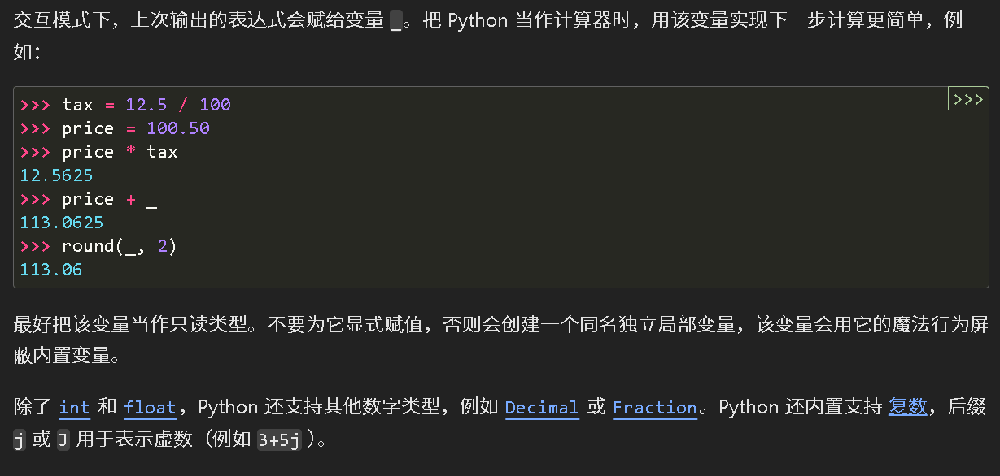
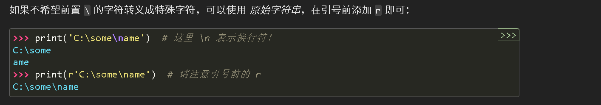
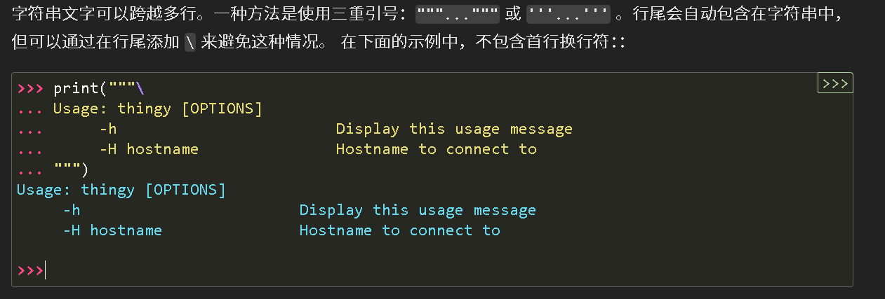
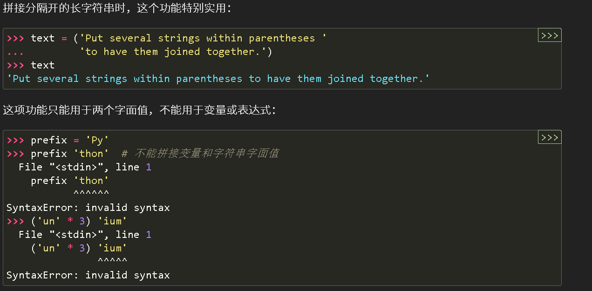
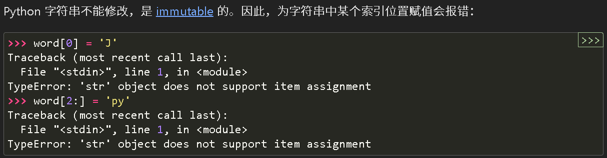

# python

&gt; 目标：需要掌握一门简单易用的语言
&gt;
&gt; 为什么不选择（c/c++）：这两个太过于繁杂，不方便使用

## 序言

&gt; 掌握一门语言的一般步骤
&gt;
&gt; 不谦虚的说，我也算是会3门编程语言（r,python,c++）（这里的会指的是会写，借助工具能完成所给的任务；如果把c和c++看作是两门语言的话是4种）
&gt;
&gt; 我发现了一些学习编程语言的基本逻辑，列举如下

1. 了解该语言的基本逻辑（解释型 \ 编译型；总之就是看看简介不亏，也给你一个大概的框架）
2. 学习数据类型（整型，浮点型，字符型，布尔型），结构（数组，集合，字典）及相关用法（如何遍历，劈分，排序）
3. 学习控制结构（循环，条件）
4. 学习函数

以上四步是基本的了解一门语言的要求，更高级的涉及面向对象编程的部分需要单独讨论，还有一些语言的特色功能（比方说py丰富的第三方库，r的各种包，c与c++的指针）

## reference

[Python 语言参考手册 — Python 3.13.0 文档](https://docs.python.org/zh-cn/3/reference/index.html)

- 如果您的工作主要是用电脑完成的，总有一天您会想能不能自动执行一些任务。比如，对大量文本文件执行查找、替换操作；利用复杂的规则重命名、重排序一堆照片文件；也可能您想编写一个小型数据库、或开发专用的图形界面应用，甚至是开发一个简单的游戏。
  作为一名专业软件开发人员，您可能要处理 C/C++/Java 库，但编码、编译、测试、再编译这些开发流程太慢了；也许您正在给这些库开发测试套件，但总觉得这项工作真是枯燥乏味。又或许，您开发了个使用扩展语言的软件，却不想为这个软件专门设计一种新语言。

- Python “可以扩展”：会开发 C 语言程序，就能快速上手为解释器增加新的内置函数或模块，不论是让核心程序以最高速度运行，还是把 Python 程序链接到只提供预编译程序的库（比如，硬件图形库）。只要下点功夫，就能把 Python 解释器和用 C 开发的应用链接在一起，用它来扩展和控制该应用。

- 

- 

- 

- 

- 

- &gt; - *浅层复制* 构造一个新的复合对象，然后（在尽可能的范围内）将原始对象中找到的对象的 *引用* 插入其中。
  &gt; - *深层复制* 构造一个新的复合对象，然后，递归地将在原始对象里找到的对象的 *副本* 插入其中。
  &gt;
  &gt; &gt; 在 Python 中，浅复制和深复制的行为在处理基本变量（如整数、字符串等不可变类型）时确实有所不同。
  &gt; &gt;
  &gt; &gt; 对于基本变量（不可变类型），浅复制和深复制的效果是一样的，因为这些变量的值是直接复制的，而不是引用。也就是说，复制后的变量和原变量是独立的，修改其中一个不会影响另一个。
  &gt; &gt;
  &gt; &gt; 但是，对于可变类型（如列表、字典等），浅复制只复制对象的引用，而不是对象本身。这意味着复制后的对象和原对象共享相同的子对象，修改其中一个会影响另一个。
  &gt; &gt;
  &gt; &gt; ```python
  &gt; &gt; import copy
  &gt; &gt; 
  &gt; &gt; # 不可变类型
  &gt; &gt; a = 10
  &gt; &gt; b = copy.copy(a)
  &gt; &gt; b = 20
  &gt; &gt; print(a)  # 输出: 10
  &gt; &gt; print(b)  # 输出: 20
  &gt; &gt; 
  &gt; &gt; # 可变类型
  &gt; &gt; list1 = [1, 2, [3, 4]]
  &gt; &gt; list2 = copy.copy(list1)
  &gt; &gt; list2[2][0] = 99
  &gt; &gt; print(list1)  # 输出: [1, 2, [99, 4]]
  &gt; &gt; print(list2)  # 输出: [1, 2, [99, 4]]
  &gt; &gt; ```
  &gt; &gt;
  &gt; &gt; 在这个例子中，对于不可变类型 `int`，浅复制创建了一个新的独立变量 `b`，修改 `b` 不会影响 `a`。但是对于可变类型 `list`，浅复制创建了一个新的列表 `list2`，但它们共享相同的子列表 `[3, 4]`，因此修改 `list2` 的子列表会影响 `list1`。
  &gt;
  &gt; 深度复制操作通常存在两个问题, 而浅层复制操作并不存在这些问题：
  &gt;
  &gt; - 递归对象 (直接或间接包含对自身引用的复合对象) 可能会导致递归循环。
  &gt; - 由于深层复制会复制所有内容，因此可能会过多复制（例如本应该在副本之间共享的数据）。

- 嵌套列表（多维数组）

  - ```python
    a = ['a', 'b', 'c']
    n = [1, 2, 3]
    x = [a, n]
    ```

- range

  - ```python
    # 生成的序列绝不会包括给定的终止值；range(10) 生成 10 个值——长度为 10 的序列的所有合法索引。range 可以不从 0 开始，且可以按给定的步长递增（即使是负数步长）：
    list(range(5, 10))
    # [5, 6, 7, 8, 9]
    
    list(range(0, 10, 3))
    # [0, 3, 6, 9]
    
    list(range(-10, -100, -30))
    # [-10, -40, -70],不会反向，别记错了
    ```

- 循环的技巧

  - &gt; ## 循环的技巧
    &gt;
    &gt; 当对字典执行循环时，可以使用 [`items()`](https://docs.python.org/zh-cn/3/library/stdtypes.html#dict.items) 方法同时提取键及其对应的值。
    &gt;
    &gt; ```python
    &gt; knights = {'gallahad': 'the pure', 'robin': 'the brave'}
    &gt; for k, v in knights.items():
    &gt;      print(k, v)
    &gt; 
    &gt; # gallahad the pure
    &gt; # robin the brave
    &gt; ```
    &gt;
    &gt; 在序列中循环时，用 [`enumerate()`](https://docs.python.org/zh-cn/3/library/functions.html#enumerate) 函数可以同时取出位置索引和对应的值：
    &gt;
    &gt; 
    &gt;
    &gt; ```python
    &gt; for i, v in enumerate(['tic', 'tac', 'toe']):
    &gt;      print(i, v)
    &gt; # 0 tic
    &gt; # 1 tac
    &gt; # 2 toe
    &gt; ```
    &gt;
    &gt; 同时循环两个或多个序列时，用 [`zip()`](https://docs.python.org/zh-cn/3/library/functions.html#zip) 函数可以将其内的元素一一匹配：
    &gt;
    &gt; ```python
    &gt; questions = ['name', 'quest', 'favorite color']
    &gt; answers = ['lancelot', 'the holy grail', 'blue']
    &gt; for q, a in zip(questions, answers):
    &gt;      print('What is your {0}?  It is {1}.'.format(q, a))
    &gt;         
    &gt; # What is your name?  It is lancelot.
    &gt; # What is your quest?  It is the holy grail.
    &gt; # What is your favorite color?  It is blue.
    &gt; ```
    &gt;
    &gt; 为了逆向对序列进行循环，可以求出欲循环的正向序列，然后调用 [`reversed()`](https://docs.python.org/zh-cn/3/library/functions.html#reversed) 函数：
    &gt;
    &gt; ```python
    &gt; for i in reversed(range(1, 10, 2)):
    &gt;     print(i)
    &gt; # 9
    &gt; # 7
    &gt; # 5
    &gt; # 3
    &gt; # 1
    &gt; ```
    &gt;
    &gt; 按指定顺序循环序列，可以用 [`sorted()`](https://docs.python.org/zh-cn/3/library/functions.html#sorted) 函数，在不改动原序列的基础上，返回一个重新的序列：
    &gt;
    &gt; ```python
    &gt; basket = ['apple', 'orange', 'apple', 'pear', 'orange', 'banana']
    &gt; for i in sorted(basket):
    &gt;     print(i)
    &gt; # apple
    &gt; # apple
    &gt; # banana
    &gt; # orange
    &gt; # orange
    &gt; # pear
    &gt; ```
    &gt;
    &gt; 使用 [`set()`](https://docs.python.org/zh-cn/3/library/stdtypes.html#set) 去除序列中的重复元素。使用 [`sorted()`](https://docs.python.org/zh-cn/3/library/functions.html#sorted) 加 [`set()`](https://docs.python.org/zh-cn/3/library/stdtypes.html#set) 则按排序后的顺序，循环遍历序列中的唯一元素：
    &gt;
    &gt; ```python
    &gt; basket = ['apple', 'orange', 'apple', 'pear', 'orange', 'banana']
    &gt; for f in sorted(set(basket)):
    &gt;     print(f)
    &gt; ```
    &gt;
    &gt; 一般来说，在循环中修改列表的内容时，**创建新列表比较简单，且安全**：
    &gt;
    &gt; ```python
    &gt; import math
    &gt; raw_data = [56.2, float('NaN'), 51.7, 55.3, 52.5, float('NaN'), 47.8]
    &gt; filtered_data = []
    &gt; for value in raw_data:
    &gt;     if not math.isnan(value):
    &gt;         filtered_data.append(value)
    &gt; 
    &gt; filtered_data
    &gt; ```

- match

  - &gt; ## `match` 语句(*Added in version 3.10.*)
    &gt;
    &gt; [`match`](https://docs.python.org/zh-cn/3/reference/compound_stmts.html#match) 语句接受一个表达式并把它的值与一个或多个 case 块给出的一系列模式进行比较。这表面上像 C、Java 或 JavaScript（以及许多其他程序设计语言）中的 switch 语句，但其实它更像 Rust 或 Haskell 中的模式匹配。只有第一个匹配的模式会被执行，并且它还可以提取值的组成部分（序列的元素或对象的属性）赋给变量。
    &gt;
    &gt; 最简单的形式是将一个主语值与一个或多个字面值进行比较：
    &gt;
    &gt; ```
    &gt; def http_error(status):
    &gt;     match status:
    &gt;         case 400:
    &gt;             return "Bad request"
    &gt;         case 404:
    &gt;             return "Not found"
    &gt;         case 418:
    &gt;             return "I'm a teapot"
    &gt;         case _:
    &gt;             return "Something's wrong with the internet"
    &gt; ```
    &gt;
    &gt; 注意最后一个代码块：“变量名” `_` 被作为 *通配符* 并必定会匹配成功。如果没有 case 匹配成功，则不会执行任何分支。
    &gt;
    &gt; 你可以用 `|` （“或”）将多个字面值组合到一个模式中：
    &gt;
    &gt; ```
    &gt; case 401 | 403 | 404:
    &gt;     return "Not allowed"
    &gt; ```
    &gt;
    &gt; 形如解包赋值的模式可被用于绑定变量：
    &gt;
    &gt; ```
    &gt; # point 是一个 (x, y) 元组
    &gt; match point:
    &gt;     case (0, 0):
    &gt;         print("Origin")
    &gt;     case (0, y):
    &gt;         print(f"Y={y}")
    &gt;     case (x, 0):
    &gt;         print(f"X={x}")
    &gt;     case (x, y):
    &gt;         print(f"X={x}, Y={y}")
    &gt;     case _:
    &gt;         raise ValueError("Not a point")
    &gt; ```
    &gt;
    &gt; 请仔细学习此代码！第一个模式有两个字面值，可视为前述字面值模式的扩展。接下来的两个模式结合了一个字面值和一个变量，变量 *绑定* 了来自主语（`point`）的一个值。第四个模式捕获了两个值，使其在概念上与解包赋值 `(x, y) = point` 类似。
    &gt;
    &gt; 如果用类组织数据，可以用“类名后接一个参数列表”这种很像构造器的形式，把属性捕获到变量里：
    &gt;
    &gt; ```
    &gt; class Point:
    &gt;     def __init__(self, x, y):
    &gt;         self.x = x
    &gt;         self.y = y
    &gt; 
    &gt; def where_is(point):
    &gt;     match point:
    &gt;         case Point(x=0, y=0):
    &gt;             print("Origin")
    &gt;         case Point(x=0, y=y):
    &gt;             print(f"Y={y}")
    &gt;         case Point(x=x, y=0):
    &gt;             print(f"X={x}")
    &gt;         case Point():
    &gt;             print("Somewhere else")
    &gt;         case _:
    &gt;             print("Not a point")
    &gt; ```
    &gt;
    &gt; 一些内置类（如 dataclass）为属性提供了一个顺序，此时，可以使用位置参数。自定义类可通过在类中设置特殊属性 `__match_args__`，为属性指定其在模式中对应的位置。若设为 ("x", "y")，则以下模式相互等价（且都把属性 `y` 绑定到变量 `var`）：
    &gt;
    &gt; ```
    &gt; Point(1, var)
    &gt; Point(1, y=var)
    &gt; Point(x=1, y=var)
    &gt; Point(y=var, x=1)
    &gt; ```
    &gt;
    &gt; 建议这样来阅读一个模式——通过将其视为赋值语句等号左边的一种扩展形式，来理解各个变量被设为何值。match 语句只会为单一的名称（如上面的 `var`）赋值，而不会赋值给带点号的名称（如 `foo.bar`）、属性名（如上面的 `x=` 和 `y=`）和类名（是通过其后的 "(...)" 来识别的，如上面的 `Point`）。
    &gt;
    &gt; 模式可以任意嵌套。举例来说，如果我们有一个由 Point 组成的列表，且 Point 添加了 `__match_args__` 时，我们可以这样来匹配它：
    &gt;
    &gt; ```
    &gt; class Point:
    &gt;     __match_args__ = ('x', 'y')
    &gt;     def __init__(self, x, y):
    &gt;         self.x = x
    &gt;         self.y = y
    &gt; 
    &gt; match points:
    &gt;     case []:
    &gt;         print("No points")
    &gt;     case [Point(0, 0)]:
    &gt;         print("The origin")
    &gt;     case [Point(x, y)]:
    &gt;         print(f"Single point {x}, {y}")
    &gt;     case [Point(0, y1), Point(0, y2)]:
    &gt;         print(f"Two on the Y axis at {y1}, {y2}")
    &gt;     case _:
    &gt;         print("Something else")
    &gt; ```
    &gt;
    &gt; 我们可以为模式添加 `if` 作为守卫子句。如果守卫子句的值为假，那么 `match` 会继续尝试匹配下一个 case 块。注意是先将值捕获，再对守卫子句求值：
    &gt;
    &gt; ```
    &gt; match point:
    &gt;     case Point(x, y) if x == y:
    &gt;         print(f"Y=X at {x}")
    &gt;     case Point(x, y):
    &gt;         print(f"Not on the diagonal")
    &gt; ```
    &gt;
    &gt; 该语句的一些其它关键特性：
    &gt;
    &gt; - 与解包赋值类似，元组和列表模式具有完全相同的含义并且实际上都能匹配任意序列，区别是它们不能匹配迭代器或字符串。
    &gt;
    &gt; - 序列模式支持扩展解包：`[x, y, *rest]` 和 `(x, y, *rest)` 和相应的解包赋值做的事是一样的。接在 `*` 后的名称也可以为 `_`，所以 `(x, y, *_)` 匹配含至少两项的序列，而不必绑定剩余的项。
    &gt;
    &gt; - 映射模式：`{"bandwidth": b, "latency": l}` 从字典中捕获 `"bandwidth"` 和 `"latency"` 的值。额外的键会被忽略，这一点与序列模式不同。`**rest` 这样的解包也支持。（但 `**_` 将会是冗余的，故不允许使用。）
    &gt;
    &gt; - 使用 `as` 关键字可以捕获子模式：
    &gt;
    &gt;   ```
    &gt;   case (Point(x1, y1), Point(x2, y2) as p2): ...
    &gt;   ```
    &gt;
    &gt;   将把输入中的第二个元素捕获为 `p2` （只要输入是包含两个点的序列）
    &gt;
    &gt; - 大多数字面值是按相等性比较的，但是单例对象 `True`、`False` 和 `None` 则是按 id 比较的。
    &gt;
    &gt; - 模式可以使用具名常量。它们必须作为带点号的名称出现，以防止它们被解释为用于捕获的变量：
    &gt;
    &gt;   ```
    &gt;   from enum import Enum
    &gt;   class Color(Enum):
    &gt;       RED = 'red'
    &gt;       GREEN = 'green'
    &gt;       BLUE = 'blue'
    &gt;     
    &gt;   color = Color(input("Enter your choice of 'red', 'blue' or 'green': "))
    &gt;     
    &gt;   match color:
    &gt;       case Color.RED:
    &gt;           print("I see red!")
    &gt;       case Color.GREEN:
    &gt;           print("Grass is green")
    &gt;       case Color.BLUE:
    &gt;           print("I'm feeling the blues :(")
    &gt;   ```
    &gt;
    &gt; 更详细的说明和更多示例，可参阅以教程格式撰写的 [**PEP 636**](https://peps.python.org/pep-0636/)。

- 函数说明

  - &gt; ```python
    &gt; def my_function():
    &gt;     """Do nothing, but document it.
    &gt; 
    &gt;     No, really, it doesn't do anything.
    &gt;     """
    &gt;     pass
    &gt; 
    &gt; print(my_function.__doc__)
    &gt; ```
    &gt;
    &gt; 

    &gt; 1. **文档字符串的格式**：
    &gt;    - **第一行**：应该是一个简短的摘要，描述对象的用途。这一行不应该包含对象的名称或类型，因为这些信息可以通过其他方式获得。除非对象的名称是一个动词，描述了函数的操作，否则不要在摘要中包含名称或类型。这一行应该以大写字母开始，并以句点结束。
    &gt;    - **第二行**：如果文档字符串有多行，第二行应该是一个空行，用来在视觉上分隔摘要和后续的详细描述。
    &gt;    - **后续行**：可以包含多个段落，描述对象的调用约定、副作用等信息。
    &gt; 2. **缩进的处理**：
    &gt;    - Python解析器不会自动删除多行字符串字面值中的缩进，因此需要文档处理工具来处理这些缩进。处理的规则是：文档字符串中第一行之后的第一个非空行决定了整个文档字符串的缩进量。这意味着，所有行的缩进应该与这个非空行的缩进相同。
    &gt;    - 如果有行的缩进少于这个量，那么这些行的所有前导空白符应该被删除。
    &gt;    - 在转换制表符为空白符（通常是8个空格）之后，应该测试空白符的等效性，确保文档字符串的格式正确。

- PEP8

  - &gt; Python 项目大多都遵循 [**PEP 8**](https://peps.python.org/pep-0008/) 的风格指南；它推行的编码风格易于阅读、赏心悦目。Python 开发者均应抽时间悉心研读；以下是该提案中的核心要点：
    &gt;
    &gt; - 缩进，用 4 个空格，不要用制表符。
    &gt;
    &gt;   4 个空格是小缩进（更深嵌套）和大缩进（更易阅读）之间的折中方案。制表符会引起混乱，最好别用。
    &gt;
    &gt; - 换行，一行不超过 79 个字符。
    &gt;
    &gt;   这样换行的小屏阅读体验更好，还便于在大屏显示器上并排阅读多个代码文件。
    &gt;
    &gt; - 用空行分隔函数和类，及函数内较大的代码块。
    &gt;
    &gt; - 最好把注释放到单独一行。
    &gt;
    &gt; - 使用文档字符串。
    &gt;
    &gt; - 运算符前后、逗号后要用空格，但不要直接在括号内使用： `a = f(1, 2) + g(3, 4)`。
    &gt;
    &gt; - 类和函数的命名要一致；按惯例，命名类用 `UpperCamelCase`，命名函数与方法用 `lowercase_with_underscores`。命名方法中第一个参数总是用 `self` (类和方法详见 [初探类](https://docs.python.org/zh-cn/3/tutorial/classes.html#tut-firstclasses))。
    &gt;
    &gt; - 编写用于国际多语环境的代码时，不要用生僻的编码。Python 默认的 UTF-8 或纯 ASCII 可以胜任各种情况。
    &gt;
    &gt; - 同理，就算多语阅读、维护代码的可能再小，也不要在标识符中使用非 ASCII 字符。

- list

  - &gt; 列表数据类型支持很多方法，列表对象的所有方法所示如下：
    &gt;
    &gt; - list.**append**(*x*)
    &gt;
    &gt;   Add an item to the end of the list. Similar to `a[len(a):] = [x]`.
    &gt;
    &gt; - list.**extend**(*iterable*)
    &gt;
    &gt;   Extend the list by appending all the items from the iterable. Similar to `a[len(a):] = iterable`.
    &gt;
    &gt; - list.**insert**(*i*, *x*)
    &gt;
    &gt;   在指定位置插入元素。第一个参数是插入元素的索引，因此，`a.insert(0, x)` 在列表开头插入元素， `a.insert(len(a), x)` 等同于 `a.append(x)` 。
    &gt;
    &gt; - list.**remove**(*x*)
    &gt;
    &gt;   从列表中删除第一个值为 *x* 的元素。未找到指定元素时，触发 [`ValueError`](https://docs.python.org/zh-cn/3/library/exceptions.html#ValueError) 异常。
    &gt;
    &gt; - list.**pop**([*i*])
    &gt;
    &gt;   移除列表中给定位置上的条目，并返回该条目。 如果未指定索引号，则 `a.pop()` 将移除并返回列表中的最后一个条目。 如果列表为空或索引号在列表索引范围之外则会引发 [`IndexError`](https://docs.python.org/zh-cn/3/library/exceptions.html#IndexError)。
    &gt;
    &gt; - list.**clear**()
    &gt;
    &gt;   Remove all items from the list. Similar to `del a[:]`.
    &gt;
    &gt; - list.**index**(*x*[, *start*[, *end*]])
    &gt;
    &gt;   返回列表中第一个值为 *x* 的元素的零基索引。未找到指定元素时，触发 [`ValueError`](https://docs.python.org/zh-cn/3/library/exceptions.html#ValueError) 异常。可选参数 *start* 和 *end* 是切片符号，用于将搜索限制为列表的特定子序列。返回的索引是相对于整个序列的开始计算的，而不是 *start* 参数。
    &gt;
    &gt;   &gt; 在函数的参数列表中，用中括号 `[]` 包围的参数表示该参数是**可选的**。(有层级关系)
    &gt;   &gt;
    &gt;   &gt; 对于 `list.index(x[, start[, end]])` 方法：
    &gt;   &gt;
    &gt;   &gt; - **`x`**：要查找的元素，**必需参数**。
    &gt;   &gt; - **`[start]`**：可选参数，表示搜索的起始索引位置。如果不指定，默认为 `0`。
    &gt;   &gt; - **`[end]`**：可选参数，表示搜索的结束索引位置（不包含该位置）。如果不指定，默认为列表的长度。
    &gt;   &gt;
    &gt;   &gt; 嵌套的中括号表示只有在提供了前一个可选参数的情况下，才能提供下一个可选参数。
    &gt;   &gt;
    &gt;   &gt; ```python
    &gt;   &gt; my_list = [1, 2, 3, 2, 4]
    &gt;   &gt; 
    &gt;   &gt; # 只提供必需参数 x
    &gt;   &gt; index = my_list.index(2)
    &gt;   &gt; print(index)  # 输出: 1
    &gt;   &gt; 
    &gt;   &gt; # 提供 x 和 start 参数
    &gt;   &gt; index = my_list.index(2, 2)
    &gt;   &gt; print(index)  # 输出: 3
    &gt;   &gt; 
    &gt;   &gt; # 提供 x、start 和 end 参数
    &gt;   &gt; index = my_list.index(2, 2, 4)
    &gt;   &gt; print(index)  # 输出: 3
    &gt;   &gt; ```
    &gt;   &gt;
    &gt;   &gt; 因此，中括号在参数列表中用于表示哪些参数是可选的，调用函数时可以根据需要提供相应的参数。
    &gt;
    &gt; - list.**count**(*x*)
    &gt;
    &gt;   返回列表中元素 *x* 出现的次数。
    &gt;
    &gt; - list.**sort**(***, *key=None*, *reverse=False*)
    &gt;
    &gt;   就地排序列表中的元素（要了解自定义排序参数，详见 [`sorted()`](https://docs.python.org/zh-cn/3/library/functions.html#sorted)）。
    &gt;
    &gt; - list.**reverse**()
    &gt;
    &gt;   翻转列表中的元素。
    &gt;
    &gt; - list.**copy**()
    &gt;
    &gt;   Return a shallow copy of the list. Similar to `a[:]`.


```
