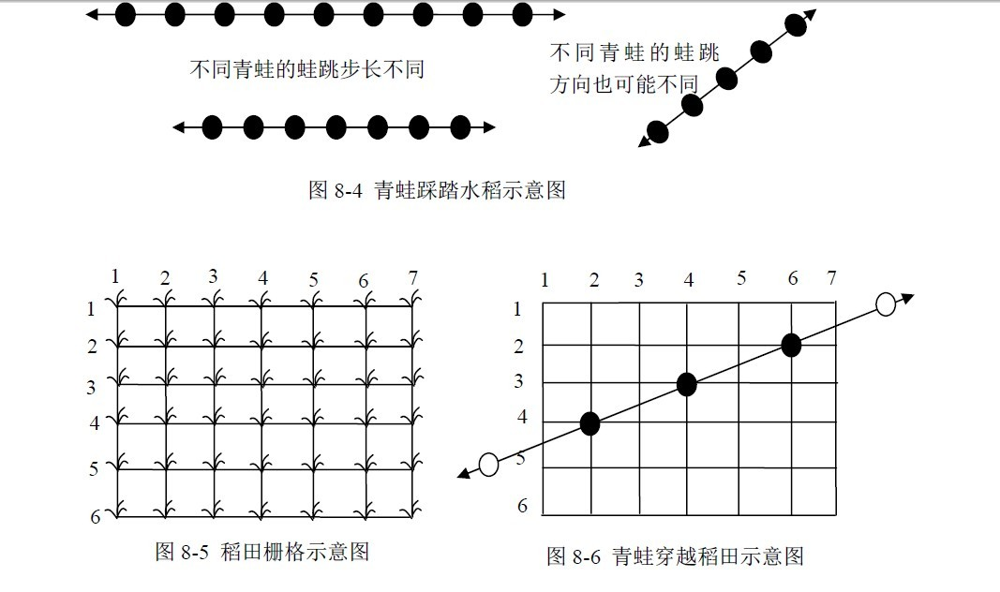
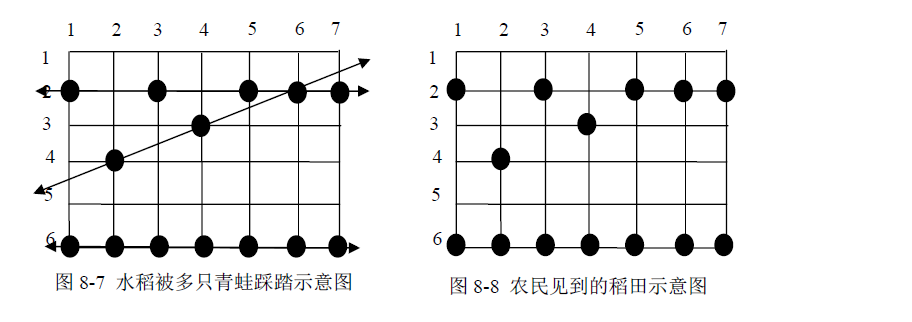
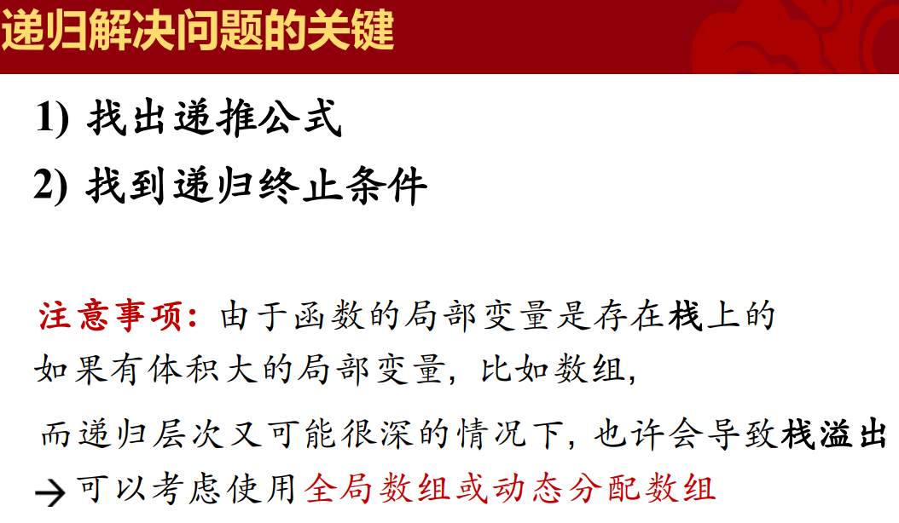
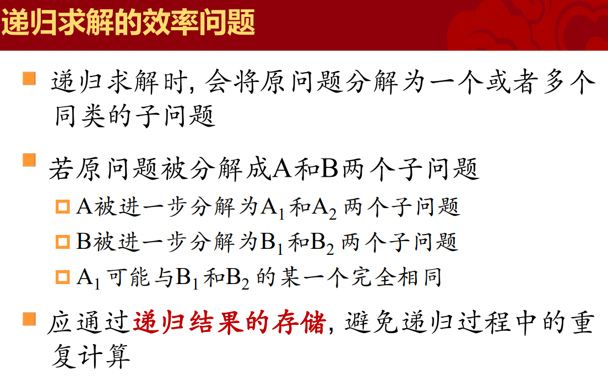

## 时间复杂度

&gt; 一个程序或算法的时间效率, 也称 “时间复杂度” , 有时简称 "复杂度"
&gt;
&gt; 复杂度常用大的字母 O 和小写字母 n 来表示, 例如 $O(n)$, $O(n^2)$​​​等,  n 代表问题的规模
&gt;
&gt; 时间复杂度是用算法运行过程中, 某种时间固定的操作需要被执行的次数和 n 的关系来度量的, 在无序数列中查找某个数, 复杂度是$O(n)$
&gt;
&gt; 计算复杂度的时候, 只统计执行次数最多的 (n足够大时) 那种固定操作的次数, 例如某个算法需要执行加法 $n^2$次, 除法 n 次, 那么就记其复杂度是 $O(n^2 )$ 的
&gt;
&gt; 复杂度有 “平均复杂度” 和 “最坏复杂度” 两种, 两者可能一致, 也可能不一致
&gt;
&gt; 如果复杂度是多个n的函数之和, 则只关心随n的增长, 增长得最快的那个函数 
&gt;
&gt; $O(n3 + n 2 ) -&gt; O(n3 ) $
&gt;
&gt; $O(2n + n3) -&gt; O(2n) $
&gt;
&gt; $O(n! + 3n) -&gt; O(n!)$

- 常数复杂度： $O(1)$, 即时间(操作次数)和问题的规模无关
- 对数复杂度： $O(log(n))$
- 线性复杂度： $O(n)$​


- 多项式复杂度： $O(n^k)$
- 指数复杂度： $O(a^n )$
- 阶乘复杂度： $O(n!)$

&gt;**一些例子**
&gt;
&gt;在无序数列中查找某个数（顺序查找）$O(n)$
&gt;
&gt; 平面上有n个点, 要求出任意两点之间的距离  $O(n^2 )$
&gt;
&gt; 插入排序、选择排序、冒泡排序  $O(n^2 )$
&gt;
&gt; 快速排序  $O(n*log(n))$
&gt;
&gt; 二分查找  $O(log(n))$

## 二分查找

&gt; `BinarySearch`
&gt;
&gt; 要求是有序区间

### 例子

&gt; 写一个函数`BinarySeach( )`, 在包含size个元素的、从小到大排序的int数组a里 如果找到, 则返回元素下标; 如果找不到, 则返回-1, 要求复杂度$O(log(n))$

```c++
int BinarySearch(int a[], int size, int p) {
  int L = 0;                   
  int R = size - 1;            
  while (L &lt;= R) {             
    int mid = L + (R - L) / 2;  //为了防止 (L+R)过大溢出
    if (p == a[mid])
      return mid;
    else if (p &gt; a[mid])
      L = mid + 1; 
    else
      R = mid - 1; 
  }
  return -1;
}
```

&gt; 写一个函数`LowerBound()`, 在包含size个元素的、从小到大排序的int数组a里查找 比给定整数p小的, 下标最大的元素, 找到则返回其下标, 找不到则返回-1

```c++
int LowerBound(int a[], int size, int p) {
  int L = 0;
  int R = size - 1;
  int lastPos = -1;
  while (L &lt;= R) {
    int mid = L + (R - L) / 2;
    if (a[mid] &gt;= p)
      R = mid - 1;
    else {
      lastPos = mid;
      L = mid + 1;
    }
  }
  return lastPos;
}
```

&gt; 求下面方程的一个根:$ f(x) = x^3 -5x^2+10x-80 = 0$
&gt;
&gt; 若求出的根是$a$, 则要求$ |f(a)| &lt;= 10^{-6}$​
&gt;
&gt; &gt; 解法:
&gt; &gt;
&gt; &gt;  对f(x)求导, 得 f'(x)=3x2 -10x+10 由一元二次方程求根公式知, 方程 f'(x)= 0 无解, 因此f'(x)恒大于0 故f(x)是单调递增的 易知 f(0) &lt; 0且f(100)&gt;0, 所以区间[0, 100]内必然有且只有一个根 由于f(x)在[0, 100]内是单调的, 所以可以用二分法在区间[0, 100]中寻找根

```c++
#include <cmath>
#include <cstdio>
#include <iostream>

using namespace std;
double EPS = 1e-6;
double f(double x) { return x * x * x - 5 * x * x + 10 * x - 80; }
int main() {
  double root, x1 = 0, x2 = 100, y;
  root = x1 + (x2 - x1) / 2;
  int triedTimes = 1;
  y = f(root);
  while (fabs(y) &gt; EPS) {
    if (y &gt; 0)
      x2 = root;
    else
      x1 = root;
    root = x1 + (x2 - x1) / 2;
    y = f(root);
    triedTimes++;
  }
  printf("%.8f\n", root);
  printf("%d", triedTimes);
  return 0;
}
```

&gt; 输入n (n&lt;= 100, 000)个整数, 找出其中的两个数, 它们之和等于整数m（假定肯定有解）, 题中所有整数都能用 int 表示
&gt;
&gt; $solution_1$双重for循环 $O(n^2)$
&gt;
&gt; $solution_2$​排序后对于每一个元素二分查找它的配对数  $O(nlogn)$
&gt;
&gt; $solution_3$排序后双指针法  $O(nlogn)$

&gt; Aggressive cows
&gt;
&gt; http://bailian.openjudge.cn/practice/2456
&gt;
&gt; 农夫John建造了一座很长的畜栏, 它包括N (2≤N≤100, 000)个隔间, 这些小隔间的位置为$x_0, ..., x_{N-1} (0≤x_i≤1,000,000,000, 均为整数, 各不相同)$​ John的C (2≤C≤N) 头牛每头分到一个隔间, 牛都希望互相离得远点省得互相打扰 怎样才能使任意两头牛之间的最小距离尽可能的大, 这个最大的最小距离是多少呢?

```c++
#include <algorithm>
#include <iostream>
#include <vector>

using namespace std;
int main() {
  int n, c;
  cin &gt;&gt; n &gt;&gt; c;
  vector<int> location(n, 0);
  for (int i = 0; i &lt; n; i++) {
    cin &gt;&gt; location[i];
  }
  sort(location.begin(), location.end());
  int left = 0, right = location[n - 1] - location[0];
  int last_distance = 0;
  while (left &lt;= right) {
    int distance = left + (right - left) / 2;
    int count = 1;
    int last_pos = location[0];
    for (int i = 0; i &lt; c; i++) {
      auto iter =
          lower_bound(location.begin(), location.end(), last_pos + distance);
      if (iter != location.end()) {
        count++; 
        last_pos = *(iter);
      } else {
        right = distance - 1;
        break;
      }
      if (count == c) {
        left = distance + 1;
        last_distance = distance;
        break;
      }
    }
  }
  cout &lt;&lt; last_distance &lt;&lt; endl;
  return 0;
}
```


## 枚举

- 找到解空间
  - 模型中变量数尽可能少, 它们之间相互独立
- 缩小解空间
  - 利用知识缩小模型中各变量的取值范围, 避免不必要的 计算
- 使用合适的搜索顺序遍历
  - 搜索空间的遍历顺序要与模型中条件表达式一致

### 例题

&gt; 题目描述
&gt; $a^3 = b^3 + c^3 + d^3$为完美立方等式。例如$12^3 = 6^3 + 8^3 + 10^3$ 。编写一个程序，对任给的正整数N (N≤100)，寻找所有的四元组(a, b, c, d)，使得$a^3 = b^3 + c^3 + d^3$，其中1<a, b,="" c,="" d="" ≤n。="">
&gt; 输入
&gt; 正整数N (N≤100)
&gt;
&gt; 输出
&gt; 每行输出一个完美立方，按照a的值，从小到大依次输出。当两个完美立方等式中a的值相同，则依次按照b、c、d进行非降升序排列输出，即b值小的先输出、然后c值小的先输出、然后d值小的先输出。
&gt;
&gt; 样例输入
&gt; ```
&gt; 24
&gt; ```
&gt;
&gt; 样例输出
&gt; ```
&gt; Cube = 6, Triple = (3,4,5)
&gt; Cube = 12, Triple = (6,8,10)
&gt; Cube = 18, Triple = (2,12,16)
&gt; Cube = 18, Triple = (9,12,15)
&gt; Cube = 19, Triple = (3,10,18)
&gt; Cube = 20, Triple = (7,14,17)
&gt; Cube = 24, Triple = (12,16,20)
&gt; ```

```c++
```


&gt; 描述
&gt; 人生来就有三个生理周期，分别为体力周期、感情周期和智力周期，它们的周期长度分别为23天、28天和33天。每一个周期中有一天是高峰。在高峰这天，人会在相应的方面表现出色。例如，在智力周期的高峰，人会思维敏捷，注意力容易高度集中。因为三个周期的长度不同，所以通常三个周期的高峰不会落在同一天。对于每个人，想知道何时三个高峰落在同一天。对于每个周期，会给出从当前年份的第一天开始，到出现高峰的天数（不一定是第一次高峰出现的时间）。给定一个从当年第一天开始的天数，你的任务是输出从给定时间开始（不包括给定时间），下一次三个高峰落在同一天的时间（距给定时间的天数）。例如：给定时间为10，下次出现三个高峰同一天的时间是12，则输出2（注意这里不是3）。
&gt;
&gt; 输入
&gt; 输入包含多组数据，每一组数据由四个整数组成，数据以-1 -1 -1 -1 结束。
&gt; 对于四个整数p, e, i和d，p, e, i分别表示体力、情感和智力高峰出现的时间（时间从当年的第一天开始计算）。d是给定的时间，可能小于p, e或i。所有给定时间是非负的并且小于或等于365，所求的时间小于或等于21252。
&gt;
&gt; 输出
&gt; 从给定时间起，下一次三个高峰同一天的时间（距离给定时间的天数）。
&gt;
&gt; 样例输入
&gt;
&gt; ```
&gt; 0 0 0 0
&gt; 0 0 0 100
&gt; 5 20 34 325
&gt; 4 5 6 7
&gt; 283 102 23 320
&gt; 203 301 203 40
&gt; -1 -1 -1 -1
&gt; ```
&gt;
&gt; 样例输出
&gt;
&gt; ```
&gt; Case 1: the next triple peak occurs in 21252 days.
&gt; Case 2: the next triple peak occurs in 21152 days.
&gt; Case 3: the next triple peak occurs in 19575 days.
&gt; Case 4: the next triple peak occurs in 16994 days.
&gt; Case 5: the next triple peak occurs in 8910 days.
&gt; Case 6: the next triple peak occurs in 10789 days.
&gt; ```

```c++
```

&gt; **问题描述**
&gt; 有12枚硬币。其中有11枚真币和1枚假币。假币和真币重量不同，但不知道假币比真币轻还是重。现在，用一架天平称了这些币三次，告诉你称的结果，请你找出假币并且确定假币是轻是重,数据保证一定能找出来。
&gt;
&gt; **输入样例**
&gt;
&gt; ```
&gt; ABCD EFGH even
&gt; ABCI EFJK up
&gt; ABIJ EFGH even
&gt; 
&gt; ```
&gt;
&gt; **输出样例**
&gt;
&gt; ```
&gt; K it is light.
&gt; ```

```c++
```

&gt; 题目描述
&gt; 有一个由按钮组成的矩阵，其中每行有6个按钮，共5行。每个按钮的位置上有一盏灯。当按下一个按钮后，该按钮以及周围位置(上边、下边、左边、右边)的灯都会改变一次。即，如果灯原来是点亮的，就会被熄灭；如果灯原来是熄灭的，则会被点亮。在矩阵角上的按钮改变3盏灯的状态；在矩阵边上的按钮改变4盏灯的状态；其他的按钮改变5盏灯的状态。
&gt;
&gt; 在上图中，左边矩阵中用X标记的按钮表示被按下，右边的矩阵表示灯状态的改变。对矩阵中的每盏灯设置一个初始状态。请你按按钮，直至每一盏等都熄灭。与一盏灯毗邻的多个按钮被按下时，一个操作会抵消另一次操作的结果。在下图中，第2行第3、5列的按钮都被按下，因此第2行、第4列的灯的状态就不改变。
&gt;
&gt; 请你写一个程序，确定需要按下哪些按钮，恰好使得所有的灯都熄灭。根据上面的规则，我们知道1）第2次按下同一个按钮时，将抵消第1次按下时所产生的结果。因此，每个按钮最多只需要按下一次；2）各个按钮被按下的顺序对最终的结果没有影响；3）对第1行中每盏点亮的灯，按下第2行对应的按钮，就可以熄灭第1行的全部灯。如此重复下去，可以熄灭第1、2、3、4行的全部灯。同样，按下第1、2、3、4、5列的按钮，可以熄灭前5列的灯。
&gt;
&gt; 输入
&gt; 5行组成，每一行包括6个数字（0或1）。相邻两个数字之间用单个空格隔开。0表示灯的初始状态是熄灭的，1表示灯的初始状态是点亮的。
&gt;
&gt; 输出
&gt; 5行组成，每一行包括6个数字（0或1）。相邻两个数字之间用单个空格隔开。其中的1表示需要把对应的按钮按下，0则表示不需要按对应的按钮。
&gt;
&gt; 样例输入
&gt; ```
&gt; 0 1 1 0 1 0
&gt; 1 0 0 1 1 1
&gt; 0 0 1 0 0 1
&gt; 1 0 0 1 0 1
&gt; 0 1 1 1 0 0
&gt; ```
&gt;
&gt; 样例输出
&gt; ```
&gt; 1 0 1 0 0 1
&gt; 1 1 0 1 0 1
&gt; 0 0 1 0 1 1
&gt; 1 0 0 1 0 0
&gt; 0 1 0 0 0 0
&gt; ```

```c++
```

&gt; **问题描述**
&gt; 在韩国，有一种小的青蛙。每到晚上，这种青蛙会跳越稻田，从而踩踏稻子。农民在早
&gt; 上看到被踩踏的稻子，希望找到造成最大损害的那只青蛙经过的路径。每只青蛙总是沿着一
&gt; 条直线跳越稻田，而且每次跳跃的距离都相同，如图8-4 所示。 稻田里的稻子组成一个栅
&gt; 格，每棵稻子位于一个格点上，如图8-5 所示。而青蛙总是从稻田的一侧跳进稻田，然后沿
&gt; 着某条直线穿越稻田，从另一侧跳出去，如图8-6 所示。
&gt;
&gt; 
&gt;
&gt; 青蛙的每一跳都恰好踩在一棵水稻上，将这棵水稻拍倒。可能会有多只青蛙从稻田穿越，
&gt; 有些水稻被多只青蛙踩踏，如图8-7 所示。当然，农民所见到的是图8-8 中的情形，看不到
&gt; 图8-7中的直线。
&gt;
&gt; 
&gt; 根据图8-8，农民能够构造出青蛙穿越稻田时的行走路径，并且只关心那些在穿越稻田
&gt; 时至少踩踏了3 棵水稻的青蛙。因此，每条青蛙行走路径上至少包括3 棵被踩踏的水稻。而
&gt; 在一条青蛙行走路径的直线上，也可能会有些被踩踏的水稻不属于该行走路径。在图8-8 中，
&gt; 格点(2, 1)、(6, 1)上的水稻可能是同一只青蛙踩踏的，但这条线上只有两棵被踩踏的水稻，
&gt; 因此不能作为一条青蛙行走路径；格点(2, 3)、(3, 4)、(6, 6)在同一条直线上，但它们的间距
&gt; 不等，因此不能作为一条青蛙行走路径；格点(2, 1)、(2, 3)、(2, 5)、(2, 7)是一条青蛙行走路
&gt; 径，该路径不包括格点(2, 6)。请你写一个程序，确定在所有的青蛙行路径中，踩踏水稻棵
&gt; 数最多的路径上有多少棵水稻被踩踏。例如，图8-8 的答案是7，因为第6 行上全部水稻恰
&gt; 好构成一条青蛙行走路径。
&gt; 	**输入数据**
&gt; 从标准输入设备上读入数据。第一行上两个整数R、C，分别表示稻田中水稻的行数和
&gt; 列数，1≤R、C≤5000。第二行是一个整数N，表示被踩踏的水稻数量， 3≤N≤5000。在剩下
&gt; 的N 行中，每行有两个整数，分别是一颗被踩踏水稻的行号(1~R)和列号(1~C)，两个整数用
&gt; 一个空格隔开。而且，每棵被踩踏水稻只被列出一次。
&gt; 	**输出要求**
&gt; 从标准输出设备上输出一个整数。如果在稻田中存在青蛙行走路径，则输出包含最多水
&gt; 稻的青蛙行走路径中的水稻数量，否则输出0。
&gt; 	**输入样例**
&gt;
&gt; ```
&gt; 6 7
&gt; 14
&gt; 2 1
&gt; 6 6
&gt; 4 2
&gt; 2 5
&gt; 2 6
&gt; 2 7
&gt; 3 4
&gt; 6 1
&gt; 6 2
&gt; 2 3
&gt; 6 3
&gt; 6 4
&gt; 6 5
&gt; 6 7
&gt; ```
&gt;
&gt; **输出样例**
&gt;
&gt; ```
&gt; 7
&gt; ```

```c++

```

## 递归

- 某个函数**直接或间接**的调用自身 
- 问题的求解过程 : 
  - 划分成许多相同性质的求解
  - 小问题的求解过程可以很容易的求出
  - 这些子问题的解就构成原问题的解 

- 递归的基本思想 

  - 待求解问题的解 输入变量x的函数f (x) 

  - 通过寻找函数 g( ), 使得f (x) = g(f (x-1)) 

  - 且 已知f(0) 的值, 就可以通过f(0) 和g( ) 求出f(x)的值

- 推广

  - 扩展到多个输入变量x, y, z等, x-1也可以推广到 x - x1
  - 只要递归朝着 "出口" 的方向即可

### 递归和枚举的区别

&gt; 枚举

 把一个问题划分成一组子问题, 依次对这些子问题求解 

子问题之间是**横向的同类的**关系 

&gt; 递归

把一个问题逐级分解成子问题 

子问题与原问题之间是**纵向的同类的**关系 

语法形式上：在一个函数的运行过程中, 调用这个函数自己 

-　直接调用: 在fun()中直接执行fun() 

-　间接调用: 在fun1()中执行fun2()；在fun2()中又执行fun1() 


###  递归的3个要素 

- 递归表达式
  -  如何将原问题划分成子问题

- 递归终止的条件

  - 即**最小子问题**的求解, 可以允许多个出口 

- 界函数

  - 问题规模变化的函数, 它保证递归的规模向出口条件靠拢

  

  

  

### 例题

&gt; 给定n,求解n的阶乘

```c++
int Factorial(int n){
	if (n == 0){
        return 1;
    }
	else{
        return n*Factorial(n-1);
	}	
}
```

&gt; POJ2000 金币
&gt;
&gt; 描述
&gt; 国王将金币作为工资，发放给忠诚的骑士。第一天，骑士收到一枚金币；之后两天（第二天和第三天）里，每天收到两枚金币；之后三天（第四、五、六天）里，每天收到三枚金币；之后四天（第七、八、九、十天）里，每天收到四枚金币……这种工资发放模式会一直这样延续下去：当连续N天每天收到N枚金币后，骑士会在之后的连续N+1天里，每天收到N+1枚金币（N为任意正整数）。
&gt;
&gt; 你需要编写一个程序，确定从第一天开始的给定天数内，骑士一共获得了多少金币。
&gt;
&gt; 输入
&gt; 输入包含至少一行，但不多于21行。除最后一行外，输入的每行是一组输入数据，包含一个整数（范围1到10000），表示天数。输入的最后一行为0，表示输入结束。
&gt;
&gt; 输出
&gt; 对每个数据输出一行，包含该数据对应天数和总金币数，用单个空格隔开。
&gt;
&gt; 样例输入
&gt;
&gt; ```cmd
&gt; 10
&gt; 6
&gt; 7
&gt; 11
&gt; 15
&gt; 16
&gt; 100
&gt; 10000
&gt; 1000
&gt; 21
&gt; 22
&gt; 0
&gt; ```
&gt;
&gt; 样例输出
&gt; 
&gt; ```cmd
&gt; 10 30
&gt; 6 14
&gt; 7 18
&gt; 11 35
&gt; 15 55
&gt; 16 61
&gt; 100 945
&gt; 10000 942820
&gt; 1000 29820
&gt; 21 91
&gt; 22 98
&gt; ```
&gt;
&gt; 来源
&gt; Rocky Mountain 2004

```c++
#include <iostream>
using namespace std;
int getCoins(int pay, int days) {
  if (days &lt;= pay) {
    return pay * days;
  }
  return pay * pay + getCoins(pay + 1, days - pay);
}
int main() {
  int n;
  while (scanf("%d", &amp;n)) {
    if (n == 0)
      break;
    printf("%d %d\n", n, getCoins(1, n));
  }
  return 0;
}
```

$days = \frac{n*(n-1)}{2}$​

$n^2-n- 2*days=0$

```c++

```

#### POJ2694逆波兰表达式

&gt;原题：
&gt;
&gt;问题描述：
&gt;
&gt;逆波兰表达式是一种吧运算符前置的算术表达式，例如普通的表达式2+3的逆波兰表示为+23.逆波兰表达式的优点是运算符之间不必有优先级的关系，也不必有括号改变运算次序，例如（2+3）*4的逆波兰表示法为*+2 3 4.本题求解的逆波兰表达式的值。
&gt;
&gt; 
&gt;
&gt;输入数据：
&gt;
&gt;输入为一行，其中运算符和运算数之间都用空格分隔，运算数是浮点数。
&gt;
&gt;输出要求：
&gt;
&gt;输出为一行，即表达式的值。
&gt;
&gt;输入样例：
&gt;
&gt;```
&gt;* + 11.0 12.0 + 24.0 35.0
&gt;```
&gt;
&gt;输出样例：
&gt;
&gt;```
&gt;1357.000000
&gt;```

```c++

```

&gt; 　逆波兰表达式翻译为一般表达式

```c++
```

&gt; 　常规表达式的计算

```c++
```

&gt; POJ1191 棋盘分割
&gt;
&gt; 积分图

```c++
```

&gt; POJ1390

```c++

```

## 动态规划

</iostream></a,></int></vector></iostream></algorithm></iostream></cstdio></cmath>