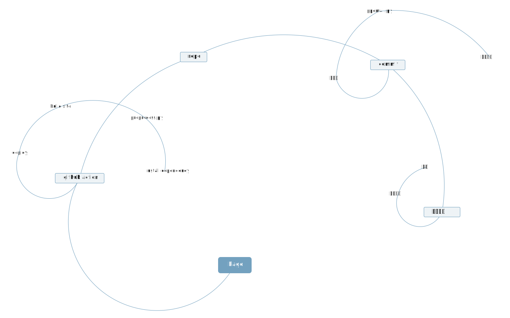

## 一些日常 (2024-12-02 05:06)

## 哈哈 (2024-12-02 05:11)

终于可以正常工作了
发自我的 iPhone

## 先把概统写了 (2024-12-02 05:23)

不能再去搭建网站了
又实现了一个功能
以后用手机更新网站上的日常
感谢伟大的clab让我有免费的服务器
昨天说的邮件更新
今天就做到了
我现在强的可怕
还有好多论文
这就是期末吗

发自我的 iPhone

## 流程图 (2024-12-02 06:00)

发自我的 iPhone

## svg (2024-12-02 06:07)

发自我的 iPhone

## 论文 (2024-12-02 09:25)

优秀的llm使用者

发自我的 iPhone

## 一些摘抄 (2024-12-02 09:52)

上野千鹤子在东京大学开学典礼上的讲话：
所以请你们不要把努力用在让自己站立在金字塔尖之上，请让你们得天独厚的环境与能力，不要用在凌驾于没有这些东西的人们之上，而应该把这些能力用来帮助他们，然后不要逞强，而是承认自己的脆弱，相互依存。

无论有多少人以怎样的方式祝福，每年有99.93%的人考不上清北，98.5%的人考不上985，96%的人考不上211，60%的人考不上本科。我们的教育资源是如此相对匮乏，以至于即使奇迹降临，一个人考上的后果不过是另一个人落榜。
因此，不如致以另一种祝福：如果你有足够的幸运，足够的努力，足够的聪明考上顶尖大学，你要明白，你已经占据了我们贫乏的纳税人贡献的大量资源。我祝福你在经过漫长的求学生涯后，仍然保持一定理想主义；
我祝福你谋求改变这种匮乏，而不是以人上人自居；我祝福你仍然对最朴素的公义怀有敬畏，而非只谋求自己的私利，所想无非“待到打下榆林城，一人一个女学生”；我祝福你发现即使所有的弊病都无法拯救，仍然愿意爱惜羽毛，而非同流合污。
希望这份理想主义，能在我们的之间薪火相传。

## bug修复 (2024-12-02 11:32)

我说怎么不生成actions啊
原来是ubuntu和windows的路径写法不一样
唉
我的写作能力好差
看来我应该学习一下了

发自我的 iPhone

## 普心的健康提醒⏰ (2024-12-02 12:01)

发自我的 iPhone

## + (2024-12-02 12:20)

发自我的 iPhone

## 好难起床 (2024-12-03 00:35)

发自我的 iPhone

## bug (2024-12-03 00:44)

发自我的 iPhone
看来使用的时间是零时区的时间

我真得好好调整作息了啊

我得学点数学

再把论文改改

## 网易邮箱账号安全通知 (2024-12-03 02:02)

