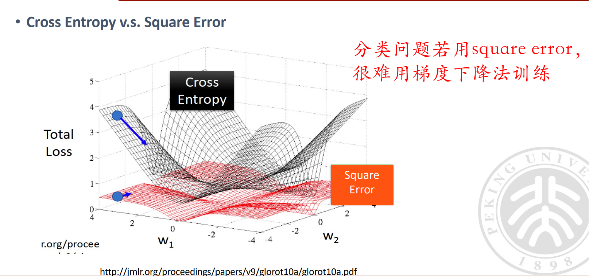

::: v-pre
## Q&A

### 请为我详细介绍map(最大后验估计),并给出推导和每一步的推导依据

最大后验估计(Maximum A Posteriori estimation,简称MAP)

最大后验估计是一种基于贝叶斯理论的参数估计方法,它考虑了先验信息和样本数据,通过最大化后验概率来估计模型参数.下面我们来推导MAP估计的公式.

假设我们有一个概率模型

$p(x|\theta)$

其中$x$表示观测数据,$\theta$表示模型参数.根据贝叶斯公式,我们可以写出后验概率:

$$p(\theta|x)=\frac{p(x|\theta)p(\theta)}{p(x)} \tag{1}$$

其中,$p(\theta)$是参数$\theta$的先验分布,$p(x)$是数据的边缘分布,也称为证据(evidence).

MAP估计的目标是找到后验概率

$p(\theta|x)$

最大时的参数值

$\hat{\theta}_{MAP}$

即:

$$\hat{\theta}_{MAP}=\arg\max_{\theta} p(\theta|x) \tag{2}$$

将公式(1)代入公式(2),得到:

$$\hat{\theta}_{MAP}=\arg\max_{\theta} \frac{p(x|\theta)p(\theta)}{p(x)} \tag{3}$$

由于分母

$p(x)$

与参数

$\theta$

无关,因此在最大化时可以忽略,简化为:

$$\hat{\theta}_{MAP}=\arg\max_{\theta} p(x|\theta)p(\theta) \tag{4}$$

为了便于计算,我们通常对公式(4)取对数,得到:

$$\hat{\theta}_{MAP}=\arg\max_{\theta} \log p(x|\theta) + \log p(\theta) \tag{5}$$

公式(5)就是MAP估计的一般形式.

推导依据:
1. 贝叶斯公式:根据贝叶斯公式,可以写出后验概率与似然函数和先验概率的关系.
2. 最大化后验概率:MAP估计的目标是找到使后验概率最大的参数值.
3. 忽略与参数无关的项:在最大化时,与参数无关的项不影响结果,因此可以忽略证据$p(x)$.
4. 取对数:为了便于计算,通常对公式(4)取对数,将乘法转化为加法.

需要注意的是,MAP估计中需要指定先验分布$p(\theta)$.常见的先验分布有均匀分布,高斯分布,拉普拉斯分布等.先验分布的选择会影响MAP估计的结果.

总结:MAP估计通过最大化后验概率来估计模型参数,考虑了先验信息和样本数据.推导过程基于贝叶斯公式,通过忽略与参数无关的项并取对数简化计算.MAP估计的结果依赖于先验分布的选择.

### 在计算线性回归中,惩罚函数是如何作用的?

在线性回归中,我们通常使用最小二乘法来估计模型参数,即最小化残差平方和(RSS):

$$RSS(\beta)=\sum_{i=1}^{n}(y_i-\mathbf{x}_i^T\beta)^2 \tag{1}$$

其中,$y_i$是第$i$个样本的目标值,$\mathbf{x}_i$是第$i$个样本的特征向量,$\beta$是待估计的参数向量.

然而,当模型复杂度过高时,仅最小化RSS可能导致过拟合.为了防止过拟合,我们可以在目标函数中引入惩罚项,限制参数的大小或复杂度.常见的惩罚函数有L1惩罚(Lasso)和L2惩罚(Ridge).

1. ==L1惩罚(Lasso): (**符合拉普拉斯分布**)==
L1惩罚在RSS的基础上加入参数绝对值之和,目标函数变为:

$$\hat{\beta}_{Lasso}=\arg\min_{\beta} \sum_{i=1}^{n}(y_i-\mathbf{x}_i^T\beta)^2 + \lambda\sum_{j=1}^{p}|\beta_j| \tag{2}$$

其中,$\lambda$是正则化参数,控制惩罚项的强度,$p$是特征的数量.==L1惩罚可以产生稀疏解,即部分参数被压缩为0,实现特征选择的效果.==

2. ==L2惩罚(Ridge): (**符合高斯分布**)==
L2惩罚在RSS的基础上加入参数平方之和,目标函数变为:

$$\hat{\beta}_{Ridge}=\arg\min_{\beta} \sum_{i=1}^{n}(y_i-\mathbf{x}_i^T\beta)^2 + \lambda\sum_{j=1}^{p}\beta_j^2 \tag{3}$$

==L2惩罚可以缩小参数的大小,但不会将其压缩为0.==它对于处理多重共线性问题特别有效.

惩罚函数的作用:
1. 防止过拟合:通过限制参数的大小或复杂度,惩罚函数可以防止模型过度拟合训练数据,提高模型的泛化能力.
2. 特征选择(L1惩罚):L1惩罚可以将部分参数压缩为0,实现特征选择的效果,得到更简洁的模型.
3. 处理多重共线性(L2惩罚):当特征之间存在高度相关性时,L2惩罚可以有效地处理多重共线性问题,提高模型的稳定性.

需要注意的是,惩罚函数的强度由正则化参数$\lambda$控制.$\lambda$的选择需要通过交叉验证等方法来确定,以权衡模型的拟合能力和泛化能力.

总结:在线性回归中,惩罚函数通过在目标函数中引入参数的惩罚项,限制模型的复杂度,防止过拟合.L1惩罚可以实现特征选择,L2惩罚可以处理多重共线性问题.惩罚函数的强度由正则化参数控制,需要通过交叉验证等方法来选择合适的参数值.

### 请向我介绍广义的线性模型

好的,接下来我将为您介绍广义线性模型(Generalized Linear Models,简称GLMs).

广义线性模型是经典线性模型的扩展,它允许响应变量服从指数分布族中的任意一种分布,而不仅限于正态分布.GLMs由以下三个组成部分定义:

1. 随机组件(Random Component):
- 响应变量$Y$的概率分布属于指数分布族.
- 响应变量$Y_1, Y_2, \ldots, Y_n$相互独立.

2. 系统组件(Systematic Component):
- 引入预测变量(特征)$X_1, X_2, \ldots, X_p$.
- 定义线性预测式$\eta=\beta_0+\beta_1X_1+\beta_2X_2+\ldots+\beta_pX_p$.

3. 链接函数(Link Function):
- 链接函数$g(\cdot)$将响应变量的期望值$\mu=E(Y)$与线性预测式$\eta$关联起来.
- $g(\mu)=\eta=\beta_0+\beta_1X_1+\beta_2X_2+\ldots+\beta_pX_p$.

GLMs中常见的分布和链接函数包括:

1. 正态分布(Gaussian Distribution):
- 响应变量$Y$服从正态分布.
- 链接函数为恒等函数,即$g(\mu)=\mu$.
- 此时,GLMs退化为经典的线性回归模型.

2. 二项分布(Binomial Distribution):
- 响应变量$Y$服从二项分布.
- 常用的链接函数为Logit函数,即$g(\mu)=\log\left(\frac{\mu}{1-\mu}\right)$.
- 此时,GLMs称为Logistic回归模型.

3. 泊松分布(Poisson Distribution):
- 响应变量$Y$服从泊松分布.
- 常用的链接函数为Log函数,即$g(\mu)=\log(\mu)$.
- 此时,GLMs称为泊松回归模型,常用于计数数据建模.

GLMs的参数估计通常使用极大似然估计(Maximum Likelihood Estimation,简称MLE)方法.对于给定的链接函数和响应变量分布,MLE旨在找到一组参数值,使得观测数据的似然函数最大化.

总结:广义线性模型是经典线性模型的扩展,它允许响应变量服从指数分布族中的任意一种分布.GLMs由随机组件,系统组件和链接函数三个部分组成.常见的GLMs包括正态分布(线性回归),二项分布(Logistic回归)和泊松分布(泊松回归).GLMs的参数估计通常使用极大似然估计方法.

### 请为我介绍Sigmoid (Logistic) function

Sigmoid函数,也称为Logistic函数.

Sigmoid函数是一种常见的**激活函数**,广泛应用于机器学习和深度学习领域,特别是在二分类问题中.它将实数域上的输入映射到(0, 1)区间内,可以将输入值解释为概率或置信度.

Sigmoid函数的数学定义如下:

$$\sigma(z)=\frac{1}{1+e^{-z}} \tag{1}$$

其中,$z$是实数域上的输入,$\sigma(z)$是对应的输出,取值范围为(0, 1).

Sigmoid函数的一些重要性质:

1. 非线性:Sigmoid函数是非线性函数,可以引入非线性变换,使模型能够学习更复杂的特征.

2. 单调递增:对于任意$z_1 < z_2$,有$\sigma(z_1) < \sigma(z_2)$,即函数值随着输入的增加而单调递增.

3. 连续可导:Sigmoid函数在实数域上连续可导,其导数可以表示为:

   $$\frac{d\sigma(z)}{dz}=\sigma(z)(1-\sigma(z)) \tag{2}$$

4. 对称性:Sigmoid函数关于点$(0, 0.5)$中心对称,即$\sigma(-z)=1-\sigma(z)$.

5. 输出范围:Sigmoid函数的输出值在(0, 1)区间内,可以解释为概率或置信度.

在机器学习中,Sigmoid函数常用于以下场景:

1. 二分类问题:在Logistic回归和神经网络中,Sigmoid函数可以将实数域上的输入映射到(0, 1)区间内,表示样本属于某一类的概率.

2. 门控机制:在长短期记忆网络(LSTM)和门控循环单元(GRU)中,Sigmoid函数用于控制信息的流动,决定哪些信息需要保留或遗忘.

3. 注意力机制:在注意力机制中,Sigmoid函数可以用于计算注意力权重,控制不同特征或时间步的重要性.

需要注意的是,Sigmoid函数存在一些缺点,如梯度消失问题和输出非零中心化.为了克服这些缺点,在实践中也会使用其他激活函数,如双曲正切函数(Tanh)和整流线性单元(ReLU)等.

总结:Sigmoid函数是一种常见的激活函数,将实数域上的输入映射到(0, 1)区间内.它具有非线性,单调递增,连续可导等性质,在二分类问题,门控机制和注意力机制中有广泛应用.但Sigmoid函数也存在一些缺点,实践中也会使用其他激活函数.

### 请为我介绍交叉熵

好的,我将为您介绍**交叉熵(Cross-Entropy)**的概念及其在机器学习中的应用.

交叉熵是来自信息论的一个概念,用于衡量两个概率分布之间的差异性.**在机器学习中,交叉熵常用作分类问题的损失函数,衡量模型预测分布与真实分布之间的差异.**

给定两个概率分布$p(x)$和$q(x)$,它们之间的交叉熵定义为:

$$H(p,q)=-\sum_{x} p(x) \log q(x) \tag{1}$$

其中,$p(x)$通常表示**真实分布(ground truth)**,而$q(x)$表示**预测分布(model prediction)**.

在二分类问题中,假设真实标签$y\in\{0,1\}$,模型的预测概率为$\hat{y}\in(0,1)$,则交叉熵损失函数可以写为:

$$L_{CE}=-[y\log(\hat{y})+(1-y)\log(1-\hat{y})] \tag{2}$$

在多分类问题中,假设有$C$个类别,真实标签$y$以**one-hot编码(独热码)**的形式表示,即$y_i\in\{0,1\}$且$\sum_{i=1}^{C}y_i=1$,模型的预测概率为$\hat{y}_i\in(0,1)$且$\sum_{i=1}^{C}\hat{y}_i=1$,则交叉熵损失函数可以写为:

$$L_{CE}=-\sum_{i=1}^{C} y_i \log(\hat{y}_i) \tag{3}$$

交叉熵损失函数有以下优点:

1. 非负性:交叉熵损失函数的取值范围为$[0,+\infty)$,当预测分布与真实分布完全一致时,交叉熵取得最小值0.

2. 惩罚错误预测:当模型对某个样本的预测概率越接近0或1,而真实标签与预测不一致时,交叉熵损失函数的值就会越大,对错误预测进行更严厉的惩罚.

3. 优化方便:交叉熵损失函数对于模型参数可微,便于计算梯度和优化模型.

在实践中,交叉熵损失函数常与Softmax函数搭配使用.Softmax函数将模型的输出转化为概率分布,然后使用交叉熵损失函数衡量预测分布与真实分布之间的差异,进而优化模型参数.

总结:交叉熵是衡量两个概率分布之间差异性的度量,在机器学习中常用作分类问题的损失函数.交叉熵损失函数具有非负性,惩罚错误预测和优化方便等优点,常与Softmax函数搭配使用,用于优化模型参数.

### 对于逻辑回归问题,为什么使用交叉熵作为损失函数而不是平方残差和作为损失函数?

逻辑回归是一种广泛用于二分类问题的统计方法,它通过使用逻辑函数(或称为sigmoid函数)输出一个介于0和1之间的概率值.在逻辑回归中,使用**交叉熵损失函数**而不是**平方残差和(Mean Squared Error, MSE)**作为损失函数有几个原因:

1. **概率解释**:逻辑回归模型的输出可以被解释为属于正类的概率.交叉熵损失函数(也称作对数损失)直接针对概率分布进行惩罚,衡量的是模型预测的概率分布与真实标签的概率分布之间的差异.这种衡量方式与逻辑回归输出的概率解释直接对应,因此非常合适.

2. **数学性质**:在逻辑回归的上下文中,如果使用平方残差和作为损失函数,训练过程中所需的损失函数的导数(即梯度)将不再保持一个简洁的形式.这是因为sigmoid函数的导数和输出在组合时,会产生非线性项,这使得梯度更新没有简单的解析解,从而使得优化过程变得复杂和效率低下.

3. **凸函数特性**:交叉熵损失函数对于逻辑回归问题是凸函数,这意味着优化问题只有一个全局最优解,这使得梯度下降等优化算法能保证找到全局最小值.然而,如果使用平方残差和作为损失函数,其组合后的损失面可能不再是凸形的,会导致存在多个局部最小值,这可能使得梯度下降陷入局部最小值,而不是全局最小值.

4. **梯度消失问题**:在使用平方残差和时,当预测值接近于1或0,但实际标签是0或1时,模型的梯度将会很小,导致模型权重更新缓慢,这就是所谓的梯度消失问题.使用交叉熵损失函数可以避免这个问题,因为即使预测值非常接近于0或1,对于错误分类的情况,交叉熵仍然会给出一个较大的梯度,有效地促进模型的学习.

5. **概率论背景**:交叉熵损失函数来源于信息论中的交叉熵概念,它是衡量两个概率分布之间差异的自然度量.使用交叉熵作为损失函数时,实际上是在最小化模型预测分布和真实分布之间的KL散度,这是一种衡量两个概率分布差异的方法.

因此,交叉熵损失函数因其与逻辑回归模型的输出概率分布直接相关,数学性质良好,凸优化保证,梯度更稳定等优点,成为了逻辑回归中的首选损失函数.



> 这幅图展示了在逻辑回归问题中,交叉熵损失函数和平方残差损失函数关于模型参数(这里用W1和W2表示)的损失曲面.从图中可以看出,交叉熵损失函数的损失曲面是凸形的,表明了它在整个参数空间中只有一个全局最小值点.这意味着,使用梯度下降或其他优化算法时,不管起始点在何处,我们总是能够找到这个全局最小值,这是优化过程中非常重要的性质.
>
> 另一方面,平方残差损失函数在这种情况下展现出了非凸形的损失曲面,特别是在曲面的中间部分可以看到多个最小值点.这可能导致梯度下降算法在寻找最小值时陷入局部最优解,无法达到全局最优,从而影响模型的最终性能.
>
> 此外,注意图表下方的"Cross Entropy vs. Square Error"文字说明,以及左侧的箭头和蓝点,这些元素突出了两种损失函数在优化路径上的不同表现.蓝点可能表示了梯度下降在训练过程中对参数的迭代更新路径,箭头指向了全局最小值点.
>
> 总结来说,这幅图很好地说明了在逻辑回归问题中,为什么要选择交叉熵损失函数而不是平方残差损失函数.交叉熵损失函数能够提供更好的数学性质和优化路径,从而使得求解过程更加高效和可靠.

### 请为我详细介绍梯度下降法

梯度下降法是一种优化算法,主要用于求解无约束最小化问题.它是通过迭代的方式不断更新参数,以期望找到函数的局部最小值.当我们使用梯度下降法来优化机器学习模型时,我们通常是在尝试最小化损失函数,即我们希望找到一组参数,使得模型对训练数据的预测尽可能接近实际标签.

下面是梯度下降法的详细介绍:

#### 概念

梯度是函数(在机器学习中通常是损失函数)在某一点上的导数向量,指示了函数在这一点上最陡峭的上升方向.因此,梯度的反方向自然地指示了在这一点上最陡降下方向.梯度下降法正是沿着梯度的负方向更新参数,逐步减小函数值.

#### 算法步骤

1. **初始化参数**:选择一个初始点作为参数的起始值.这个点可以是随机的,也可以根据一些先验知识进行选择.

2. **计算梯度**:在当前参数值下,计算损失函数的梯度.这里梯度的计算通常涉及求解损失函数对每个参数的偏导数.

3. **更新参数**:使用以下公式更新参数:
   $$[\theta := \theta - \alpha \cdot \nabla_\theta J(\theta)]$$
   其中:
   - \($$\theta$$) 表示当前的参数值
   - \($$\alpha$$) 是学习率,控制每一步沿梯度负方向更新参数的步长
   - \($$\nabla_\theta J(\theta)$$) 是损失函数\(J\)关于参数\($$\theta$$)的梯度
   
4. **重复步骤**:重复步骤2和3,直到满足停止条件,例如梯度变得非常小(接近于0,表示可能接近极小值点),或者达到预设的迭代次数.

#### 学习率的选择

学习率\($$\alpha$$\)是梯度下降算法中一个非常重要的超参数.如果学习率太小,梯度下降法可能会收敛得非常慢;如果学习率太大,梯度下降法可能会在最小值附近震荡,甚至发散,导致找不到最小值.因此,通常需要通过实验来选择一个合适的学习率.

#### 变体

梯度下降法有几种变体,主要是针对不同的参数更新策略:
- **批量梯度下降法(Batch Gradient Descent)**:在每一次迭代中使用所有的样本来计算梯度.
- **随机梯度下降法(Stochastic Gradient Descent, SGD)**:在每一次迭代中仅使用一个样本来计算梯度,这样可以加速计算,但更新的方向会有噪声.
- **小批量梯度下降法(Mini-batch Gradient Descent)**:介于上述两者之间,每次迭代使用一小批样本来计算梯度.

此外,还有一些高级的梯度下降优化算法,如Momentum,AdaGrad,RMSprop和Adam,它们通常可以加快收敛速度,并有助于梯度下降算法更稳定地进行.

#### 应用梯度下降法是一种最优化算法,它用于最小化一个函数,也就是寻找这个函数的最小值点.在机器学习领域,梯度下降法常用于最小化损失函数,即找到一组参数值,使得模型的错误率最低.

梯度下降是基于以下的直观理念:如果实值函数\( F(\mathbf{x}) \)在点\( \mathbf{a} \)的梯度已知,那么\( F(\mathbf{x}) \)在\( \mathbf{a} \)附近的最陡下降方向对应于负梯度方向.换句话说,如果你想要快速找到山坡的最低点,那么沿着斜率最陡的方向下山是最快的途径.在数学上,梯度是一个向量,指向多元函数梯度增加的方向,其模长表示增长的斜率.

#### 数学原理:

给定一个可微分函数\($$ F(\mathbf{x}) $$\),其中\( $$\mathbf{x}$$ \)是参数向量(例如,机器学习模型的权重).这个函数的梯度(记作\( $$\nabla F(\mathbf{x}$$) \))由所有参数的偏导数组成:

$$[ \nabla F(\mathbf{x}) = \left[\frac{\partial F}{\partial x_1}, \frac{\partial F}{\partial x_2}, \ldots, \frac{\partial F}{\partial x_n}\right]^T ]$$

#### 梯度下降算法的步骤:

1. **初始化参数**:首先选择一个初始点\( $$\mathbf{x}_0 $$\)作为起始参数.

2. **选择学习率**:设置一个学习率\($$ \alpha $$\),这个学习率决定了在梯度指明的方向上前进的步长.

3. **计算梯度**:计算当前位置\($$ \mathbf{x}$$ \)的梯度\( $$\nabla F(\mathbf{x})$$ \).

4. **更新参数**:根据梯度和学习率更新参数:
$$[ \mathbf{x}_{\text{new}} = \mathbf{x} - \alpha \cdot \nabla F(\mathbf{x}) ]$$

5. **重复迭代**:使用新的参数值\( $$\mathbf{x}_{\text{new}} $$\)重复上述步骤,直到满足终止条件,比如梯度足够小或迭代次数达到某个设定的阈值.

#### 注意事项:

- **学习率的选择至关重要**:如果学习率太大,可能会越过最小值点,导致算法发散;如果学习率太小,算法会收敛得非常慢.

- **梯度下降法可能会找到局部最小值**:在非凸函数中,梯度下降法可能会导致找到局部最小值而非全局最小值.在凸函数中,梯度下降法可以保证找到全局最小值.

- **批量梯度下降法(BGD)**:在每次迭代中使用所有数据计算梯度.

- **随机梯度下降法(SGD)**:在每次迭代中随机选择一个数据点来计算梯度.

- **小批量梯度下降法(Mini-batch GD)**:在每次迭代中使用一小部分的数据集来计算梯度.这种方法试图在全批量和随机两者之间取得良好的平衡,通常在实践中表

### 逻辑回归的局限性和解决办法

逻辑回归是一种广泛使用的统计方法,用于二分类问题.尽管它在许多场景下都很有用,但也存在一些局限性.以下是一些常见的局限性以及可能的解决办法:

### 局限性

1. **线性边界**:
   - 逻辑回归假设数据是线性可分的,即可以用一个线性边界来区分不同的类别.对于复杂的数据结构,这可能不是有效的.

2. **特征空间依赖**:
   - 如果特征之间存在高度的相关性(多重共线性),逻辑回归的性能可能会受到影响.

3. **假设分布**:
   - 逻辑回归假定自变量和对数几率是线性关系,并且残差项服从二项分布.这种假设不总是成立.

4. **处理不平衡数据的能力有限**:
   - 当分类问题中的类别极度不平衡时,逻辑回归可能会偏向多数类.

5. **特征选择敏感**:
   - 逻辑回归模型的性能在很大程度上取决于输入的特征.如果特征选择不当,模型的效果会大打折扣.

6. **受异常值影响**:
   - 异常值可能严重影响逻辑回归模型的性能,因为它们可以扭曲数据的整体分布.

### 解决办法

1. **非线性特征**:
   - 可以通过引入多项式或交互项来增加模型的非线性能力.

2. **正则化**:
   - 使用L1或L2正则化可以帮助减少特征之间的多重共线性问题,并且可以进行特征选择.

3. **分布假设**:
   - 如果数据违反了逻辑回归的分布假设,可以考虑使用非参数方法或者基于树的模型,如随机森林或梯度提升机.

4. **重采样/加权**:
   - 针对不平衡数据,可以使用过采样少数类,欠采样多数类或者调整分类阈值.另外,也可以采用模型层面的权重调整策略.

5. **特征工程**:
   - 进行彻底的特征工程,包括特征选择和特征转换,以提高模型的预测能力.

6. **异常值处理**:
   - 在建模之前,识别并处理异常值,例如通过截断,变换或使用稳健的统计方法来减少它们的影响.

7. **模型组合**:
   - 可以通过集成学习方法结合逻辑回归和其他模型来提高性能,例如使用堆叠(stacking)或模型融合(blending).

8. **模型校准**:
   - 对于预测概率,可以使用概率校准技术,如等温回归(Isotonic Regression)或Platt缩放,来改善模型概率输出的可靠性.

通过这些策略,可以在很大程度上克服逻辑回归的局限性,并在各种不同的数据集上实现更好的性能.然而,在某些情况下,可能需要考虑替代的机器学习方法,特别是当数据的分布或复杂性超出了逻辑回归可以有效处理的范围时.

### 级联的逻辑回归模型是如何解决异或的分类问题的?

级联逻辑回归模型可以通过组合多个逻辑回归分类器来解决异或(XOR)分类问题.异或问题是一个经典的非线性问题,在二维空间上它不能用一条直线将两个类别完全分开.但是,通过将原始特征空间转换或扩展为能够表示非线性关系的新特征空间,可以使得数据线性可分.

下面是一个解决二维异或问题的级联逻辑回归模型的例子:

1. **特征转换**:
   首先,我们可以创造新的特征以表示原始特征的非线性组合.例如,对于具有特征 $$x_1 和 x_2$$的数据点,我们可以创建额外的特征,如$$ (x_1^2), (x_2^2), (x_1 \cdot x_2) $$等.

2. **第一层逻辑回归模型**:
   使用转换后的特征,我们可以训练第一个逻辑回归模型.

3. 这个模型可以是一个简单的二分类器,它可能会学习数据的某些分割,但不太可能完全解决XOR问题.

4. **第二层逻辑回归模型**:
   接下来,我们可以采用第一层模型的预测作为特征来训练第二个逻辑回归模型.第二层模型将进一步学习第一层模型的输出与目标变量之间的关系.

5. **组合预测**:
   最终的预测可以基于这些级联模型的输出进行.例如,如果第一层模型能够将数据分为两部分(即使不完美),第二层模型可以进一步学习如何根据第一层的输出正确分类每部分中的点.

这种方法可以被看作是手动制作一个简单的神经网络,其中每层的逻辑回归模型相当于一个神经网络层,特征转换提供了非线性激活函数的作用.实际上,这种级联模型的思想已经在神经网络中得到了广泛应用,神经网络通过多个层和非线性激活函数自然地学习复杂函数,包括XOR关系.

重要的是要注意,单个逻辑回归模型不能解决XOR问题,因为它本质上是线性分类器.级联逻辑回归模型或者复杂的神经网络通过引入非线性,使得原本线性不可分的问题变得线性可分.


## numpy的shape是如何对应数组的维数的?

NumPy 中的 `shape` 属性是用来描述数组每个维度上元素的数量.对于一个 NumPy 数组,`shape` 返回一个元组,元组中的每个元素对应于该数组在每个维度上的大小.

在 NumPy 中,维度通常被称为轴(axes),而 `shape` 的概念可以通过以下方式与数组的维度联系起来:

- **0维(标量)**: 如果是一个标量,即一个单一的数值,它的 `shape` 是一个空元组 `()`,因为它没有任何维度.
- **1维(向量)**: 对于一个1维数组(或称作向量),其 `shape` 将是 `(n,)`,其中 `n` 是数组中元素的数量,即这个维度上的大小.
- **2维(矩阵)**: 对于一个2维数组(通常可以视为矩阵),其 `shape` 将是 `(m, n)`,其中 `m` 是数组的行数,`n` 是数组的列数.
- **3维及以上**: 对于高于2维的数组,`shape` 会继续以元组的形式展示,包含更多的元素,每个元素代表对应维度上的大小.例如,一个3维数组可能有一个形状 `(x, y, z)`,分别表示数组在第一维,第二维和第三维上的大小.

`shape` 是理解和操作 NumPy 数组结构的基础.通过改变数组的 `shape`,你可以重新排列其数据的组织方式,而不改变数据本身.例如,可以将一个1维数组重新构造成一个2维矩阵,或者将一个2维数组展平为一个1维数组.

简单的示例:

```python
import numpy as np

# 创建一个1维数组
arr1d = np.array([1, 2, 3, 4, 5])
print(arr1d.shape)  # 输出: (5,)

# 创建一个2维数组(矩阵)
arr2d = np.array([[1, 2, 3], [4, 5, 6]])
print(arr2d.shape)  # 输出: (2, 3)

# 创建一个3维数组
arr3d = np.array([[[1, 2], [3, 4]], [[5, 6], [7, 8]]])
print(arr3d.shape)  # 输出: (2, 2, 2)
```

在这些例子中,`shape` 属性清晰地描述了数组在每个维度上的大小.

###　数组的秩和维度有什么区别?

在数学和计算机科学中,数组的秩(rank)和维度(dimension)是两个相关但又不同的概念,特别是在讨论多维数组时.

- **数组的秩(Rank):** 数组的秩指的是数组中维度的数量,也可以理解为数组的维度数.在一维数组中,秩为1;在二维数组(例如矩阵)中,秩为2;在三维数组中,秩为3,依此类推.秩实际上是描述数组中维度的个数.

- **数组的维度(Dimension):** 数组的维度指的是在每个轴上的元素个数.例如,一个二维数组的维度可以是3x4,表示有3行和4列.在多维数组中,每个轴上的元素个数都会构成数组的维度.维度描述了数组在各个方向上的大小.

简而言之,秩描述了数组中维度的数量,而维度描述了数组在每个维度上的大小或长度.在实际应用中,秩和维度经常一起使用,以完整描述数组的形状和结构.


### 协方差

> 协方差是统计学中衡量两个随机变量之间线性关系强度和方向的度量.具体来说,它表示两个变量如何一同变化:如果一个变量的值增加时另一个变量的值也倾向于增加,这两个变量被认为是正相关的;如果一个变量的值增加时另一个变量的值减少,它们则是负相关的;如果两个变量之间没有线性关系,协方差接近零.
>
> ### 定义
>
> 设 \( X \) 和 \( Y \) 是两个随机变量,它们的均值分别为 \( E(X) \) 和 \( E(Y) \).协方差的计算公式为:
>
> $\[ \text{Cov}(X, Y) = E\left[\left(X - E(X)\right)\left(Y - E(Y)\right)\right] \]$
>
> 或者,协方差的另一个等价表达式是:
>
> $\[ \text{Cov}(X, Y) = E(XY) - E(X)E(Y) \]$
>
> ### 性质
>
> 1. **对称性**:协方差是对称的,即$ \( \text{Cov}(X, Y) = \text{Cov}(Y, X) \).$
> 2. **非负性**:协方差的值总是非负的,因为它们基于方差,方差总是非负的.
> 3. **尺度敏感性**:协方差的单位是 \( X \) 和 \( Y \) 单位的乘积,这意味着它对数据的尺度很敏感.
> 4. **零值**:协方差为零并不意味着两个变量独立,它仅意味着它们之间没有线性关系.
>
> ### 相关系数
>
> 协方差的一个限制是它的数值依赖于变量的尺度.为了克服这个问题,我们通常使用相关系数(或称为皮尔逊相关系数),它是协方差标准化的形式,其计算公式为:
>
> $\[ \text{Corr}(X, Y) = \frac{\text{Cov}(X, Y)}{\sigma_X \sigma_Y} \]$
>
> 其中,$\( \sigma_X \) $和$ \( \sigma_Y \) $分别是 \( X \) 和 \( Y \) 的标准差.
>
> 相关系数的值范围在 -1 和 1 之间,其中:
>
> - 1 表示完美的正相关
> - -1 表示完美的负相关
> - 0 表示没有线性相关
>
> ### 应用
>
> 协方差和相关系数在多个领域都有应用,包括:
>
> - **金融**:评估资产回报率之间的关系.
> - **生物统计**:研究不同生物指标之间的关系.
> - **社会科学**:分析不同社会经济指标之间的联系.
> - **信号处理**:分析信号成分之间的相关性.
>
> 理解协方差对于分析变量之间的关系和构建统计模型非常重要,尤其是在多元统计分析和机器学习算法中.

## alpha beta剪枝


α-β剪枝是一种在博弈树搜索中用来减少搜索空间的优化算法.它基于Minimax算法,通过剪除那些不可能被选择的分支来提高搜索效率.以下是α-β剪枝的基本原理:

1. **α和β的定义**:在博弈树中,有两种类型的节点,极大节点(MAX)和极小节点(MIN).**α是极大节点能取得的最小值,β是极小节点能取得的最大值.**在搜索过程中,α和β分别代表当前玩家和对手在当前节点上能取得的最优解的下界和上界12.
2. **剪枝条件**:在搜索过程中,如果某个极大节点的α值已经超过了父节点的β值,或者某个极小节点的β值已经低于了父节点的α值,那么这个节点及其子节点就不需要继续搜索,因为它们不可能成为最终的选择12.
3. **剪枝操作**:当α值和β值在搜索过程中不断更新,如果α值在极大节点上超过了β值,或者β值在极小节点上低于了α值,就可以剪掉这个节点以下的分支,因为这些分支不可能影响最终的决策12.
4. **递归搜索**:α-β剪枝算法通过递归地搜索博弈树,并在每个节点上更新α和β值.从根节点开始,交替地考虑极大节点和极小节点,直到达到预定的搜索深度或到达叶子节点2.
5. **效率提升**:通过剪除那些不会影响最终决策的分支,α-β剪枝算法显著减少了需要评估的节点数,从而提高了搜索效率和AI的响应速度2.
6. **评估函数**:α-β剪枝算法通常与评估函数结合使用,评估函数用于估计叶子节点的价值,帮助确定搜索的终止条件2.
7. **实际应用**:α-β剪枝算法广泛应用于棋类游戏的计算机程序中,如国际象棋,围棋等,它是实现高级AI对弈策略的关键技术之一810.

通过这些原理,α-β剪枝算法能够有效地减少搜索空间,提高决策效率,使得计算机能够在有限的计算资源下,进行更深层次的搜索和更优的决策.
:::