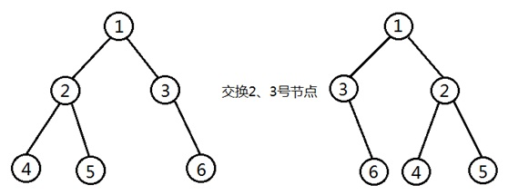
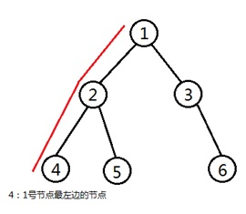

::: v-pre
> 　收集目前解决的所有代码

## 钢条切割问题

> #### 题目描述
>
> Serling公司购买长钢条,将其切割为短钢条出售.切割工序本身没有成本支出.公司管理层希望知道最佳的切割方案.假定我们知道Serling公司出售一段长为i英寸的钢条的价格为pi(i=1,2,…,单位为美元).钢条的长度均为整英寸.
>
> 给定一段长度为n英寸的钢条和一个价格表pi(i=1,2,…n),求切割钢条方案,使得销售收益rn最大.
>
> #### 关于输入
>
> 第一行:n,表示购买的长钢条的长度.
> 接下来一行包含 n 个数字,第 i 个数字出售长为 i 的钢条的价格,即 pi.
>
> 其中 0 < n <= 3000,0 < pi <= 10000.
>
> #### 关于输出
>
> 输出仅一行,为最大的销售收益值 rn.
>
> #### 例子输入
>
> ```
> 7
> 1 5 8 9 10 17 17
> ```
>
> #### 例子输出
>
> ```
> 18
> ```
>
> #### 提示信息
>
> 注意,如果长度为n英寸的钢条的价格pn足够大,最优解可能就是完全不需要切割.

```c++
#include <iostream>
#include <vector>
using namespace std;
int main() {
  int n;
  cin >> n;
  vector<int> price(n + 1, 0);
  for (int i = 1; i <= n; i++) {
    cin >> price[i];
  }
  vector<int> dp(n + 1, 0);
  dp[1] = price[1];
  for (int i = 2; i <= n; i++) {
    for (int j = 1; j < i; j++) {
      dp[i] = max(dp[i], dp[i - j] + price[j]);
    }
  }
  cout << dp[n] << endl;
  return 0;
}
```

## 木材切割

> 描述
>
> 有一根长度为n的木材(n为不大于100的正整数),要将其切割为m(0 < m < n) 段出售,每段均为正整数长度.不同长度的木材具有不同的售价p(0 < p < 100).求一个最优的切割方案,以尽可能卖出更多的钱.
>
> 
>
> 输入
>
> 第一行为n
>
> 第二行为m
>
> 第三行包含 n 个数字,第 i 个数字出售长为 i 的木材的价格,用空格隔开
>
> 输出
>
> 最大的总售价.
>
> 样例输入
>
> ```
> 7
> 2
> 1 5 8 9 10 17 17
> ```
>
> 样例输出
>
> ```
> 18
> ```

```c++
#include <iostream>
#include <vector>
using namespace std;
int main() {
  int n, m;
  cin >> n >> m;
  vector<int> price(n + 1, 0);
  for (int i = 1; i <= n; i++) {
    cin >> price[i];
  }
  vector<vector<int>> dp(m + 1, vector<int>(n + 1, 0));
  for (int i = 1; i <= n; i++) {
    dp[1][i] = price[i];
  }
  for (int i = 2; i <= m; i++) {
    for (int j = 1; j <= n; j++) {
      for (int k = 0; k < j; k++) {
        dp[i][j] = max(dp[i][j], dp[i - 1][k] + price[j - k]);
      }
    }
  }
  cout << dp[m][n] << endl;
  return 0;
}
```

## [最长递增子序列](https://leetcode.cn/problems/longest-increasing-subsequence/)

> 给你一个整数数组 `nums` ,找到其中最长严格递增子序列的长度.
>
> **子序列** 是由数组派生而来的序列,删除(或不删除)数组中的元素而不改变其余元素的顺序.例如,`[3,6,2,7]` 是数组 `[0,3,1,6,2,2,7]` 的子序列.
>
> **示例 1:**
>
> ```
> 输入:nums = [10,9,2,5,3,7,101,18]
> 输出:4
> 解释:最长递增子序列是 [2,3,7,101],因此长度为 4 .
> ```
>
> **示例 2:**
>
> ```
> 输入:nums = [0,1,0,3,2,3]
> 输出:4
> ```
>
> **示例 3:**
>
> ```
> 输入:nums = [7,7,7,7,7,7,7]
> 输出:1
> ```

```c++
class Solution {

public:
    int lengthOfLIS(vector<int>& nums) {
        vector<int> dp(nums.size(), 1); // 记录以num[i]为结尾的最长子序列的长度
        for (int i = 1; i < nums.size(); i++) {
            for (int j = 0; j < i; j++) {
                if (nums[i] > nums[j]) {
                    dp[i] = max(dp[i], dp[j] + 1);
                }
            }
        }
        return *(max_element(dp.begin(),dp.end()));
    }
};
```

## [32. 最长有效括号](https://leetcode.cn/problems/longest-valid-parentheses/)

> 给你一个只包含 `'('` 和 `')'` 的字符串,找出最长有效(格式正确且连续)括号
>
> 子串的长度. 
>
> **示例 1:**
>
> ```
> 输入:s = "(()"
> 输出:2
> 解释:最长有效括号子串是 "()"
> ```
>
> **示例 2:**
>
> ```
> 输入:s = ")()())"
> 输出:4
> 解释:最长有效括号子串是 "()()"
> ```
>
> **示例 3:**
>
> ```
> 输入:s = ""
> 输出:0
> ```
>
> 
>
> **提示:**
>
> - `0 <= s.length <= 3 * 104`
> - `s[i]` 为 `'('` 或 `')'`
> - ==转化为容易解决的形式==

```c++
class Solution {

public:
    int longestValidParentheses(string s) {
        stack<pair<char, int>> space;
        vector<int> count(s.size(), 0);
        for (int i = 0; i < s.size(); i++) {
            if (space.empty()) {
                space.push(make_pair(s[i], i));
            } else {
                if (s[i] == ')' && space.top().first == '(') {
                    count[i] = 1;
                    count[space.top().second] = 1;
                    space.pop();
                } else {
                    space.push(make_pair(s[i], i));
                }
            }
        }
        int max_count = 0, current_count = 0;
        for (int i = 0; i < s.size(); i++) {
            if (count[i] == 0) {
                max_count = max(max_count, current_count);
                current_count = 0;
            } else {
                current_count++;
            }
        }
        return max(max_count, current_count);
    }
};
```

## [AcWing 01背包问题](https://www.acwing.com/problem/content/2/)

> 有 N𝑁 件物品和一个容量是 V𝑉 的背包.每件物品只能使用一次.
>
> 第 i𝑖 件物品的体积是 vi𝑣𝑖,价值是 wi𝑤𝑖.
>
> 求解将哪些物品装入背包,可使这些物品的总体积不超过背包容量,且总价值最大.
> 输出最大价值.
>
> #### 输入格式
>
> 第一行两个整数,N,V𝑁,𝑉,用空格隔开,分别表示物品数量和背包容积.
>
> 接下来有 N𝑁 行,每行两个整数 vi,wi𝑣𝑖,𝑤𝑖,用空格隔开,分别表示第 i𝑖 件物品的体积和价值.
>
> #### 输出格式
>
> 输出一个整数,表示最大价值.
>
> #### 数据范围
>
> 0<N,V≤10000<𝑁,𝑉≤1000
> 0<vi,wi≤10000<𝑣𝑖,𝑤𝑖≤1000
>
> #### 输入样例
>
> ```
> 4 5
> 1 2
> 2 4
> 3 4
> 4 5
> ```
>
> #### 输出样例:
>
> ```
> 8
> ```

```c++

```

## [Luogu P2925干草出售](https://www.luogu.org/problemnew/show/P2925)

> 农民 John 面临一个很可怕的事,因为防范力度不大所以他存储的所有稻草都被蟑螂吃光了,他将面临没有稻草喂养奶牛的局面.在奶牛断粮之前,John 拉着他的马车到农民 Don 的农场中买一些稻草给奶牛过冬.已知 John 的马车可以装的下 𝐶(1≤𝐶≤5×104)*C*(1≤*C*≤5×104) 立方的稻草.
>
> 农民 Don 有 𝐻(1≤𝐻≤5×103)*H*(1≤*H*≤5×103) 捆体积不同的稻草可供购买,每一捆稻草有它自己的体积 𝑉𝑖(1≤𝑉𝑖≤𝐶)*V**i*(1≤*V**i*≤*C*).面对这些稻草 John 认真的计算如何充分利用马车的空间购买尽量多的稻草给他的奶牛过冬.
>
> 现在给定马车的最大容积 𝐶*C* 和每一捆稻草的体积 𝑉𝑖*V**i*,John 如何在不超过马车最大容积的情况下买到最大体积的稻草?他不可以把一捆稻草分开来买.

```c++
#include <iostream>
#include <vector>
using namespace std;
int main() {
  int c, h;
  cin >> c >> h;
  vector<int> v(h, 0);
  for (int i = 0; i < h; i++) {
    cin >> v[i];
  }
  vector<int> dp(c + 1, 0);
  for (int i = 0; i < h; i++) {
    for (int j = c; j >= v[i]; j--) {
      dp[j] = max(dp[j], dp[j - v[i]] + v[i]);
    }
  }
  cout << dp[c] << endl;
  return 0;
}
```

## [Luogu P1048 采药](https://www.luogu.org/problemnew/show/P1048)

> ## 题目描述
>
> 辰辰是个天资聪颖的孩子,他的梦想是成为世界上最伟大的医师.为此,他想拜附近最有威望的医师为师.医师为了判断他的资质,给他出了一个难题.医师把他带到一个到处都是草药的山洞里对他说:"孩子,这个山洞里有一些不同的草药,采每一株都需要一些时间,每一株也有它自身的价值.我会给你一段时间,在这段时间里,你可以采到一些草药.如果你是一个聪明的孩子,你应该可以让采到的草药的总价值最大."
>
> 如果你是辰辰,你能完成这个任务吗?
>
> ## 输入格式
>
> 第一行有 22 个整数 𝑇*T*(1≤𝑇≤10001≤*T*≤1000)和 𝑀*M*(1≤𝑀≤1001≤*M*≤100),用一个空格隔开,𝑇*T* 代表总共能够用来采药的时间,𝑀*M* 代表山洞里的草药的数目.
>
> 接下来的 𝑀*M* 行每行包括两个在 11 到 100100 之间(包括 11 和 100100)的整数,分别表示采摘某株草药的时间和这株草药的价值.
>
> ## 输出格式
>
> 输出在规定的时间内可以采到的草药的最大总价值.
>
> ## 输入输出样例
>
> **输入 #1**复制
>
> ```
> 70 3
> 71 100
> 69 1
> 1 2
> ```
>
> **输出 #1**复制
>
> ```
> 3
> ```
>
> ## 说明/提示
>
> **[数据范围]**
>
> - 对于 30%30% 的数据,𝑀≤10*M*≤10;
> - 对于全部的数据,𝑀≤100*M*≤100.

```c++

```

## [AcWing 完全背包问题](https://www.acwing.com/problem/content/3/)

> 有 N种物品和一个容量是 V的背包,每种物品都有无限件可用.
>
> 第 i种物品的体积是 vi,价值是 wi.
>
> 求解将哪些物品装入背包,可使这些物品的总体积不超过背包容量,且总价值最大.
> 输出最大价值.
>
> #### 输入格式
>
> 第一行两个整数,N,V,用空格隔开,分别表示物品种数和背包容积.
>
> 接下来有 N 行,每行两个整数 vi,wi用空格隔开,分别表示第 i种物品的体积和价值.
>
> #### 输出格式
>
> 输出一个整数,表示最大价值.
>
> #### 数据范围
>
> 0<N,V≤1000
> 0<vi,wi≤1000
>
> #### 输入样例
>
> ```
> 4 5
> 1 2
> 2 4
> 3 4
> 4 5
> ```
>
> #### 输出样例:
>
> ```
> 10
> ```

```c++
#include <algorithm>
#include <cmath>
#include <iostream>
#include <vector>

using namespace std;

int main() {
  int n, av;
  cin >> n >> av;
  vector<int> v(n, 0);
  vector<int> w(n, 0);
  for (int i = 0; i < n; i++) {
    cin >> v[i] >> w[i];
  }
  vector<int> dp(av + 1, 0);
  for (int i = 0; i < n; i++) {
    for (int j = v[i]; j <= av; j++) {
      dp[j] = max(dp[j], dp[j - v[i]] + w[i]);
    }
  }
  cout << dp[av] << endl;
  return 0;
}
```

## [Luogu P1853投资的最大效益](https://www.luogu.org/problemnew/show/P1853#sub)

==TLE==

> ## 题目背景
>
> 约翰先生获得了一大笔遗产,他暂时还用不上这一笔钱,他决定进行投资以获得更大的效益.银行工作人员向他提供了多种债券,每一种债券都能在固定的投资后,提供稳定的年利息.当然,每一种债券的投资额是不同的,一般来说,投资越大,收益也越大,而且,每一年还可以根据资金总额的增加,更换收益更大的债券.
>
> ## 题目描述
>
> 例如:有如下两种不同的债券:
>
> 1. 投资额 $4000$4000,年利息 $400$400;
> 2. 投资额 $3000$3000,年利息 $250$250.
>
> 初始时,有 $10000$10000 的总资产,可以投资两份债券 1 债券,一年获得 $800$800 的利息;而投资一份债券 1 和两份债券 2,一年可获得 $900$900 的利息,两年后,可获得 $1800$1800 的利息;而所有的资产达到 $11800$11800,然后将卖掉一份债券 2,换购债券 1,年利息可达到 $1050$1050;第三年后,总资产达到 $12850$12850,可以购买三份债券 1,年利息可达到 $1200$1200,第四年后,总资产可达到 $14050$14050.
>
> 现给定若干种债券,最初的总资产,帮助约翰先生计算,经过 𝑛*n* 年的投资,总资产的最大值.
>
> ## 输入格式
>
> 第一行为三个正整数 𝑠,𝑛,𝑑*s*,*n*,*d*,分别表示最初的总资产,年数和债券的种类.
>
> 接下来 𝑑*d* 行,每行表示一种债券,两个正整数 𝑎,𝑏*a*,*b* 分别表示债券的投资额和年利息.
>
> ## 输出格式
>
> 仅一个整数,表示 𝑛*n* 年后的最大总资产.
>
> ## 输入输出样例
>
> **输入 #1**复制
>
> ```
> 10000 4 2
> 4000 400
> 3000 250
> ```
>
> **输出 #1**复制
>
> ```
> 14050
> ```
>
> ## 说明/提示
>
> 对于 100%100% 的数据,1≤𝑠≤1061≤*s*≤106,2≤𝑛≤402≤*n*≤40,1≤𝑑≤101≤*d*≤10,1≤𝑎≤1041≤*a*≤104,且 𝑎*a* 是 10001000 的倍数,𝑏*b* 不超过 𝑎*a* 的 10%10%.

```c++
#include <algorithm>
#include <cmath>
#include <iostream>
#include <vector>

using namespace std;

int main() {
  int amount, year, kind;
  cin >> amount >> year >> kind;

  vector<int> cost(kind, 0);
  vector<int> reward(kind, 0);

  for (int i = 0; i < kind; i++) {
    cin >> cost[i] >> reward[i];
  }
  while (year--) {
    vector<int> dp(amount + 1, 0);
    for (int i = 0; i < kind; i++) {
      for (int j = cost[i]; j <= amount; j++) {
        dp[j] = max(dp[j], dp[j - cost[i]] + reward[i]);
      }
    }
    amount += dp[amount];
  }
  cout << amount << endl;
  return 0;
}
```

## [Luogu P1776宝物筛选](https://www.luogu.org/problemnew/show/P1776)

> ## 题目描述
>
> 终于,破解了千年的难题.小 FF 找到了王室的宝物室,里面堆满了无数价值连城的宝物.
>
> 这下小 FF 可发财了,嘎嘎.但是这里的宝物实在是太多了,小 FF 的采集车似乎装不下那么多宝物.看来小 FF 只能含泪舍弃其中的一部分宝物了.
>
> 小 FF 对洞穴里的宝物进行了整理,他发现每样宝物都有一件或者多件.他粗略估算了下每样宝物的价值,之后开始了宝物筛选工作:小 FF 有一个最大载重为 𝑊*W* 的采集车,洞穴里总共有 𝑛*n* 种宝物,每种宝物的价值为 𝑣𝑖*v**i*,重量为 𝑤𝑖*w**i*,每种宝物有 𝑚𝑖*m**i* 件.小 FF 希望在采集车不超载的前提下,选择一些宝物装进采集车,使得它们的价值和最大.
>
> ## 输入格式
>
> 第一行为一个整数 𝑛*n* 和 𝑊*W*,分别表示宝物种数和采集车的最大载重.
>
> 接下来 𝑛*n* 行每行三个整数 𝑣𝑖,𝑤𝑖,𝑚𝑖*v**i*,*w**i*,*m**i*.
>
> ## 输出格式
>
> 输出仅一个整数,表示在采集车不超载的情况下收集的宝物的最大价值.
>
> ## 输入输出样例
>
> **输入**
>
> ```
> 4 20
> 3 9 3
> 5 9 1
> 9 4 2
> 8 1 3
> ```
>
> **输出**
>
> ```
> 47
> ```
>
> ## 说明/提示
>
> 对于 30%30% 的数据,𝑛≤∑𝑚𝑖≤104*n*≤∑*m**i*≤104,0≤𝑊≤1030≤*W*≤103.
>
> 对于 100%100% 的数据,𝑛≤∑𝑚𝑖≤105*n*≤∑*m**i*≤105,0≤𝑊≤4×1040≤*W*≤4×104,1≤𝑛≤1001≤*n*≤100.

```c++
#include <iostream>
#include <vector>
using namespace std;
int main() {
  int w, n;
  cin >> n >> w;
  vector<int> weight(n, 0);
  vector<int> value(n, 0);
  vector<int> number(n, 0);
  vector<int> dp(w + 1, 0);
  for (int i = 0; i < n; i++) {
    cin >> value[i] >> weight[i] >> number[i];
  }
  for (int i = 0; i < n; i++) {
    int k = 1, an = number[i];
    int t_weight = k * weight[i], t_value = k * value[i];
    while (k < an) { // 二进制逼近
      t_weight = k * weight[i], t_value = k * value[i];
      for (int l = w; l >= t_weight; l--) {
        dp[l] = max(dp[l], dp[l - t_weight] + t_value);
      }
      an = an - k;
      k *= 2;
    }
    t_weight = an * weight[i], t_value = an * value[i];
    for (int l = w; l >= t_weight; l--) {
      dp[l] = max(dp[l], dp[l - t_weight] + t_value);
    }
  }
  cout << dp[w] << endl;
  return 0;
}
```

## [Ⅰ(普通多重背包)](https://www.acwing.com/problem/content/4/)

> 有 N种物品和一个容量是 V 的背包.
>
> 第 i𝑖 种物品最多有 si件,每件体积是 vi,价值是 wi.
>
> 求解将哪些物品装入背包,可使物品体积总和不超过背包容量,且价值总和最大.
> 输出最大价值.
>
> #### 输入格式
>
> 第一行两个整数,N,V,𝑉,用空格隔开,分别表示物品种数和背包容积.
>
> 接下来有 N 行,每行三个整数 vi,wi,si用空格隔开,分别表示第 i𝑖 种物品的体积,价值和数量.
>
> #### 输出格式
>
> 输出一个整数,表示最大价值.
>
> #### 数据范围
>
> 0<N,V≤100
> 0<vi,wi,si≤100
>
> #### 输入样例
>
> ```
> 4 5
> 1 2 3
> 2 4 1
> 3 4 3
> 4 5 2
> ```
>
> #### 输出样例:
>
> ```
> 10
> ```

```c++

```

## [Ⅱ(二进制优化)](https://www.acwing.com/problem/content/5/)

> 有 N𝑁 种物品和一个容量是 V𝑉 的背包.
>
> 第 i𝑖 种物品最多有 si件,每件体积是 vi,价值是 wi.
>
> 求解将哪些物品装入背包,可使物品体积总和不超过背包容量,且价值总和最大.
> 输出最大价值.
>
> #### 输入格式
>
> 第一行两个整数,N,V,𝑉,用空格隔开,分别表示物品种数和背包容积.
>
> 接下来有 N 行,每行三个整数 $vi,wi,si$用空格隔开,分别表示第 i 种物品的体积,价值和数量.
>
> #### 输出格式
>
> 输出一个整数,表示最大价值.
>
> #### 数据范围
>
> $0<N≤1000$
> $0<V≤2000$
> $0<vi,wi,si≤20000$
>
> ##### 提示:
>
> 本题考查多重背包的二进制优化方法.
>
> #### 输入样例
>
> ```
> 4 5
> 1 2 3
> 2 4 1
> 3 4 3
> 4 5 2
> ```
>
> #### 输出样例:
>
> ```
> 10
> ```

```c++

```

## [Ⅲ(单调队列优化)](https://www.acwing.com/problem/content/6/)

> 有 N𝑁 种物品和一个容量是 V𝑉 的背包.
>
> 第 i𝑖 种物品最多有 si𝑠𝑖 件,每件体积是 vi𝑣𝑖,价值是 wi𝑤𝑖.
>
> 求解将哪些物品装入背包,可使物品体积总和不超过背包容量,且价值总和最大.
> 输出最大价值.
>
> #### 输入格式
>
> 第一行两个整数,N,V(0<N≤1000, 0<V≤20000),用空格隔开,分别表示物品种数和背包容积.
>
> 接下来有 N𝑁 行,每行三个整数 vi,wi,si,用空格隔开,分别表示第 i 种物品的体积,价值和数量.
>
> #### 输出格式
>
> 输出一个整数,表示最大价值.
>
> #### 数据范围
>
> 0<N≤1000
> 0<V≤20000
> 0<vi,wi,si≤20000
>
> ##### 提示
>
> 本题考查多重背包的单调队列优化方法.
>
> #### 输入样例
>
> ```
> 4 5
> 1 2 3
> 2 4 1
> 3 4 3
> 4 5 2
> ```
>
> #### 输出样例:
>
> ```
> 10
> ```

```c++

```

## [AcWing 混合背包问题](https://www.acwing.com/problem/content/7/)

> 有 N𝑁 种物品和一个容量是 V𝑉 的背包.
>
> 物品一共有三类:
>
> - 第一类物品只能用1次(01背包);
> - 第二类物品可以用无限次(完全背包);
> - 第三类物品最多只能用 si 次(多重背包);
>
> 每种体积是 vi,价值是 wi.
>
> 求解将哪些物品装入背包,可使物品体积总和不超过背包容量,且价值总和最大.
> 输出最大价值.
>
> #### 输入格式
>
> 第一行两个整数,N,V用空格隔开,分别表示物品种数和背包容积.
>
> 接下来有 N𝑁 行,每行三个整数 vi,wi,si用空格隔开,分别表示第 i𝑖 种物品的体积,价值和数量.
>
> - si=−1 表示第 i种物品只能用1次;
> - si=0 表示第 i种物品可以用无限次;
> - si>0 表示第 i 种物品可以使用 si 次;
>
> #### 输出格式
>
> 输出一个整数,表示最大价值.
>
> #### 数据范围
>
> 0<N,V≤1000
> 0<vi,wi≤1000
> −1≤si≤1000
>
> #### 输入样例
>
> ```
> 4 5
> 1 2 -1
> 2 4 1
> 3 4 0
> 4 5 2
> ```
>
> #### 输出样例:
>
> ```
> 8
> ```

```c++
#include <iostream>
#include <vector>
using namespace std;

int main() {
  int n, v;
  cin >> n >> v;
  vector<int> cost(n, 0);
  vector<int> value(n, 0);
  vector<int> number(n, 0);
  vector<int> dp(v + 1, 0);

  for (int i = 0; i < n; i++) {
    cin >> cost[i] >> value[i] >> number[i];
  }

  for (int i = 0; i < n; i++) {
    if (number[i] == -1) { // 01背包
      for (int j = v; j >= cost[i]; j--) {
        dp[j] = max(dp[j], dp[j - cost[i]] + value[i]);
      }
    } else if (number[i] == 0) { // 完全背包
      for (int j = cost[i]; j <= v; j++) {
        dp[j] = max(dp[j], dp[j - cost[i]] + value[i]);
      }
    } else { // 多重背包
      int k = 1, an = number[i];
      int t_cost = k * cost[i], t_value = k * value[i];
      while (k < an) {
        t_cost = k * cost[i], t_value = k * value[i];
        for (int l = v; l >= t_cost; l--) {
          dp[l] = max(dp[l], dp[l - t_cost] + t_value);
        }
        an = an - k;
        k *= 2;
      }
      t_cost = an * cost[i], t_value = an * value[i];
      for (int l = v; l >= t_cost; l--) {
        dp[l] = max(dp[l], dp[l - t_cost] + t_value);
      }
    }
  }

  cout << dp[v] << endl;
  return 0;
}
```

## [Luogu P1833樱花](https://www.luogu.org/problemnew/show/P1833)

> ## 题目背景
>
> <爱与愁的故事第四弹.plant>第一章.
>
> ## 题目描述
>
> 爱与愁大神后院里种了 𝑛*n* 棵樱花树,每棵都有美学值 𝐶𝑖(0≤𝐶𝑖≤200)*C**i*(0≤*C**i*≤200).爱与愁大神在每天上学前都会来赏花.爱与愁大神可是生物学霸,他懂得如何欣赏樱花:一种樱花树看一遍过,一种樱花树最多看 𝑃𝑖(0≤𝑃𝑖≤100)*P**i*(0≤*P**i*≤100) 遍,一种樱花树可以看无数遍.但是看每棵樱花树都有一定的时间 𝑇𝑖(0≤𝑇𝑖≤100)*T**i*(0≤*T**i*≤100).爱与愁大神离去上学的时间只剩下一小会儿了.求解看哪几棵樱花树能使美学值最高且爱与愁大神能准时(或提早)去上学.
>
> ## 输入格式
>
> 共 𝑛+1*n*+1行:
>
> 第 11 行:现在时间 𝑇𝑠*T**s*(几时:几分),去上学的时间 𝑇𝑒*T**e*(几时:几分),爱与愁大神院子里有几棵樱花树 𝑛*n*.这里的 𝑇𝑠*T**s*,𝑇𝑒*T**e* 格式为:`hh:mm`,其中 0≤ℎℎ≤230≤*h**h*≤23,0≤𝑚𝑚≤590≤*m**m*≤59,且 ℎℎ,𝑚𝑚,𝑛*h**h*,*m**m*,*n* 均为正整数.
>
> 第 22 行到第 𝑛+1*n*+1 行,每行三个正整数:看完第 𝑖*i* 棵树的耗费时间 𝑇𝑖*T**i*,第 𝑖*i* 棵树的美学值 𝐶𝑖*C**i*,看第 𝑖*i* 棵树的次数 𝑃𝑖*P**i*(𝑃𝑖=0*P**i*=0 表示无数次,𝑃𝑖*P**i* 是其他数字表示最多可看的次数 𝑃𝑖*P**i*).
>
> ## 输出格式
>
> 只有一个整数,表示最大美学值.
>
> ## 输入输出样例
>
> **输入 #1**复制
>
> ```
> 6:50 7:00 3
> 2 1 0
> 3 3 1
> 4 5 4
> ```
>
> **输出 #1**复制
>
> ```
> 11
> ```
>
> ## 说明/提示
>
> 100%100% 数据:𝑇𝑒−𝑇𝑠≤1000*T**e*−*T**s*≤1000(即开始时间距离结束时间不超过 10001000 分钟),𝑛≤10000*n*≤10000.保证 𝑇𝑒,𝑇𝑠*T**e*,*T**s* 为同一天内的时间.
>
> 样例解释:赏第一棵樱花树一次,赏第三棵樱花树 22 次.

```c++
#include <iostream>
#include <sstream>
#include <vector>
using namespace std;

int main() {
  int h1, h2, m1, m2, t;
  char a1, a2;
  cin >> h1 >> a1 >> m1;
  cin >> h2 >> a2 >> m2;
  t = h2 * 60 + m2 - (h1 * 60 + m1);

  int n;
  cin >> n;
  vector<int> cost(n, 0);
  vector<int> value(n, 0);
  vector<int> number(n, 0);
  vector<int> dp(t + 1, 0);

  for (int i = 0; i < n; i++) {
    cin >> cost[i] >> value[i] >> number[i];
  }

  for (int i = 0; i < n; i++) {
    if (number[i]) {
      for (int j = t; j >= 0; j--) {
        for (int k = 0; k <= number[i]; k++) {
          if (j >= k * cost[i]) {
            dp[j] = max(dp[j], dp[j - k * cost[i]] + value[i] * k);
          }
        }
      }
    } else {
      for (int j = t; j >= 0; j--) {
        for (int k = 0; k <= j / cost[i]; k++) {
          if (j >= k * cost[i]) {
            dp[j] = max(dp[j], dp[j - k * cost[i]] + value[i] * k);
          }
        }
      }
    }
  }

  cout << dp[t] << endl; // 输出最终最大美学值
  return 0;
}
```

## [AcWing二维费用的背包问题](https://www.acwing.com/problem/content/8/)

> 有 N𝑁 件物品和一个容量是 V𝑉 的背包,背包能承受的最大重量是 M𝑀.
>
> 每件物品只能用一次.体积是 vi𝑣𝑖,重量是 mi𝑚𝑖,价值是 wi𝑤𝑖.
>
> 求解将哪些物品装入背包,可使物品总体积不超过背包容量,总重量不超过背包可承受的最大重量,且价值总和最大.
> 输出最大价值.
>
> #### 输入格式
>
> 第一行三个整数,N,V,M𝑁,𝑉,𝑀,用空格隔开,分别表示物品件数,背包容积和背包可承受的最大重量.
>
> 接下来有 N𝑁 行,每行三个整数 vi,mi,wi𝑣𝑖,𝑚𝑖,𝑤𝑖,用空格隔开,分别表示第 i𝑖 件物品的体积,重量和价值.
>
> #### 输出格式
>
> 输出一个整数,表示最大价值.
>
> #### 数据范围
>
> 0<N≤10000<𝑁≤1000
> 0<V,M≤1000<𝑉,𝑀≤100
> 0<vi,mi≤1000<𝑣𝑖,𝑚𝑖≤100
> 0<wi≤10000<𝑤𝑖≤1000
>
> #### 输入样例
>
> ```
> 4 5 6
> 1 2 3
> 2 4 4
> 3 4 5
> 4 5 6
> ```
>
> #### 输出样例:
>
> ```
> 8
> ```

```c++
#include <iostream>
#include <vector>
using namespace std;

int main() {
  int n, av, am;
  cin >> n >> av >> am;
  vector<int> v(n, 0), m(n, 0), w(n, 0);
  for (int i = 0; i < n; i++) {
    cin >> v[i] >> m[i] >> w[i];
  }
  vector<vector<int>> dp(av + 1, vector<int>(am + 1, 0));
  for (int i = 0; i < n; i++) {
    for (int j = av; j >= v[i]; j--) {
      for (int k = am; k >= m[i]; k--) {
        dp[j][k] = max(dp[j][k], dp[j - v[i]][k - m[i]] + w[i]);
      }
    }
  }
  cout << dp[av][am] << endl;
  return 0;
}
```


## [Luogu 1507 NASA的食物计划](https://www.luogu.org/problemnew/show/P1507)

> ## 题目背景
>
> NASA(美国航空航天局)因为航天飞机的隔热瓦等其他安全技术问题一直大伤脑筋,因此在各方压力下终止了航天飞机的历史,但是此类事情会不会在以后发生,谁也无法保证.所以,在遇到这类航天问题时,也许只能让航天员出仓维修.但是过多的维修会消耗航天员大量的能量,因此 NASA 便想设计一种食品方案,使体积和承重有限的条件下多装载一些高卡路里的食物.
>
> ## 题目描述
>
> 航天飞机的体积有限,当然如果载过重的物品,燃料会浪费很多钱,每件食品都有各自的体积,质量以及所含卡路里.在告诉你体积和质量的最大值的情况下,请输出能达到的食品方案所含卡路里的最大值,当然每个食品只能使用一次.
>
> ## 输入格式
>
> 第一行 22 个整数,分别代表体积最大值 ℎ*h* 和质量最大值 𝑡*t*.
>
> 第二行 11 个整数代表食品总数 𝑛*n*.
>
> 接下来 𝑛*n* 行每行 33 个数 体积 ℎ𝑖*h**i*,质量 𝑡𝑖*t**i*,所含卡路里 𝑘𝑖*k**i*.
>
> ## 输出格式
>
> 一个数,表示所能达到的最大卡路里(`int` 范围内)
>
> ## 输入输出样例
>
> **输入 #1**复制
>
> ```
> 320 350
> 4
> 160 40 120
> 80 110 240
> 220 70 310
> 40 400 220
> ```
>
> **输出 #1**复制
>
> ```
> 550
> ```
>
> ## 说明/提示
>
> 对于 100%100% 的数据,ℎ,𝑡,ℎ𝑖,𝑡𝑖≤400*h*,*t*,*h**i*,*t**i*≤400,𝑛≤50*n*≤50,𝑘𝑖≤500*k**i*≤500.

```c++
#include <iostream>
#include <vector>
using namespace std;

int main() {
  int n, av, am;
  cin >> av >> am;
  cin >> n;
  vector<int> v(n, 0), m(n, 0), w(n, 0);
  for (int i = 0; i < n; i++) {
    cin >> v[i] >> m[i] >> w[i];
  }
  vector<vector<int>> dp(av + 1, vector<int>(am + 1, 0));
  for (int i = 0; i < n; i++) {
    for (int j = av; j >= v[i]; j--) {
      for (int k = am; k >= m[i]; k--) {
        dp[j][k] = max(dp[j][k], dp[j - v[i]][k - m[i]] + w[i]);
      }
    }
  }
  cout << dp[av][am] << endl;
  return 0;
}
```

## [AcWing分组背包问题](https://www.acwing.com/problem/content/description/9/)

> 有 N𝑁 组物品和一个容量是 V𝑉 的背包.
>
> 每组物品有若干个,同一组内的物品最多只能选一个.
> 每件物品的体积是 vij𝑣𝑖𝑗,价值是 wij𝑤𝑖𝑗,其中 i𝑖 是组号,j𝑗 是组内编号.
>
> 求解将哪些物品装入背包,可使物品总体积不超过背包容量,且总价值最大.
>
> 输出最大价值.
>
> #### 输入格式
>
> 第一行有两个整数 N,V𝑁,𝑉,用空格隔开,分别表示物品组数和背包容量.
>
> 接下来有 N𝑁 组数据:
>
> - 每组数据第一行有一个整数 Si𝑆𝑖,表示第 i𝑖 个物品组的物品数量;
> - 每组数据接下来有 Si𝑆𝑖 行,每行有两个整数 vij,wij𝑣𝑖𝑗,𝑤𝑖𝑗,用空格隔开,分别表示第 i𝑖 个物品组的第 j𝑗 个物品的体积和价值;
>
> #### 输出格式
>
> 输出一个整数,表示最大价值.
>
> #### 数据范围
>
> 0<N,V≤1000<𝑁,𝑉≤100
> 0<Si≤1000<𝑆𝑖≤100
> 0<vij,wij≤1000<𝑣𝑖𝑗,𝑤𝑖𝑗≤100
>
> #### 输入样例
>
> ```
> 3 5
> 2
> 1 2
> 2 4
> 1
> 3 4
> 1
> 4 5
> ```
>
> #### 输出样例:
>
> ```
> 8
> ```

```c++
#include <iostream>
#include <vector>
using namespace std;
int main() {
  int m, n;
  cin >> n >> m;
  vector<int> weight;
  vector<int> value;
  vector<int> group;
  vector<vector<int>> index(101, vector<int>());
  vector<int> dp(m + 1, 0);
  for (int i = 1; i <= n; i++) {
    int temp;
    cin >> temp;
    for (int j = 0; j < temp; j++) {
      int a, b;
      cin >> a >> b;
      weight.push_back(a);
      value.push_back(b);
      group.push_back(i);
      index[i].push_back(group.size() - 1);
    }
  }
  for (int i = 1; i <= 100; i++) {
    for (int j = m; j >= 0; j--) {
      for (int k = 0; k < index[i].size(); k++) {
        if (j >= weight[index[i][k]]) {
          dp[j] = max(dp[j], dp[j - weight[index[i][k]]] + value[index[i][k]]);
        }
      }
    }
  }
  cout << dp[m] << endl;
  return 0;
}
```

## [Luogu P1757通天之分组背包](https://www.luogu.org/problemnew/show/P1757#sub)

> ## 题目背景
>
> 直达通天路.小 A 历险记第二篇
>
> ## 题目描述
>
> 自 0101 背包问世之后,小 A 对此深感兴趣.一天,小 A 去远游,却发现他的背包不同于 0101 背包,他的物品大致可分为 𝑘*k* 组,每组中的物品相互冲突,现在,他想知道最大的利用价值是多少.
>
> ## 输入格式
>
> 两个数 𝑚,𝑛*m*,*n*,表示一共有 𝑛*n* 件物品,总重量为 𝑚*m*.
>
> 接下来 𝑛*n* 行,每行 33 个数 𝑎𝑖,𝑏𝑖,𝑐𝑖*a**i*,*b**i*,*c**i*,表示物品的重量,利用价值,所属组数.
>
> ## 输出格式
>
> 一个数,最大的利用价值.
>
> ## 输入输出样例
>
> **输入 #1**
>
> ```
> 45 3
> 10 10 1
> 10 5 1
> 50 400 2
> ```
>
> **输出 #1**
>
> ```
> 10
> ```
>
> ## 说明/提示
>
> 0≤𝑚≤10000≤*m*≤1000,1≤𝑛≤10001≤*n*≤1000,1≤𝑘≤1001≤*k*≤100,𝑎𝑖,𝑏𝑖,𝑐𝑖*a**i*,*b**i*,*c**i* 在 `int` 范围内.

```c++
#include <iostream>
#include <vector>
using namespace std;
int main() {
  int m, n;
  cin >> m >> n;
  vector<int> weight(n, 0);
  vector<int> value(n, 0);
  vector<int> group(n, 0);
  vector<vector<int>> index(101, vector<int>());
  vector<int> dp(m + 1, 0);
  for (int i = 0; i < n; i++) {
    cin >> weight[i] >> value[i] >> group[i];
    index[group[i]].push_back(i);
  }
  for (int i = 1; i <= 100; i++) {
    for (int j = m; j >= 0; j--) {
      for (int k = 0; k < index[i].size(); k++) {
        if (j >= weight[index[i][k]]) {
          dp[j] = max(dp[j], dp[j - weight[index[i][k]]] + value[index[i][k]]);
        }
      }
    }
  }
  cout << dp[m] << endl;
  return 0;
}
```

## [OpenJudge - 2806:公共子序列](http://bailian.openjudge.cn/practice/2806)

> - 总时间限制: 
>
>   1000ms
>
> - 内存限制: 
>
>   65536kB
>
> - 描述
>
>   我们称序列Z = < z1, z2, ..., zk >是序列X = < x1, x2, ..., xm >的子序列当且仅当存在 **严格上升** 的序列< i1, i2, ..., ik >,使得对j = 1, 2, ... ,k, 有xij = zj.比如Z = < a, b, f, c > 是X = < a, b, c, f, b, c >的子序列.  现在给出两个序列X和Y,你的任务是找到X和Y的最大公共子序列,也就是说要找到一个最长的序列Z,使得Z既是X的子序列也是Y的子序列. 
>
> - 输入
>
>   输入包括多组测试数据.每组数据包括一行,给出两个长度不超过200的字符串,表示两个序列.两个字符串之间由若干个空格隔开.
>
> - 输出
>
>   对每组输入数据,输出一行,给出两个序列的最大公共子序列的长度.
>
> - 样例输入
>
>   `abcfbc         abfcab`
>
>   ` programming    contest` 
>
>    `abcd           mnp `
>
> - 样例输出
>
>   `4 2 0 `
>
> - 来源
>
>   翻译自Southeastern Europe 2003的试题

```c++
#include <stdio.h>
#include <string.h>
#define MAX_LEN 1000
char sz1[MAX_LEN];
char sz2[MAX_LEN];
int aMaxLen[MAX_LEN][MAX_LEN];

int main() {
  while (scanf("%s%s", sz1 + 1, sz2 + 1) > 0) {
    int nLength1 = strlen(sz1 + 1);
    int nLength2 = strlen(sz2 + 1);
    int nTmp;
    int i, j;
    for (i = 0; i <= nLength1; i++)
      aMaxLen[i][0] = 0;
    for (j = 0; j <= nLength2; j++)
      aMaxLen[0][j] = 0;
    for (i = 1; i <= nLength1; i++) {
      for (j = 1; j <= nLength2; j++) {
        if (sz1[i] == sz2[j])
          aMaxLen[i][j] = aMaxLen[i - 1][j - 1] + 1;
        else {
          int nLen1 = aMaxLen[i][j - 1];
          int nLen2 = aMaxLen[i - 1][j];
          if (nLen1 > nLen2)
            aMaxLen[i][j] = nLen1;
          else
            aMaxLen[i][j] = nLen2;
        }
      }
    }
    printf("%d\n", aMaxLen[nLength1][nLength2]);
  }
  return 0;
}
```

## [704. 二分查找](https://leetcode.cn/problems/binary-search/)

> 给定一个 `n` 个元素有序的(升序)整型数组 `nums` 和一个目标值 `target` ,写一个函数搜索 `nums` 中的 `target`,如果目标值存在返回下标,否则返回 `-1`.
>
>
> **示例 1:**
>
> ```
> 输入: nums = [-1,0,3,5,9,12], target = 9
> 输出: 4
> 解释: 9 出现在 nums 中并且下标为 4
> ```
>
> **示例 2:**
>
> ```
> 输入: nums = [-1,0,3,5,9,12], target = 2
> 输出: -1
> 解释: 2 不存在 nums 中因此返回 -1
> ```
>
> 
>
> **提示:**
>
> 1. 你可以假设 `nums` 中的所有元素是不重复的.
> 2. `n` 将在 `[1, 10000]`之间.
> 3. `nums` 的每个元素都将在 `[-9999, 9999]`之间.

```c++
class Solution {
public:
    int search(vector<int>& nums, int target) {
        int left = 0, right = nums.size() - 1;
        while (left <= right) {
            int middle = left + (right - left) / 2;
            if (target > nums[middle]) {
                left = middle + 1;
            } else if (target < nums[middle]) {
                right = middle - 1;
            } else {
                return middle;
            }
        }
        return -1;
    }
};
```

```c++
class Solution {
public:
    int search(vector<int>& nums, int target) {
        int left = 0, right = nums.size();
        while (left < right) {
            int middle = left + (right - left) >> 1;
            if (target > nums[middle]) {
                left = middle + 1;
            } else if (target < nums[middle]) {
                right = middle;
            } else {
                return middle;
            }
        }
        return -1;
    }
};
```

- `left`,`right`的设置取决于你的**合法区间**的设置
  - 如果是闭区间,使用`int left = 0, right = nums.size() - 1;`
  - 如果是左闭右开区间,使用`int left = 0, right = nums.size();`
- `while`的条件判断取`<`还是`<=`和上面的条件要求一致,如果可以取等即代表使用了**闭区间**
- `>>`和`<<`可能会被忽视,但是后面可以用于**状态压缩**
- 要注意所有的分支都应当返回结果
- 注意在`middle`的计算中出现了**加法**运算,要避免数据超出`int`所表示的范围(c++/c)

```python
class Solution:
    def search(self, nums: List[int], target: int) -> int:
        left = 0
        right = len(nums) - 1
        while left <= right:
            middle = left + (right - left) // 2
            if target > nums[middle]:
                left = middle + 1
            elif target < nums[middle]:
                right = middle - 1
            else:
                return middle
        return -1
```

- `python`要注意缩进
- 因为`python`中数据的隐式转换更加智能,所以注意区分`/`和`//`的区别,防止得出的数据不是自己想要的数据类型
  - `/`是浮点数除法
  - `//`为整数除法(与c++一致)

## [35. 搜索插入位置](https://leetcode.cn/problems/search-insert-position/)

> 给定一个排序数组和一个目标值,在数组中找到目标值,并返回其索引.如果目标值不存在于数组中,返回它将会被按顺序插入的位置.
>
> 请必须使用时间复杂度为 `O(log n)` 的算法.
>
> 
>
> **示例 1:**
>
> ```
> 输入: nums = [1,3,5,6], target = 5
> 输出: 2
> ```
>
> **示例 2:**
>
> ```
> 输入: nums = [1,3,5,6], target = 2
> 输出: 1
> ```
>
> **示例 3:**
>
> ```
> 输入: nums = [1,3,5,6], target = 7
> 输出: 4
> ```
>
> 
>
> **提示:**
>
> - `1 <= nums.length <= 10^4`
> - `-10^4 <= nums[i] <= 10^4`
> - `nums` 为 **无重复元素** 的 **升序** 排列数组
> - `-10^4 <= target <= 10^4`

```c++
class Solution {
public:
    int searchInsert(vector<int>& nums, int target) {
        int left = 0, right = nums.size() - 1;
        while (left <= right) {
            int middle = (left + right) >> 1;
            if (target > nums[middle]) { // 目标值在右区间
                left = middle + 1;
            } else if (target < nums[middle]) { // 目标值在左区间
                right = middle - 1;
            } else {
                return middle; // 目标值在中间
            }
        }
        return left; //目标值不在区间之内
        // 在所有元素之前 ==> 0 ==> 一直更新右边界 ==> left
        // 在所有元素之后 ==> num.size() ==> 一直更新左边界 ==> left
        // 在元素集合内部 ==> 更新左右边界,但是不断趋向于目标值,直到left和right翻转 ==> left 
        
    }
};
```

```python
class Solution:
    def searchInsert(self, nums: List[int], target: int) -> int:
        left = 0
        right = len(nums) - 1
        while left <= right:
            middle = (left + right) // 2
            if nums[middle] < target:
                left = middle + 1
            elif nums[middle] > target:
                right = middle - 1
            else:
                return middle
        return left
```

- 和一般的**二分查找**没有太大区别,主要在于没有找到时的返回值上:二分查找会不断靠近目标值,停止的位置便是数据应当插入的位置,`left`在变化中会转移到`right`的后面,恰好是目标位置

- 暴力解法是直接遍历数组,没有什么技术含量

## [34. 在排序数组中查找元素的第一个和最后一个位置](https://leetcode.cn/problems/find-first-and-last-position-of-element-in-sorted-array/)

> 给你一个按照非递减顺序排列的整数数组 `nums`,和一个目标值 `target`.请你找出给定目标值在数组中的开始位置和结束位置.
>
> 如果数组中不存在目标值 `target`,返回 `[-1, -1]`.
>
> 你必须设计并实现时间复杂度为 `O(log n)` 的算法解决此问题.
>
> **示例 1:**
>
> ```
> 输入:nums = [5,7,7,8,8,10], target = 8
> 输出:[3,4]
> ```
>
> **示例 2:**
>
> ```
> 输入:nums = [5,7,7,8,8,10], target = 6
> 输出:[-1,-1]
> ```
>
> **示例 3:**
>
> ```
> 输入:nums = [], target = 0
> 输出:[-1,-1]
> ```
>
> **提示:**
>
> - `0 <= nums.length <= 105`
> - `-109 <= nums[i] <= 109`
> - `nums` 是一个非递减数组
> - `-109 <= target <= 109`

```c++
class Solution {
public:
    vector<int> searchRange(vector<int>& nums, int target) {
        int left = 0, right = nums.size() - 1;
        int middle, point = -1;
        bool flag = false; // 找到目标数据则为true
        vector<int> ans(2, -1);
        while (left <= right) {
            middle = (right + left) / 2;
            if (target > nums[middle]) {
                left = middle + 1;
            } else if (target < nums[middle]) {
                right = middle - 1;
            } else {
                point = middle;
                flag = true;
                break;
            }
        }
        // 找到之后向左右延伸,这里使用了for循环来寻找,当然也可以使用while循环
        if (flag) {
            for (int i = point; i < nums.size(); i++) {
                if (nums[i] == target) {
                    right = i;
                    continue;
                } else {
                    break;
                }
            }
            ans[1] = right;
            for (int i = point; i >= 0; i--) {
                if (nums[i] == target) {
                    left = i;
                    continue;
                } else {
                    break;
                }
            }
            ans[0] = left;
        }
        return ans;
    }
};
```

```python
class Solution:
    def searchRange(self, nums: List[int], target: int) -> List[int]:
        length = len(nums)
        left = 0
        right = length - 1
        point = 0
        flag = False
        ans = [-1, -1]
        while left <= right:
            middle = left + (right - left) // 2
            if target > nums[middle]:
                left = middle + 1
            elif target < nums[middle]:
                right = middle - 1
            else:
                ans[0] = ans[1] = middle
                flag = True
                break
        # while循环版
        if flag:
            while ans[1] < length - 1:
                if nums[ans[1] + 1] == target:
                    ans[1] += 1
                else:
                    break
            while ans[0] > 0:
                if nums[ans[0] - 1] == target:
                    ans[0] -= 1
                else:
                    break
        return ans
```

- 此种做法采用**二分查找**的思路找到一个目标值,然后向左右**延伸**(延伸的逻辑可以使用`for`循环或者`while`循环)
- 但如果想要更加**直接**的找到两个边界`leftwall`和`rightwall`,则需要仔细思考循环过程**更新边界值**的逻辑
  - 一个在**二分查找**中普遍的现象是`left`会不断向右,(如果没有在循环内部终止)直至大于`right`,`right`会不断向左,直至小于`left`
  - 则`left`和`right`终止的位置会在目标值的两侧,也就是**未经处理的边界**
  - 一个数组会有以下三种情况
    - 目标值大于或小于全体数据 ==> 对应的一侧`leftwall`或`rightwall`不被更新
    - 目标值在数组中没有出现 ==> `leftwall`或`rightwall`的差值小于1
    - 目标值出现 ==> `leftwall`或`rightwall`一个指向目标片段的前方,一个指向后方(不包含该元素)

```c++
class Solution {
private:
    int searchRightWall(vector<int>& nums, int target) {
        int left = 0, right = nums.size() - 1;
        int rightwall = -2;
        while (left <= right) {
            int middle = left + ((right - left) >> 1);
            if (nums[middle] > target) {
                right = middle - 1;
            } else {
                left = middle + 1;
                rightwall = left;
            }
        }
        return rightwall;
    }
    int searchLeftWall(vector<int>& nums, int target) {
        int left = 0, right = nums.size() - 1;
        int leftwall = -2;
        while (left <= right) {
            int middle = left + ((right - left) >> 1);
            if (nums[middle] >= target) {
                right = middle - 1;
                leftwall = right;
            } else {
                left = middle + 1;
            }
        }
        return leftwall;
    }

public:
    vector<int> searchRange(vector<int>& nums, int target) {
        int leftwall = searchLeftWall(nums, target),
            rightwall = searchRightWall(nums, target);
        if (rightwall == -2 || leftwall == -2) {
            return {-1, -1};
        }
        if (rightwall - leftwall > 1) {
            return {leftwall + 1, rightwall - 1};
        }
        return {-1, -1};
    }
};
```

```python
class Solution:
    def searchLeftWall(self, nums: List[int], target: int) -> int:
        left = 0
        right = len(nums) - 1
        leftWall = -2
        while left <= right:
            middle = left + (right - left) // 2
            if nums[middle] >= target:
                right = middle - 1
                leftWall = right
            else:
                left = middle + 1
        return leftWall

    def searchRightWall(self, nums: List[int], target: int) -> int:
        left = 0
        right = len(nums) - 1
        rightWall = -2
        while left <= right:
            middle = left + (right - left) // 2
            if nums[middle] > target:
                right = middle - 1
            else:
                left = middle + 1
                rightWall = left
        return rightWall

    def searchRange(self, nums: List[int], target: int) -> List[int]:
        leftWall = self.searchLeftWall(nums, target)
        rightWall = self.searchRightWall(nums, target)
        if leftWall == -2 or rightWall == -2:
            return [-1, -1]
        if rightWall - leftWall > 1:
            return [leftWall + 1, rightWall - 1]
        return [-1, -1]
```

- 注意使用`self`来调用类内部的**方法** (如果不使用`self`来调用这些方法,那么它们将被视为全局函数,而不是类的方法.这将导致未定义的行为或错误.)
- 在面向对象编程中,`self`是一个约定俗成的名称,用于表示对象自身.在类的方法中,`self`是必须的,它作为第一个参数传递给方法.通过使用`self`来调用方法,可以确保该方法是在对象上调用的.

- `python`可以在函数内部定义函数
  - 这种在函数内定义函数的方式称为**嵌套函数**(nested function)或**内部函数**(inner function).
  - 嵌套函数的定义方式与普通函数类似,只是它们位于另一个函数的内部.
  - 嵌套函数可以访问外部函数的变量和参数,这是因为它们形成了一个**闭包**(closure).

## [27. 移除元素](https://leetcode.cn/problems/remove-element/)

> 给你一个数组 `nums` 和一个值 `val`,你需要 **[原地](https://baike.baidu.com/item/原地算法)** 移除所有数值等于 `val` 的元素,并返回移除后数组的新长度.
>
> 不要使用额外的数组空间,你必须仅使用 `O(1)` 额外空间并 **[原地](https://baike.baidu.com/item/原地算法)修改输入数组**.
>
> 元素的顺序可以改变.你不需要考虑数组中超出新长度后面的元素.
>
> 
>
> **说明:**
>
> 为什么返回数值是整数,但输出的答案是数组呢?
>
> 请注意,输入数组是以**「引用」**方式传递的,这意味着在函数里修改输入数组对于调用者是可见的.
>
> 你可以想象内部操作如下:
>
> ```
> // nums 是以"引用"方式传递的.也就是说,不对实参作任何拷贝
> int len = removeElement(nums, val);
> 
> // 在函数里修改输入数组对于调用者是可见的.
> // 根据你的函数返回的长度, 它会打印出数组中 该长度范围内 的所有元素.
> for (int i = 0; i < len; i++) {
>  print(nums[i]);
> }
> ```
>
> 
>
> **示例 1:**
>
> ```
> 输入:nums = [3,2,2,3], val = 3
> 输出:2, nums = [2,2]
> 解释:函数应该返回新的长度 2, 并且 nums 中的前两个元素均为 2.你不需要考虑数组中超出新长度后面的元素.例如,函数返回的新长度为 2 ,而 nums = [2,2,3,3] 或 nums = [2,2,0,0],也会被视作正确答案.
> ```
>
> **示例 2:**
>
> ```
> 输入:nums = [0,1,2,2,3,0,4,2], val = 2
> 输出:5, nums = [0,1,3,0,4]
> 解释:函数应该返回新的长度 5, 并且 nums 中的前五个元素为 0, 1, 3, 0, 4.注意这五个元素可为任意顺序.你不需要考虑数组中超出新长度后面的元素.
> ```
>
> 
>
> **提示:**
>
> - `0 <= nums.length <= 100`
> - `0 <= nums[i] <= 50`
> - `0 <= val <= 100`

```c++
class Solution {
public:
    int removeElement(vector<int>& nums, int val) {
        for (int i = 0; i < nums.size(); i++) {
            if (nums[i] == val) {
                int move_i = i;
                while (move_i < nums.size() - 1) {
                    nums[move_i] = nums[move_i + 1];
                    move_i++;
                }
                nums.pop_back();
                i = 0;
            }
        }
        for (int i = 0; i < nums.size(); i++) {
            if (nums[i] == val) {
                int move_i = i;
                while (move_i < nums.size() - 1) {
                    nums[move_i] = nums[move_i + 1];
                    move_i++;
                }
                nums.pop_back();
                i = 0;
            }
        }
        return nums.size();
    }
};
```

```python
class Solution:
    def removeElement(self, nums: List[int], val: int) -> int:
        i = 0
        while i < len(nums):
            if nums[i] == val:
                nums.pop(i)
            i += 1
        i = 0
        while i < len(nums):
            if nums[i] == val:
                nums.pop(i)
            i += 1
        i = 0
        while i < len(nums):
            if nums[i] == val:
                nums.pop(i)
            i += 1
        return len(nums)
```

- 使用了一种非常暴力的办法,甚至可以说是愚蠢(在一次删除操作没有达成目标时,再次使用相同操作)
- 本质上是数组性质的深刻理解(数组的元素不能被直接删除,只能通过覆盖重写的方式实现删除的效果)
  - 库函数 **==>** c++的`vector`中,如果使用了`erase`方法,则数组会被重排,`size`也会随之减小(并不是`O(1)`的操作,而是`O(n)`的操作,只是将下面的操作流程封装起来使用)
    - 关于**库函数的使用**:如果可以直接用库函数解决,那么就不要使用库函数,如果库函数只是我们实现算法的一小步,并且我们知道它的实现逻辑和时空复杂度,那么是可以使用的,同时也减少了出错的概率
  - 对于一般的数组而言(没有`vector`的特性),则需要移动后续元素到前面覆盖删除位置完成删除操作以保证数组数据的地址连续性

```c++
// 一种更加简洁的暴力算法
class Solution {
public:
    int removeElement(vector<int>& nums, int val) {
        int length = nums.size();
        for (int i = 0; i < length; i++) {
            if (nums[i] == val) {
                for (int j = i; j < length - 1; j++) {
                    nums[j] = nums[j + 1];
                }
                length--;
                i--;
            }
        }
        return length;
    }
};
```

```python
class Solution:
    def removeElement(self, nums: List[int], val: int) -> int:
        length = len(nums)
        i = 0
        while i < length:
            if nums[i] == val:
                for j in range(i, length - 1):
                    nums[j] = nums[j + 1]
                length -= 1
                i -= 1
            i += 1
        return length
```

- 这里引入一种**双指针**的思路(后续有相应的章节)
  - 定义**快慢指针**,将旧数组和新数组关联起来
  - 当**快指针指向的元素**`!=`**要删除元素**时,更新慢指针指向的值为快指针指向的值,**慢指针**向后移动一次
    - 快慢指针只是在数组中存在**要删除元素时**,才会有快慢差异

```c++
class Solution {
public:
    int removeElement(vector<int>& nums, int val) {
        int fast = 0, slow = 0;
        for (; fast < nums.size(); fast++) {
            if (nums[fast] != val) {
                nums[slow] = nums[fast];
                slow++;
            }
        }
        return slow; // 最后一跳使得慢指针指向最后一个元素的后面
    }
};
```

```python
class Solution:
    def removeElement(self, nums: List[int], val: int) -> int:
        fast = slow = 0
        for fast in range(len(nums)):
            if nums[fast] != val:
                nums[slow] = nums[fast]
                slow += 1
        return slow
```

- `python`中还可以使用`list`的`remove(元素)`方法来实现该操作
  - `remove`方法的实现逻辑如下:
    1. 从列表的第一个元素开始遍历,直到找到第一个与`element`相等的元素.
    2. 找到相等的元素后,将其从列表中删除,并将后续元素向前移动,填补被删除元素的位置.
    3. 如果列表中存在多个与`element`相等的元素,`remove`方法只会删除第一个遇到的元素.
    4. 如果列表中不存在与`element`相等的元素,则会抛出`ValueError`异常.

## [26.删除排序数组中的重复项](https://leetcode.cn/problems/remove-duplicates-from-sorted-array/)

> 给你一个 **非严格递增排列** 的数组 `nums` ,请你**[原地](http://baike.baidu.com/item/原地算法)** 删除重复出现的元素,使每个元素 **只出现一次** ,返回删除后数组的新长度.元素的 **相对顺序** 应该保持 **一致** .然后返回 `nums` 中唯一元素的个数.
>
> 考虑 `nums` 的唯一元素的数量为 `k` ,你需要做以下事情确保你的题解可以被通过:
>
> - 更改数组 `nums` ,使 `nums` 的前 `k` 个元素包含唯一元素,并按照它们最初在 `nums` 中出现的顺序排列.`nums` 的其余元素与 `nums` 的大小不重要.
> - 返回 `k` .
>
> **判题标准:**
>
> 系统会用下面的代码来测试你的题解:
>
> ```
> int[] nums = [...]; // 输入数组
> int[] expectedNums = [...]; // 长度正确的期望答案
> 
> int k = removeDuplicates(nums); // 调用
> 
> assert k == expectedNums.length;
> for (int i = 0; i < k; i++) {
>     assert nums[i] == expectedNums[i];
> }
> ```
>
> 如果所有断言都通过,那么您的题解将被 **通过**.
>
> 
>
> **示例 1:**
>
> ```
> 输入:nums = [1,1,2]
> 输出:2, nums = [1,2,_]
> 解释:函数应该返回新的长度 2 ,并且原数组 nums 的前两个元素被修改为 1, 2 .不需要考虑数组中超出新长度后面的元素.
> ```
>
> **示例 2:**
>
> ```
> 输入:nums = [0,0,1,1,1,2,2,3,3,4]
> 输出:5, nums = [0,1,2,3,4]
> 解释:函数应该返回新的长度 5 , 并且原数组 nums 的前五个元素被修改为 0, 1, 2, 3, 4 .不需要考虑数组中超出新长度后面的元素.
> ```
>
> **提示:**
>
> - `1 <= nums.length <= 3 * 104`
> - `-104 <= nums[i] <= 104`
> - `nums` 已按 **非严格递增** 排列

```c++
class Solution {
public:
    int removeDuplicates(vector<int>& nums) {
        int slow = 0, fast = 1;
        for (; fast < nums.size(); fast++) {
            if (nums[fast] != nums[slow]) {
                nums[slow + 1] = nums[fast];
                slow++;
            }
        }
        return slow + 1;
    }
};
```

```python
class Solution:
    def removeDuplicates(self, nums: List[int]) -> int:
        fast = 1
        slow = 0
        for fast in range(1, len(nums)):
            if nums[fast] != nums[slow]:
                nums[slow + 1] = nums[fast]
                slow += 1
        return slow + 1
```

- 通过快慢指针的数值差异来建立新数组
  - 直到`fast`指向与`slow`不相等的值,才会把`++slow`对应的元素更新
  - 注意,`slow`在最后指向了一个不重复的元素,并没有指向新数组的最后一个元素的后面

## [283.移动零](https://leetcode.cn/problems/move-zeroes/)

> 给定一个数组 `nums`,编写一个函数将所有 `0` 移动到数组的末尾,同时保持非零元素的相对顺序.
>
> **请注意** ,必须在不复制数组的情况下原地对数组进行操作.
>
> 
>
> **示例 1:**
>
> ```
> 输入: nums = [0,1,0,3,12]
> 输出: [1,3,12,0,0]
> ```
>
> **示例 2:**
>
> ```
> 输入: nums = [0]
> 输出: [0]
> ```
>
> 
>
> **提示**:
>
> - `1 <= nums.length <= 104`
> - `-231 <= nums[i] <= 231 - 1`
>
> 
>
> **进阶:**你能尽量减少完成的操作次数吗?

```c++
class Solution {
public:
    void moveZeroes(vector<int>& nums) {
        int fast = 0, slow = 0;
        for (; fast < nums.size(); fast++) {
            if (nums[fast] != 0) {
                nums[slow] = nums[fast];
                slow++;
            }
        }
        for (int j = slow; j < nums.size(); j++) {
            nums[j] = 0;
        }
    }
};
```

```python
class Solution:
    def moveZeroes(self, nums: List[int]) -> None:
        """
        Do not return anything, modify nums in-place instead.
        """
        fast = slow = 0
        for fast in range(len(nums)):
            if nums[fast] != 0:
                nums[slow] = nums[fast]
                slow += 1
        for i in range(slow, len(nums)):
            nums[i] = 0
```

- 没有什么特殊的技巧,使用了**双指针**
- 可以使用特殊的**冒泡排序**完成

## [844.比较含退格的字符串](https://leetcode.cn/problems/backspace-string-compare/)

> 给定 `s` 和 `t` 两个字符串,当它们分别被输入到空白的文本编辑器后,如果两者相等,返回 `true` .`#` 代表退格字符.
>
> **注意:**如果对空文本输入退格字符,文本继续为空.
>
> 
>
> **示例 1:**
>
> ```
> 输入:s = "ab#c", t = "ad#c"
> 输出:true
> 解释:s 和 t 都会变成 "ac".
> ```
>
> **示例 2:**
>
> ```
> 输入:s = "ab##", t = "c#d#"
> 输出:true
> 解释:s 和 t 都会变成 "".
> ```
>
> **示例 3:**
>
> ```
> 输入:s = "a#c", t = "b"
> 输出:false
> 解释:s 会变成 "c",但 t 仍然是 "b".
> ```
>
> 
>
> **提示:**
>
> - `1 <= s.length, t.length <= 200`
> - `s` 和 `t` 只含有小写字母以及字符 `'#'`

- 栈方法(后续的章节里会展开)

```c++
// 使用栈
class Solution {
public:
    bool backspaceCompare(string s, string t) {
        stack<char> sStack, tStack;
        for (int i = 0; i < s.size(); i++) {
            if (s[i] == '#') {
                if (!sStack.empty()) {
                    sStack.pop();
                }
            } else {
                sStack.push(s[i]);
            }
        }
        for (int i = 0; i < t.size(); i++) {
            if (t[i] == '#') {
                if (!tStack.empty()) {
                    tStack.pop();
                }
            } else {
                tStack.push(t[i]);
            }
        }
        if (sStack.size() != tStack.size()) {
            return false;
        } else {
            while (!sStack.empty()) {
                if (sStack.top() == tStack.top()) {
                    sStack.pop();
                    tStack.pop();
                    continue;
                } else {
                    return false;
                }
            }
        }
        return true;
    }
};
```

- `python`中可以使用`list`这一数据结构以及相应的方法实现栈
  - `pop(index)`方法在不指定index时默认删除最后一个元素
  - `append(element)`方法可以向列表末尾**追加**一个元素
  - `listname[-1]`可以引用栈顶的元素(即末尾元素)
  - `len()`方法可以用来得到列表的长度(也可以判断列表是否为空)

```python
class Solution:
    def backspaceCompare(self, s: str, t: str) -> bool:
        sList = []
        tList = []
        for i in range(len(s)):
            if s[i] == "#":
                if len(sList):
                    sList.pop()
            else:
                sList.append(s[i])
        for i in range(len(t)):
            if t[i] == "#":
                if len(tList):
                    tList.pop()
            else:
                tList.append(t[i])
        if len(sList) != len(tList):
            return False
        else:
            while len(sList):
                if sList[-1] == tList[-1]:
                    sList.pop()
                    tList.pop()
                    continue
                else:
                    return False
        return True
```

- 双指针(不同数组内的快慢指针)

```c++
class Solution {
public:
    bool backspaceCompare(string s, string t) {
        int i = s.size() - 1, j = t.size() - 1; // 逆序遍历
        int skipS = 0, skipT = 0; // 未消耗的退格数目
        while (i >= 0 || j >= 0) {
            // 寻找s的一个合法字符
            while (i >= 0) {
                if (s[i] == '#') {
                    skipS++, i--;
                } else if (skipS > 0) {
                    skipS--, i--;
                } else {
                    break;
                }
            } 
            // 寻找t的一个合法字符
            while (j >= 0) {
                if (t[j] == '#') {
                    skipT++, j--;
                } else if (skipT > 0) {
                    skipT--, j--;
                } else {
                    break;
                }
            }
            // 判断是否相等
            if (i >= 0 && j >= 0) {
                if (s[i] != t[j]) {
                    return false;
                }
            } else {
                if (i >= 0 || j >= 0) { //有至少一个指针已经指向了字符串之外(长度不一)
                    return false;
                }
            }
            i--, j--;
        }
        return true;
    }
};
```

```python
class Solution:
    def backspaceCompare(self, s: str, t: str) -> bool:
        i = len(s) - 1
        j = len(t) - 1
        skipS = 0
        skipT = 0
        while i >= 0 or j >= 0:
            while i >= 0:
                if s[i] == "#":
                    skipS += 1
                    i -= 1
                elif skipS > 0:
                    skipS -= 1
                    i -= 1
                else:
                    break
            while j >= 0:
                if t[j] == "#":
                    skipT += 1
                    j -= 1
                elif skipT > 0:
                    skipT -= 1
                    j -= 1
                else:
                    break
            if i >= 0 and j >= 0:
                if s[i] != t[j]:
                    return False
            else:
                if i >= 0 or j >= 0:
                    return False
            i -= 1
            j -= 1
        return True
```

## [977.有序数组的平方](https://leetcode.cn/problems/squares-of-a-sorted-array/)

> 给你一个按 **非递减顺序** 排序的整数数组 `nums`,返回 **每个数字的平方** 组成的新数组,要求也按 **非递减顺序** 排序.
>
> **示例 1:**
>
> ```
> 输入:nums = [-4,-1,0,3,10]
> 输出:[0,1,9,16,100]
> 解释:平方后,数组变为 [16,1,0,9,100]
> 排序后,数组变为 [0,1,9,16,100]
> ```
>
> **示例 2:**
>
> ```
> 输入:nums = [-7,-3,2,3,11]
> 输出:[4,9,9,49,121]
> ```
>
> **提示:**
>
> - `1 <= nums.length <= 104`
> - `-104 <= nums[i] <= 104`
> - `nums` 已按 **非递减顺序** 排序
>
> **进阶:**
>
> - 请你设计时间复杂度为 `O(n)` 的算法解决本问题

- 暴力做法(直接平方+排序)
  - `python`中`list`的`sort()`方法的一些参数
    - `key`:指定一个函数来用作排序的关键字.默认值为`None`,表示使用元素自身进行比较.如果指定了`key`参数,`sort()`方法将使用该函数的返回值进行排序.
    - `reverse`:指定排序顺序.默认值为`False`,表示升序排序.如果将`reverse`设置为`True`,则进行降序排序.
  - `c++`中`algorithm`头文件下`std::sort()`函数的一些参数
    - `first` 和 `last`:指定排序范围的首元素和尾元素的迭代器.排序将从 `first` 开始,直到 `last` 的前一个元素.
      - 注意是**迭代器**,对于`vector`或者`string`排序要使用相应的迭代器;对一般数组排序使用地址即可
    - `comp`(可选):指定一个自定义的比较函数,用于确定元素的顺序.默认情况下,使用 `<` 运算符进行比较.比较函数应该接受两个参数,并返回一个布尔值,表示第一个参数是否小于第二个参数.

```c++
class Solution {
public:
    vector<int> sortedSquares(vector<int>& nums) {
        for (int i = 0; i < nums.size(); i++) {
            nums[i] = nums[i] * nums[i];
        }
        sort(nums.begin(), nums.end());
        return nums;
    }
};
```

```python
class Solution:
    def sortedSquares(self, nums: List[int]) -> List[int]:
        for i in range(len(nums)):
            nums[i] = nums[i] * nums[i]
        nums.sort()
        return nums
```

- 双指针做法

```c++
// 其实是三个指针
class Solution {
public:
    vector<int> sortedSquares(vector<int>& nums) {
        int leftptr = 0, rightptr = nums.size() - 1;
        int newptr = rightptr;
        vector<int> output(nums.size(), 0);
        while (leftptr <= rightptr) {
            int a = nums[leftptr] * nums[leftptr],
                b = nums[rightptr] * nums[rightptr];
            if (a >= b) {
                output[newptr] = a;
                leftptr++;
            } else {
                output[newptr] = b;
                rightptr--;
            }
            newptr--;
        }
        return output;
    }
};
```

```python
class Solution:
    def sortedSquares(self, nums: List[int]) -> List[int]:
        output = [0] * len(nums)
        leftptr = 0
        newptr = rightptr = len(nums) - 1
        # 提前计算出来会减少重复的计算
        for i in range(len(nums)):
            nums[i] = nums[i] ** 2
        while leftptr <= rightptr:
            if nums[leftptr] >= nums[rightptr]:
                output[newptr] = nums[leftptr]
                leftptr += 1
            else:
                output[newptr] = nums[rightptr]
                rightptr -= 1
            newptr -= 1
        return output
```

- `python`版本中如果你使用了`output = nums`这样的语句,则`output`只是对`nums`的一个新的**引用**,对于`nums`的修改会反映到`output`上

  - 在 Python 中,变量不直接存储值本身,而是存储对值的引用.这意味着当你创建一个变量时,你实际上是在创建一个指向内存中某个对象的指针.这种行为在处理可变对象(如列表,字典,集合等)时尤其重要,因为如果你有多个引用指向同一个可变对象,通过一个引用对对象的修改会影响到所有引用.

    **引用:**

    当你将一个变量赋值给另一个变量时,你只是在创建新的引用到原始对象.例如:

    ```python
    a = [1, 2, 3] # 创建一个列表 [1, 2, 3]
    b = a         # b 是对同一个列表的新引用
    ```

    在这个例子中,`a` 和 `b` 都引用相同的列表.如果你修改了 `b`(比如 `b.append(4)`),`a` 也会变化,因为它们指向的是同一个对象.

    **创建副本:**

    有时候,你可能不想要两个变量指向同一个对象,而是想要它们各自有自己的独立对象.这时候,你就需要创建一个副本.对于列表,你可以使用多种方法创建副本:

    ```python
    a = [1, 2, 3]    # 创建一个列表 [1, 2, 3]
    b = a[:]          # 使用切片操作创建 a 的一个副本
    c = list(a)       # 使用 list 构造函数创建 a 的一个副本
    d = a.copy()      # 使用列表的 copy 方法创建 a 的一个副本
    ```

    在这个例子中,`b`,`c` 和 `d` 是 `a` 的副本,它们具有相同的内容,但是是独立的对象.现在,如果你修改 `b`,`c` 或 `d`,`a` 将不会受到影响,因为它们不再指向同一个对象.

    对于其他可变数据类型,如字典和集合,你也可以使用相应的 `copy()` 方法或相应的构造函数来创建副本.

    **深拷贝与浅拷贝:**

    当对象中还包含其他对象时(例如,列表中的列表),光复制顶层对象可能不够.创建副本的方法(如切片,`list()` 构造函数,`copy()` 方法)只进行浅拷贝,即只复制对象本身和其中的直接子对象的引用,而不复制子对象本身.

    如果你需要一个完全独立的副本,其中包含的所有子对象也都是独立的副本,你需要进行深拷贝.在 Python 中,你可以使用 `copy` 模块的 `deepcopy()` 函数来实现:

    ```python
    import copy
    a = [[1, 2], [3, 4]]
    b = copy.deepcopy(a)  # 创建 a 的深拷贝
    ```

    现在,`b` 是 `a` 的一个深拷贝,所以你可以独立地修改 `b` 中的子列表,而不会影响 `a`.

## [209.长度最小的子数组](https://leetcode.cn/problems/minimum-size-subarray-sum/)

> 给定一个含有 `n` 个正整数的数组和一个正整数 `target` **.**
>
> 找出该数组中满足其总和大于等于 `target` 的长度最小的 **连续子数组** `[numsl, numsl+1, ..., numsr-1, numsr]` ,并返回其长度**.**如果不存在符合条件的子数组,返回 `0` .
>
> 
>
> **示例 1:**
>
> ```
> 输入:target = 7, nums = [2,3,1,2,4,3]
> 输出:2
> 解释:子数组 [4,3] 是该条件下的长度最小的子数组.
> ```
>
> **示例 2:**
>
> ```
> 输入:target = 4, nums = [1,4,4]
> 输出:1
> ```
>
> **示例 3:**
>
> ```
> 输入:target = 11, nums = [1,1,1,1,1,1,1,1]
> 输出:0
> ```
>
> 
>
> **提示:**
>
> - `1 <= target <= 109`
> - `1 <= nums.length <= 105`
> - `1 <= nums[i] <= 105`

- 暴力解法,遇到特别大的数据规模会超时
  - 时间复杂度:`O(n^2)`
  - 空间复杂度:`O(1)`

```c++
class Solution {
public:
    int minSubArrayLen(int target, vector<int>& nums) {
        int length = nums.size();
        bool flag = false;
        for (int i = 0; i < nums.size(); i++) {
            int sum = 0;
            for (int j = i; j < nums.size(); j++) {
                sum += nums[j];
                if (sum >= target) {
                    flag = true;
                    length = min(j - i + 1, length);
                    break;
                }
            }
        }
        if (flag) {
            return length;
        } else {
            return 0;
        }
    }
};
```

- **前缀和**做法,依然超时,但是已经开了一个好头(减去了重复的和计算)
  - 时间复杂度:`O(n^2)`
  - 空间复杂度:`O(n)`

```c++
class Solution {
public:
    int minSubArrayLen(int target, vector<int>& nums) {
        int n = nums.size();
        vector<unsigned long long int> sNums(n, 0);
        unsigned long long sum{0};
        for (int i = 0; i < n; i++) {
            sum += nums[i];
            sNums[i] = sum;
        }
        if (sum < target) {
            return 0;
        } else {
            int length = n;
            for (int j = n - 1; j >= 0; j--) {
                for (int k = j; k >= 0; k--) {
                    if (sNums[j] - sNums[k] >= target) {
                        length = min(length, j - k);
                    }
                }
            }
            return length;
        }
    }
};
```

- **滑动窗口(双指针)**+前缀和(可以被优化,这里便于理解)
  - 时间复杂度:`O(n)`
  - 空间复杂度:`O(n)`

```c++
class Solution {
public:
    int minSubArrayLen(int target, vector<int>& nums) {
        int n = nums.size();
        vector<unsigned long long int> sNums(n + 1, 0);
        unsigned long long sum{0};
        for (int i = 0; i < n; i++) {
            sum += nums[i];
            sNums[i + 1] = sum;
        }
        if (sum < target) {
            return 0;
        }
        int lPtr = 0, rPtr = 1;
        // rPtr是窗口的右端点,主动更新
        // lPtr是窗口的左端点,被动更新
        int ans = n;
        bool flag = false;
        for (; rPtr <= n; rPtr++) {
            while (sNums[rPtr] - sNums[lPtr] >= target) {
                flag = true;
                lPtr++;
                ans = min(rPtr - lPtr + 1, ans);
            }
        }
        if (flag) {
            return ans;
        } else {
            return 0;
        }
    }
};
```

```python
# 优化了连续子序列和的计算方式(有点像"忒修斯之船")
class Solution:
    def minSubArrayLen(self, target: int, nums: List[int]) -> int:
        ans = len(nums)
        lPtr = 0
        sNum = 0
        flag = False
        for rPtr in range(0, len(nums)):
            sNum += nums[rPtr]
            while sNum >= target:
                flag = True
                ans = min(rPtr - lPtr + 1, ans)
                sNum -= nums[lPtr]
                lPtr += 1
        if flag:
            return ans
        else:
            return 0
```

## [904. 水果成篮](https://leetcode.cn/problems/fruit-into-baskets/)

>你正在探访一家农场,农场从左到右种植了一排果树.这些树用一个整数数组 `fruits` 表示,其中 `fruits[i]` 是第 `i` 棵树上的水果 **种类** .
>
>你想要尽可能多地收集水果.然而,农场的主人设定了一些严格的规矩,你必须按照要求采摘水果:
>
>- 你只有 **两个** 篮子,并且每个篮子只能装 **单一类型** 的水果.每个篮子能够装的水果总量没有限制.
>- 你可以选择任意一棵树开始采摘,你必须从 **每棵** 树(包括开始采摘的树)上 **恰好摘一个水果** .采摘的水果应当符合篮子中的水果类型.每采摘一次,你将会向右移动到下一棵树,并继续采摘.
>- 一旦你走到某棵树前,但水果不符合篮子的水果类型,那么就必须停止采摘.
>
>给你一个整数数组 `fruits` ,返回你可以收集的水果的 **最大** 数目.
>
>**示例 1:**
>
>```
>输入:fruits = [1,2,1]
>输出:3
>解释:可以采摘全部 3 棵树.
>```
>
>**示例 2:**
>
>```
>输入:fruits = [0,1,2,2]
>输出:3
>解释:可以采摘 [1,2,2] 这三棵树.
>如果从第一棵树开始采摘,则只能采摘 [0,1] 这两棵树.
>```
>
>**示例 3:**
>
>```
>输入:fruits = [1,2,3,2,2]
>输出:4
>解释:可以采摘 [2,3,2,2] 这四棵树.
>如果从第一棵树开始采摘,则只能采摘 [1,2] 这两棵树.
>```
>
>**示例 4:**
>
>```
>输入:fruits = [3,3,3,1,2,1,1,2,3,3,4]
>输出:5
>解释:可以采摘 [1,2,1,1,2] 这五棵树.
>```
>
>
>
>**提示:**
>
>- `1 <= fruits.length <= 105`
>- `0 <= fruits[i] < fruits.length`

```c++
// 还没写......
```

## [76.最小覆盖子串](https://leetcode.cn/problems/minimum-window-substring/)

> 给你一个字符串 `s` ,一个字符串 `t` .返回 `s` 中涵盖 `t` 所有字符的最小子串.如果 `s` 中不存在涵盖 `t` 所有字符的子串,则返回空字符串 `""` .
>
> 
>
> **注意:**
>
> - 对于 `t` 中重复字符,我们寻找的子字符串中该字符数量必须不少于 `t` 中该字符数量.
> - 如果 `s` 中存在这样的子串,我们保证它是唯一的答案.
>
> 
>
> **示例 1:**
>
> ```
> 输入:s = "ADOBECODEBANC", t = "ABC"
> 输出:"BANC"
> 解释:最小覆盖子串 "BANC" 包含来自字符串 t 的 'A','B' 和 'C'.
> ```
>
> **示例 2:**
>
> ```
> 输入:s = "a", t = "a"
> 输出:"a"
> 解释:整个字符串 s 是最小覆盖子串.
> ```
>
> **示例 3:**
>
> ```
> 输入: s = "a", t = "aa"
> 输出: ""
> 解释: t 中两个字符 'a' 均应包含在 s 的子串中,
> 因此没有符合条件的子字符串,返回空字符串.
> ```
>
> 
>
> **提示:**
>
> - `m == s.length`
> - `n == t.length`
> - `1 <= m, n <= 105`
> - `s` 和 `t` 由英文字母组成
>
> 
>
> **进阶:**你能设计一个在 `o(m+n)` 时间内解决此问题的算法吗?

```c++
// 还没写......
```

## [59. 螺旋矩阵 II](https://leetcode.cn/problems/spiral-matrix-ii/)

> 给你一个正整数 `n` ,生成一个包含 `1` 到 `n2` 所有元素,且元素按顺时针顺序螺旋排列的 `n x n` 正方形矩阵 `matrix` .
>
> 
>
> **示例 1:**
>
> 
>
> ```
> 输入:n = 3
> 输出:[[1,2,3],[8,9,4],[7,6,5]]
> ```
>
> **示例 2:**
>
> ```
> 输入:n = 1
> 输出:[[1]]
> ```
>
> 
>
> **提示:**
>
> - `1 <= n <= 20`

```c++
class Solution {
public:
    vector<vector<int>> generateMatrix(int n) {
        vector<vector<int>> matrix(n, vector<int>(n, 0));
        int di[4] = {0, 1, 0, -1}, dj[4] = {1, 0, -1, 0}, ptr = 1, i = 0, j = 0, direction = 0;
        while (ptr <= n * n) {
            matrix[i][j] = ptr;
            int ni = i + di[direction], nj = j + dj[direction];
            if (ni < 0 || nj < 0 || ni >= n || nj >= n || matrix[ni][nj] != 0) { // 模拟,检查是否越界
                direction = (direction + 1) % 4;
            }
            i += di[direction];
            j += dj[direction];
            ptr++;
        }
        return matrix;
    }
};
```

```c++
class Solution {
public:
    vector<vector<int>> generateMatrix(int n) {
        vector<vector<int>> matrix(n, vector<int>(n, 0));
        vector<vector<int>> doneMatrix(n + 2, vector<int>(n + 2, 1)); // 使用了一个记录矩阵
        for (int i = 1; i <= n; i++) {
            for (int j = 1; j <= n; j++) {
                doneMatrix[i][j] = 0;
            }
        }
        int di[4] = {0, 1, 0, -1}, dj[4] = {1, 0, -1, 0}, ptr = 1, i = 0, j = 0,
            direction = 0;
        while (ptr <= n * n) {
            matrix[i][j] = ptr;
            doneMatrix[i + 1][j + 1] = 1; // 整体平移一波
            if (doneMatrix[i + di[direction] + 1][j + dj[direction] + 1]) {
                direction++;
                direction = direction % 4;
            } 
            i += di[direction];
            j += dj[direction];
            ptr++;
        }
        return matrix;
    }
};
```

```python
class Solution:
    def generateMatrix(self, n: int) -> List[List[int]]:
        ptr = 1
        matrix = [[0 for _ in range(n)] for _ in range(n)] # 列表推导式
        di = [0, 1, 0, -1]
        dj = [1, 0, -1, 0]
        direction = 0
        i = j = 0
        while ptr <= n**2:
            matrix[i][j] = ptr
            pi = i + di[direction]
            pj = j + dj[direction]
            if not (pi >= 0 and pi < n and pj >= 0 and pj < n and matrix[pi][pj] == 0):
                direction = (direction + 1) % 4
            i = i + di[direction]
            j = j + dj[direction]
            ptr += 1
        return matrix

```

- Python中`list`的生成可以使用列表推导式

  - 列表推导式(List Comprehension)是一种在Python中创建和转换列表的简洁方式.它允许我们使用一种紧凑的语法来生成新的列表,而不需要使用显式的循环.

    列表推导式的一般形式是:

    ```python
    targetList = [expression for item in iterable if condition]
    ```

    其中:

    - `expression` 是对每个元素进行操作的表达式或函数.
    - `item` 是可迭代对象中的每个元素.
    - `iterable` 是一个可迭代对象,如列表,字符串,元组等.
    - `condition` 是一个可选的条件,用于过滤元素.

    列表推导式的工作流程如下:

    1. 遍历可迭代对象中的每个元素.
    2. 对每个元素应用表达式或函数,并生成一个新的元素.
    3. 如果提供了条件,则只包含满足条件的元素.
    4. 返回一个新的列表,其中包含了生成的元素.

    以下是一些示例,演示了列表推导式的用法:

    ```python
    python复制# 生成一个包含1到5的平方的列表
    squares = [x**2 for x in range(1, 6)]
    # 输出: [1, 4, 9, 16, 25]
    
    # 生成一个仅包含偶数的列表
    evens = [x for x in range(1, 11) if x % 2 == 0]
    # 输出: [2, 4, 6, 8, 10]
    
    # 生成一个字符串中每个字符的ASCII码值的列表
    ascii_values = [ord(char) for char in "Hello"]
    # 输出: [72, 101, 108, 108, 111]
    
    # 生成一个包含两个列表对应位置元素乘积的列表
    nums1 = [1, 2, 3]
    nums2 = [4, 5, 6]
    product = [x * y for x, y in zip(nums1, nums2)]
    # 输出: [4, 10, 18]
    ```

    通过使用列表推导式,可以以一种简洁而优雅的方式生成新的列表,减少了代码量,并提高了可读性.

  - 可以通过**列表推导式**生成高维数组(矩阵,张量等)

- `_`的使用'

  - 1. 循环中的占位符:当我们在循环中不需要使用循环变量时,可以使用下划线 `_` 来表示占位符.

    ```python
    for _ in range(5):
        print("Hello")
    ```

    2. 忽略函数返回值:当函数返回多个值时,如果我们只关心其中的一部分,可以使用下划线 `_` 来忽略不需要的返回值.

    ```python
    _, result = some_function()  # 忽略第一个返回值
    ```

    3. 迭代器中的占位符:当我们使用迭代器进行循环遍历时,可以使用下划线 `_` 作为占位符来忽略迭代器中的某些值.

    ```python
    for _, value in enumerate(some_list):  # 忽略索引值
        print(value)
    ```

    4. 无用变量的占位符:当我们定义了某个变量,但后续没有使用时,可以使用下划线 `_` 来表示这个变量没有实际用途.

    ```python
    def some_function():
        result = calculate_result()
        _ = save_result_to_database(result)  # 没有使用返回值
    ```

## [54. 螺旋矩阵](https://leetcode.cn/problems/spiral-matrix/)

> 给你一个 `m` 行 `n` 列的矩阵 `matrix` ,请按照 **顺时针螺旋顺序** ,返回矩阵中的所有元素.
>
> 
>
> **示例 1:**
>
> 
>
> ```
> 输入:matrix = [[1,2,3],[4,5,6],[7,8,9]]
> 输出:[1,2,3,6,9,8,7,4,5]
> ```
>
> **示例 2:**
>
> 
>
> ```
> 输入:matrix = [[1,2,3,4],[5,6,7,8],[9,10,11,12]]
> 输出:[1,2,3,4,8,12,11,10,9,5,6,7]
> ```
>
> 
>
> **提示:**
>
> - `m == matrix.length`
> - `n == matrix[i].length`
> - `1 <= m, n <= 10`
> - `-100 <= matrix[i][j] <= 100`

```c++
class Solution {
public:
    vector<int> spiralOrder(vector<vector<int>>& matrix) {
        int i = 0, j = 0;
        int n = matrix.size();
        int m = matrix[0].size();
        vector<int> ans;
        int di[4] = {0, 1, 0, -1}, dj[4] = {1, 0, -1, 0}, direction = 0;
        int ptr = 1;
        while (ptr <= m * n) {
            ans.push_back(matrix[i][j]);
            matrix[i][j] = 101; // 注意题目中的数据范围,这里取了个巧
            int pi = i + di[direction], pj = j + dj[direction];
            if (!(pi >= 0 && pi < n && pj >= 0 && pj < m &&
                  matrix[pi][pj] != 101)) {
                direction = (direction + 1) % 4;
            }
            i = i + di[direction];
            j = j + dj[direction];
            ptr++;
        }
        return ans;
    }
};
```

- `vector`的高维数组,其实是**向量**嵌套,可以使用`arr[0].size()`来访问每一行的向量个数

```python
class Solution:
    def spiralOrder(self, matrix: List[List[int]]) -> List[int]:
        n = len(matrix)
        m = len(matrix[0])
        ans = []
        i = j = 0
        di = [0, 1, 0, -1]
        dj = [1, 0, -1, 0]
        ptr = 1
        direction = 0
        while ptr <= m * n:
            ans.append(matrix[i][j])
            matrix[i][j] = 101
            pi = i + di[direction]
            pj = j + dj[direction]
            if not (
                pi >= 0 and pi < n and pj >= 0 and pj < m and matrix[pi][pj] != 101
            ):
                direction = (direction + 1) % 4
            i = i + di[direction]
            j = j + dj[direction]
            ptr += 1
        return ans
```

- 注意不要混淆**C++/C**和**Python**的**数组**表示方式和**逻辑连接词**


## B:文件结构"图"

> - 总时间限制: 
> - 1000ms
>
> - 内存限制: 
>
>   65536kB
>
> - 描述
>
>   在计算机上看到文件系统的结构通常很有用.Microsoft Windows上面的"explorer"程序就是这样的一个例子.但是在有图形界面之前,没有图形化的表示方法的,那时候最好的方式是把目录和文件的结构显示成一个"图"的样子,而且使用缩排的形式来表示目录的结构.比如: 
>
>   ```
>   ROOT
>   |     dir1
>   |     file1
>   |     file2
>   |     file3
>   |     dir2
>   |     dir3
>   |     file1
>   file1
>   file2
>   ```
>
>    这个图说明:ROOT目录包括三个子目录和两个文件.第一个子目录包含3个文件,第二个子目录是空的,第三个子目录包含一个文件. 
>
> - 输入
>
>   你的任务是写一个程序读取一些测试数据.每组测试数据表示一个计算机的文件结构.每组测试数据以'*'结尾,而所有合理的输入数据以'#'结尾.一组测试数据包括一些文件和目录的名字(虽然在输入中我们没有给出,但是我们总假设ROOT目录是最外层的目录).在输入中,以']'表示一个目录的内容的结束.目录名字的第一个字母是'd',文件名字的第一个字母是'f'.文件名可能有扩展名也可能没有(比如fmyfile.dat和fmyfile).文件和目录的名字中都不包括空格,长度都不超过30.一个目录下的子目录个数和文件个数之和不超过30.
>
> - 输出
>
>   在显示一个目录中内容的时候,先显示其中的子目录(如果有的话),然后再显示文件(如果有的话).文件要求按照名字的字母表的顺序显示(目录不用按照名字的字母表顺序显示,只需要按照目录出现的先后显示).对每一组测试数据,我们要先输出"DATA SET x:",这里x是测试数据的编号(从1开始).在两组测试数据之间要输出一个空行来隔开.  你需要注意的是,我们使用一个'|'和5个空格来表示出缩排的层次.
>
> - 样例输入
>
>   ```
>   file1
>   file2
>   dir3
>   dir2
>   file1
>   file2
>   ]
>   ]
>   file4
>   dir1
>   ]
>   file3
>   *
>   file2
>   file1
>   *
>   #
>   ```
>
>   
>
> - 样例输出
>
>   ```
>   DATA SET 1:
>   ROOT
>   |     dir3
>   |     |     dir2
>   |     |     file1
>   |     |     file2
>   |     dir1
>   file1
>   file2
>   file3
>   file4
>                   
>   DATA SET 2:
>   ROOT
>   file1
>   file2
>   ```
>
>   
>
> - 提示
>
>   一个目录和它的子目录处于不同的层次 一个目录和它的里面的文件处于同一层次
>
> - 来源
>
>   翻译自 Pacific Northwest 1998 的试题

```c++
#include <algorithm>
#include <iostream>
#include <map>
#include <string>
#include <vector>

using namespace std;
map<int, vector<string>> level_stack;
void space_level(int t_level = 0) { // 输出空格,用于缩进文件树,level 初始值0
  while (t_level > 0) {
    cout << "|     ";
    t_level--;
  }
}

void f(const vector<string> &tg, int level,
       int my_index) { // my_index 初始值-1
  if (my_index == -1) {
    cout << "ROOT" << endl;
    f(tg, level, my_index + 1);
  } else {
    if (tg[my_index][0] == 'f') {
      level_stack[level].push_back(tg[my_index]);
      f(tg, level, my_index + 1);
    } else if (tg[my_index][0] == 'd') {
      level++;
      space_level(level);
      cout << tg[my_index] << endl;
      f(tg, level, my_index + 1);
    } else if (tg[my_index][0] == ']') {
      if (level - 1 >= 0) {
        sort(level_stack[level].begin(), level_stack[level].end());
        for (auto item : level_stack[level]) {
          space_level(level);
          cout << item << endl;
        }
        level_stack[level].clear();
      }
      f(tg, level - 1, my_index + 1);
    } else if (tg[my_index][0] == '*') {
      sort(level_stack[level].begin(), level_stack[level].end());
      for (auto item : level_stack[level]) {
        space_level(level);
        cout << item << endl;
      }
      level_stack[level].clear();
      return;
    }
  }
}

int main() {
  string temp;
  int my_count = 0;
  vector<vector<string>> atg;
  atg.push_back(vector<string>());
  while (cin >> temp) {
    if (temp == "#") {
      break;
    } else if (temp == "*") {
      atg[my_count].push_back("*");
      atg.push_back(vector<string>());
      my_count++;
    } else {
      atg[my_count].push_back(temp);
    }
  }

  atg.pop_back(); // 移除最后一个空vector<string>
  int i = 0;
  while (i < my_count) {
    cout << "DATA SET " << i + 1 << ":" << endl;
    f(atg[i], 0, -1);
    cout << endl;
    i++;
  }
  return 0;
}
```

## B:最佳加法表达式

> - 总时间限制: 
>
>   1000ms
>
> - 内存限制: 
>
>   65536kB
>
> - 描述
>
>   给定n个1到9的数字,要求在数字之间摆放m个加号(加号两边必须有数字),使得所得到的加法表达式的值最小,并输出该值.例如,在1234中摆放1个加号,最好的摆法就是12+34,和为36 
>
> - 输入
>
>   有不超过15组数据 每组数据两行.第一行是整数m,表示有m个加号要放( 0<=m<=50) 第二行是若干个数字.数字总数n不超过50,且 m <= n-1
>
> - 输出
>
>   对每组数据,输出最小加法表达式的值
>
> - 样例输入
>
>   `2 123456 `
>
>   `1 123456`
>
>   ` 4 12345 `
>
> - 样例输出
>
>   `102`
>
>   ` 579 ` 
>
>    `15 `
>
> - 提示
>
>   要用到高精度计算,即用数组来存放long long 都装不下的大整数,并用模拟列竖式的办法进行大整数的加法.
>
> - 来源
>
>   Guo Wei


```c++
#include <iostream>
#include <string>
using namespace std;

string my_add(const string &a, const string &b) {
  string ans(max(a.size(), b.size()) + 1, '0');
  string ra(a.rbegin(), a.rend());
  string rb(b.rbegin(), b.rend());
  int t = 0;
  for (int i = 0; i < max(a.size(), b.size()) || t; i++) {
    if (i < a.size())
      t += ra[i] - '0';
    if (i < b.size())
      t += rb[i] - '0';
    ans[i] = t % 10 + '0';
    t /= 10;
  }
  return string(ans.rbegin(), ans.rend());
}
bool is_smaller(const string &a, const string &b) {
  int ai = 0, bi = 0;
  while (a[ai] == '0') { // 字符0不是0
    ai++;
  }
  while (b[bi] == '0') {
    bi++;
  }
  string ra(a.substr(ai)), rb(b.substr(bi));
  int n = ra.size(), m = rb.size();
  if (n != m)
    return n < m;
  for (int i = 0; i < n; i++)
    if (ra[i] != rb[i])
      return ra[i] - '0' < rb[i] - '0';
  return false;
}
void my_cout(const string &s) {
  int k;
  for (int i = 0; i < s.length(); i++) {
    if (s[i] != '0') {
      k = i; // 第一个不为0的位置
      break;
    }
  }
  for (int i = k; i < s.length(); i++) {
    cout << s[i];
  }
  cout << endl;
  return;
}
int main() {
  string dp[70][70]; // 在current_index位置放add_count个加号的最小值
  int n;             // 加号的数目
  while (cin >> n) {
    string s;
    cin >> s;

    for (int i = 0; i < 70; i++) {
      for (int j = 0; j < 70; j++) {
        dp[i][j] =
            "99999999999999999999999999999999999999999999"; // 初始化,一个足够大的数
      }
    }
    for (int i = 0; i < s.length(); i++) {
      dp[i][0] = s.substr(0, i + 1); // 初始化,没有加号的情况
    }
    for (int i = 0; i < s.length(); i++) {
      // 考虑一个从0到第i个字符的串(共i+1个字符,可以放i个加号)
      string target = s.substr(0, i + 1);
      for (int j = 1; (j < i + 1 && j <= n); j++) {
        // 考虑在上述串中放入j个加号,j既要小于等于n,还要小于等于i
        // 设置初始值
        // 考虑在第k个字符之后放下加号,即到第k个字符截至中已经放了j-1个加号,第k个字符之后放1个加号,将目标串劈分成[0,k]和[k+1,i]
        for (int k = 0; k < i; k++) {
          string behind = target.substr(k + 1);
          string calu = my_add(behind, dp[k][j - 1]);
          if (is_smaller(calu, dp[i][j])) {
            dp[i][j] = calu;
          }
        }
      }
    }
    my_cout(dp[s.length() - 1][n]);
  }
  return 0;
}

```

## [ OpenJudge - A:迷宫问题](http://cxsjsx.openjudge.cn/hw202416/A/)

>- 总时间限制: 
>
>  1000ms
>
>- 内存限制: 
>
>  65536kB
>
>- 描述
>
>  定义一个二维数组:
>
>  ```
>  int maze[5][5] = {
>  
>  0, 1, 0, 0, 0,
>  
>  0, 1, 0, 1, 0,
>  
>  0, 0, 0, 0, 0,
>  
>  0, 1, 1, 1, 0,
>  
>  0, 0, 0, 1, 0,
>  
>  };
>  ```
>
>  它表示一个迷宫,其中的1表示墙壁,0表示可以走的路,只能横着走或竖着走,不能斜着走,要求编程序找出从左上角到右下角的最短路线. 
>
>- 输入
>
>  一个5 × 5的二维数组,表示一个迷宫.数据保证有唯一解.
>
>- 输出
>
>  左上角到右下角的最短路径,格式如样例所示.
>
>- 样例输入
>
>  ```
>  0 1 0 0 0
>  0 1 0 1 0
>  0 0 0 0 0
>  0 1 1 1 0
>  0 0 0 1 0
>  ```
>
>  
>
>- 样例输出
>
>  ```
>  (0, 0)
>  (1, 0)
>  (2, 0)
>  (2, 1)
>  (2, 2)
>  (2, 3)
>  (2, 4)
>  (3, 4)
>  (4, 4)
>  ```

```c++
#include <iostream>
#include <queue>
#include <utility>
#include <vector>
// 记录路径需要前驱节点(父节点)
struct node {
  int i, j;
  node *prev;
};
using namespace std;
int main() {
  int g[5][5]{0};
  for (int i = 0; i < 5; i++) {
    for (int j = 0; j < 5; j++) {
      cin >> g[i][j];
    }
  }
  // 初始化迷宫图
  // 要寻找最短路径,使用广度优先搜索
  queue<node *> q;
  vector<pair<int, int>> path; // 记录路径的vector
  bool found = false;
  node *beginnode = new node{0, 0, nullptr};
  q.push(beginnode);
  int visited[5][5]{0};
  int circle = 0; // 记录循环次数
  node *endnode;
  while (!q.empty()) {
    int size = q.size();
    for (int l = 0; l < size; l++) {
      node *cur = q.front();
      q.pop();
      int i = cur->i, j = cur->j;
      visited[i][j] = 1; // 标记为已访问
      if (i == 4 && j == 4) {
        found = true;
        endnode = cur;
        break; // 找到终点,退出循环
      }
      node *temp;
      if (i + 1 < 5 && !visited[i + 1][j] && !g[i + 1][j]) {
        temp = new node{i + 1, j, cur};
        q.push(temp);
      }
      if (i - 1 >= 0 && !visited[i - 1][j] && !g[i - 1][j]) {
        temp = new node{i - 1, j, cur};
        q.push(temp);
      }
      if (j + 1 < 5 && !visited[i][j + 1] && !g[i][j + 1]) {
        temp = new node{i, j + 1, cur};
        q.push(temp);
      }
      if (j - 1 >= 0 && !visited[i][j - 1] && !g[i][j - 1]) {
        temp = new node{i, j - 1, cur};
        q.push(temp);
      }
    }
    circle++;
  }
  while (endnode != nullptr) {
    path.push_back({endnode->i, endnode->j});
    endnode = endnode->prev; // 反向记录路径
  }
  for (int i = path.size() - 1; i >= 0; i--) {
    cout << "(" << path[i].first << ", " << path[i].second << ")"
         << endl; // 输出路径
  }
  //   cout << circle << endl; // 输出最短路径的长度
  return 0;
}
```

## [OpenJudge - B:棋盘问题](http://cxsjsx.openjudge.cn/hw202416/B/)

>- 总时间限制: 
>
>  1000ms
>
>- 内存限制: 
>
>  65536kB
>
>- 描述
>
>  在一个给定形状的棋盘(形状可能是不规则的)上面摆放棋子,棋子没有区别.要求摆放时任意的两个棋子不能放在棋盘中的同一行或者同一列,请编程求解对于给定形状和大小的棋盘,摆放k个棋子的所有可行的摆放方案C.
>
>- 输入
>
>  输入含有多组测试数据. 每组数据的第一行是两个正整数,n k,用一个空格隔开,表示了将在一个n*n的矩阵内描述棋盘,以及摆放棋子的数目. n <= 8 , k <= n 当为-1 -1时表示输入结束. 随后的n行描述了棋盘的形状:每行有n个字符,其中 # 表示棋盘区域, . 表示空白区域(数据保证不出现多余的空白行或者空白列). 
>
>- 输出
>
>  对于每一组数据,给出一行输出,输出摆放的方案数目C (数据保证C<2^31).
>
>- 样例输入
>
>  ```
>  2 1
>  #.
>  .#
>  4 4
>  ...#
>  ..#.
>  .#..
>  #...
>  -1 -1
>  ```
>
>  
>
>- 样例输出
>
>  ```.
>  2
>  1
>  ```
>
>  
>
>- 来源
>
>  蔡错@pku

```c++
#include <iostream>
#include <vector>
using namespace std;
int n, k, way_count;
void dfs(const vector<pair<int, int>> &pos, vector<int> &col, vector<int> &row,
         int c, int start_index) {
  if (c == k) {
    way_count++;
    return;
  }
  for (int i = start_index; i < pos.size(); i++) {  // 优化时间复杂度
    int x = pos[i].first, y = pos[i].second; // 枚举合法的位置
    if (col[x] || row[y]) { // 如果该位置被占用,跳过
      continue;
    }
    col[x] = row[y] = 1;              // 标记该位置被占用
    dfs(pos, col, row, c + 1, i + 1); // 继续搜索
    col[x] = row[y] = 0; // 恢复该位置的状态,以便其他位置使用
  }
  return;
}
int main() {

  while (cin >> n >> k) {
    if (n == -1 && k == -1) {
      break; // 输入结束
    }
    vector<vector<char>> board(n + 2, vector<char>(n + 2, '.'));
    vector<int> col(n + 2, 0);
    vector<int> row(n + 2, 0);
    vector<pair<int, int>> pos;  // 优化时间复杂度
    for (int i = 1; i <= n; i++) {
      for (int j = 1; j <= n; j++) {
        cin >> board[i][j]; // 输入棋盘状态
        if (board[i][j] == '#') {
          pos.push_back({i, j}); // 记录合法的位置
        }
      }
    }
    way_count = 0;            // 初始化方案数
    dfs(pos, col, row, 0, 0); // 开始搜索
    cout << way_count << endl; // 输出方案数(棋子无差别,除以全排列)
  }
  return 0;
}
```

## [OpenJudge - C:海贼王之伟大航路](http://cxsjsx.openjudge.cn/hw202416/C/)

> - 总时间限制: 
>
>   1000ms
>
> - 内存限制: 
>
>   65536kB
>
> - 描述
>
>   "我是要成为海贼王的男人!",路飞一边喊着这样的口号,一边和他的伙伴们一起踏上了伟大航路的艰险历程.路飞他们伟大航路行程的起点是罗格镇,终点是拉夫德鲁(那里藏匿着"唯一的大秘宝"--ONE PIECE).而航程中间,则是各式各样的岛屿.因为伟大航路上的气候十分异常,所以来往任意两个岛屿之间的时间差别很大,从A岛到B岛可能需要1天,而从B岛到A岛则可能需要1年.当然,任意两个岛之间的航行时间虽然差别很大,但都是已知的.现在假设路飞一行从罗格镇(起点)出发,遍历伟大航路中间所有的岛屿(但是已经经过的岛屿不能再次经过),最后到达拉夫德鲁(终点).假设他们在岛上不作任何的停留,请问,他们最少需要花费多少时间才能到达终点?
>
> - 输入
>
>   输入数据包含多行. 第一行包含一个整数N(2 < N ≤ 16),代表伟大航路上一共有N个岛屿(包含起点的罗格镇和终点的拉夫德鲁).其中,起点的编号为1,终点的编号为N. 之后的N行每一行包含N个整数,其中,第i(1 ≤ i ≤ N)行的第j(1 ≤ j ≤ N)个整数代表从第i个岛屿出发到第j个岛屿需要的时间t(0 < t < 10000).第i行第i个整数为0.
>
> - 输出
>
>   输出为一个整数,代表路飞一行从起点遍历所有中间岛屿(不重复)之后到达终点所需要的最少的时间.
>
> - 样例输入
>
>   ```
>   样例输入1:
>   4
>   0 10 20 999
>   5 0 90 30
>   99 50 0 10
>   999 1 2 0
>                 
>   样例输入2:
>   5
>   0 18 13 98 8
>   89 0 45 78 43 
>   22 38 0 96 12
>   68 19 29 0 52
>   95 83 21 24 0
>   ```
>
>   
>
> - 样例输出
>
>   ```
>   样例输出1:
>   100
>                 
>   样例输出2:
>   137
>   ```
>
>   
>
> - 提示
>
>   提示: 对于样例输入1:路飞选择从起点岛屿1出发,依次经过岛屿3,岛屿2,最后到达终点岛屿4.花费时间为20+50+30=100. 对于样例输入2:可能的路径及总时间为:
>
>    1,2,3,4,5: 18+45+96+52=211 
>
>   1,2,4,3,5: 18+78+29+12=137 
>
>   1,3,2,4,5: 13+38+78+52=181 
>
>   1,3,4,2,5: 13+96+19+43=171 
>
>   1,4,2,3,5: 98+19+45+12=174 
>
>   1,4,3,2,5: 98+29+38+43=208 
>
>   所以最短的时间花费为137 单纯的枚举在N=16时需要14!次运算,一定会超时.

```c++
#include <climits>
#include <cstring>
#include <iostream>
#include <vector>

using namespace std;

int n = 0;
int min_time[1 << 16][17]{0};
int min_time_all = INT_MAX; // 初始化为最大值

void dfs(int end_sit, int pos, int time, int visited,
         const vector<vector<int>> &dist) {
  if (time >= min_time[visited][pos]) {
    return; // 剪枝
  } else {
    min_time[visited][pos] = time;
  }
  if (visited == end_sit) {
    min_time_all = min(min_time_all, time + dist[pos][n]);
    return;
  }
  for (int i = 2; i < n; i++) {
    if (!(visited & (1 << i))) {
      int new_visited = visited | (1 << i);
      dfs(end_sit, i, time + dist[pos][i], new_visited, dist);
    }
  }
  return;
}
// 注意状态压缩的使用和状态的初始和终止条件以及状态的转移
int main() {
  while (cin >> n) {
    vector<vector<int>> dist(n + 1, vector<int>(n + 1, 0));
    for (int i = 1; i <= n; i++) {
      for (int j = 1; j <= n; j++) {
        cin >> dist[i][j];
      }
    }
    // 状态压缩
    int end_sit = 0;
    for (int i = 0; i < n; i++) {
      end_sit |= (1 << i);
    }
    memset(min_time, 0x3f, sizeof(min_time));
    min_time_all = INT_MAX;
    dfs(end_sit, 1, 0, 3, dist);
    cout << min_time_all << endl;
  }
  return 0;
}

```

## [OpenJudge - 1:二叉树的操作](http://forhuwei.openjudge.cn/fourthhomework/1/)

> - 总时间限制: 
>
>   1000ms
>
> - 内存限制: 
>
>   65535kB
>
> - 描述
>
>   给定一棵二叉树,在二叉树上执行两个操作: 
>
>   1. 节点交换 把二叉树的两个节点交换.  
>
>   
>
>   2. 前驱询问 询问二叉树的一个节点对应的子树最左边的节点.
>
>      
>
>       
>
> - 输入
>
>   第一行输出一个整数t(t <= 100),代表测试数据的组数.  对于每组测试数据,第一行输入两个整数n m,n代表二叉树节点的个数,m代表操作的次数.  随后输入n行,每行包含3个整数X Y Z,对应二叉树一个节点的信息.X表示节点的标识,Y表示其左孩子的标识,Z表示其右孩子的标识.  再输入m行,每行对应一次操作.每次操作首先输入一个整数type.  当type=1,节点交换操作,后面跟着输入两个整数x y,表示将标识为x的节点与标识为y的节点交换.输入保证对应的节点不是祖先关系.  当type=2,前驱询问操作,后面跟着输入一个整数x,表示询问标识为x的节点对应子树最左的孩子.  1<=n<=100,节点的标识从0到n-1,根节点始终是0. m<=100
>
> - 输出
>
>   对于每次询问操作,输出相应的结果.
>
> - 样例输入
>
>   ```
>   2
>   5 5
>   0 1 2
>   1 -1 -1
>   2 3 4
>   3 -1 -1
>   4 -1 -1
>   2 0
>   1 1 2
>   2 0
>   1 3 4
>   2 2
>   3 2
>   0 1 2
>   1 -1 -1
>   2 -1 -1
>   1 1 2
>   2 0
>   ```
>
> - 样例输出
>
>   ```
>   1
>   3
>   4
>   2
>   ```

```c++
#include <iostream>
#include <map>
#include <queue>

using namespace std;
struct node {
  int val;
  node *prev = nullptr, *left = nullptr, *right = nullptr;
};
int main() {

  int n, m;
  while (cin >> n >> m) {
    queue<node *> node_queue;
    map<int, node *> node_map;
    int a, b, c, circle;
    node_queue.push(new node{0, nullptr, nullptr, nullptr});
    circle = 0;
    while (circle < n) {
      cin >> a >> b >> c;
      if (circle == 0) {
        node_queue.front()->val = a;
      }
      node *tmp = node_queue.front();
      node_map.insert({tmp->val, tmp});
      node_queue.pop();
      if (tmp->val == a) {
        if (b != -1) {
          tmp->left = new node{b, tmp, nullptr, nullptr};
          node_queue.push(tmp->left);
        }
        if (c != -1) {
          tmp->right = new node{c, tmp, nullptr, nullptr};
          node_queue.push(tmp->right);
        }
      }
      circle++;
    }
    int type, l, r;
    for (int i = 0; i < m; i++) {
      cin >> type;
      if (type == 1) {
        cin >> l >> r;
        node *left = node_map[l]->prev;
        node *right = node_map[r]->prev;
        if (left->right == node_map[l]) {
          left->right = node_map[r];
        } else {
          left->left = node_map[r];
        }
        if (right->right == node_map[r]) {
          right->right = node_map[l];
        } else {
          right->left = node_map[l];
        }
      } else {
        cin >> l;
        node *tmp = node_map[l];
        while (tmp->left != nullptr) {
          tmp = tmp->left;
        }
        cout << tmp->val << endl;
      }
    }
  }
  return 0;
}
```

## [OpenJudge - A:Saving Tang Monk](http://cxsjsx.openjudge.cn/hw202417/A/)

> - 总时间限制: 
>
>   1000ms
>
> - 内存限制: 
>
>   65536kB
>
> - 描述
>
>   ‘<Journey to the West>’(also ‘<Monkey>’) is one of the Four Great Classical Novels of Chinese literature. It was written by Wu Cheng'en during the Ming Dynasty. In this novel, Monkey King Sun Wukong, pig Zhu Bajie and Sha Wujing, escorted Tang Monk to India to get sacred Buddhism texts.During the journey, Tang Monk was often captured by demons. Most of demons wanted to eat Tang Monk to achieve immortality, but some female demons just wanted to marry him because he was handsome. So, fighting demons and saving Monk Tang is the major job for Sun Wukong to do.Once, Tang Monk was captured by the demon White Bones. White Bones lived in a palace and she cuffed Tang Monk in a room. Sun Wukong managed to get into the palace. But to rescue Tang Monk, Sun Wukong might need to get some keys and kill some snakes in his way.The palace can be described as a matrix of characters. Each character stands for a room. In the matrix, 'K' represents the original position of Sun Wukong, 'T' represents the location of Tang Monk and 'S' stands for a room with a snake in it. Please note that there are only one 'K' and one 'T', and at most five snakes in the palace. And, '.' means a clear room as well '#' means a deadly room which Sun Wukong couldn't get in.There may be some keys of different kinds scattered in the rooms, but there is at most one key in one room. There are at most 9 kinds of keys. A room with a key in it is represented by a digit(from '1' to '9'). For example, '1' means a room with a first kind key, '2' means a room with a second kind key, '3' means a room with a third kind key... etc. To save Tang Monk, Sun Wukong must get ALL kinds of keys(in other words, at least one key for each kind).For each step, Sun Wukong could move to the adjacent rooms(except deadly rooms) in 4 directions(north,west,south and east), and each step took him one minute. If he entered a room in which a living snake stayed, he must kill the snake. Killing a snake also took one minute. If Sun Wukong entered a room where there is a key of kind N, Sun would get that key if and only if he had already got keys of kind 1,kind 2 ... and kind N-1. In other words, Sun Wukong must get a key of kind N before he could get a key of kind N+1 (N>=1). If Sun Wukong got all keys he needed and entered the room in which Tang Monk was cuffed, the rescue mission is completed. If Sun Wukong didn't get enough keys, he still could pass through Tang Monk's room. Since Sun Wukong was a impatient monkey, he wanted to save Tang Monk as quickly as possible. Please figure out the minimum time Sun Wukong needed to rescue Tang Monk.
>
> - 输入
>
>   There are several test cases.  For each case, the first line includes two integers N and M(0 < N <= 100, 0 <= M <= 9), meaning that the palace is a N * N matrix and Sun Wukong needed M kinds of keys(kind 1, kind 2, ... kind M).  Then the N*N matrix follows.  The input ends with N = 0 and M = 0.
>
> - 输出
>
>   For each test case, print the minimum time (in minute) Sun Wokong needed to save Tang Monk. If it's impossible for Sun Wokong to complete the mission, print "impossible".
>
> - 样例输入
>
> - ```
>   3 1
>   K.S
>   ##1
>   1#T
>   3 1
>   K#T
>   .S#
>   1#.
>   3 2
>   K#T
>   .S.
>   21.
>   0 0
>   ```
>
> - 样例输出
>
> - ```
>   5
>   impossible
>   8
>   ```

```c++
#include <iostream>
#include <map>
#include <queue>
#include <tuple>
#include <vector>

using namespace std;

// 定义状态结构体
struct State {
  int i, j, keys, time, snake; // 分别表示当前位置的行,列坐标,拥有的钥匙数量,当前时间,蛇的状态
  State(int _i, int _j, int _keys, int _time, int _snake)
      : i(_i), j(_j), keys(_keys), time(_time), snake(_snake) {}

  // 重载小于运算符,用于优先队列
  bool operator<(const State &other) const {
    return time > other.time; // 时间越短优先级越高
  }
};

int main() {
  int n, m; // n表示地图大小,m表示钥匙数量
  while (cin >> n >> m) { // 不断读取地图大小和钥匙数量,直到n和m都为0时结束循环
    if (n == 0 && m == 0) { // 如果地图大小和钥匙数量都为0,结束循环
      break;
    }

    // 创建地图二维数组,起点,终点坐标,蛇的数量计数器,蛇的位置映射表
    vector<vector<char>> palace(n, vector<char>(n));
    pair<int, int> start, target; // 起点和终点的坐标
    int snake_count = 0; // 蛇的数量计数器,初始为0
    map<pair<int, int>, int> snake_map; // 蛇的位置映射表,用于记录蛇的位置以及对应的编号

    // 读取地图数据,并记录起点,终点和蛇的位置
    for (int i = 0; i < n; ++i) {
      for (int j = 0; j < n; ++j) {
        cin >> palace[i][j]; // 读取地图数据
        if (palace[i][j] == 'K') { // 如果是起点
          start = {i, j}; // 记录起点坐标
        } else if (palace[i][j] == 'T') { // 如果是终点
          target = {i, j}; // 记录终点坐标
        } else if (palace[i][j] == 'S') { // 如果是蛇
          snake_map[{i, j}] = snake_count; // 将蛇的位置映射到蛇的编号
          snake_count++; // 蛇的数量加1
        }
      }
    }

    priority_queue<State> pq; // 定义优先队列,用于存储状态,并根据状态的时间排序
    map<tuple<int, int, int>, int> visited; // 记录状态是否访问过以及访问时的时间

    pq.push(State(start.first, start.second, 0, 0, 0)); // 将起点状态加入优先队列
    visited[{start.first, start.second, 0}] = 0; // 标记起点状态已访问,时间为0

    int directions[4][2] = {{1, 0}, {-1, 0}, {0, 1}, {0, -1}}; // 定义四个方向的增量数组
    bool found = false; // 标记是否找到终点
    int min_time = -1; // 记录找到终点时的最短时间

    // 使用Dijkstra算法搜索最短路径
    while (!pq.empty()) { // 当优先队列不为空时循环
      State cur = pq.top(); // 取出优先队列中时间最短的状态
      pq.pop(); // 将该状态从优先队列中移除

      // 如果当前状态是终点状态且拥有全部钥匙,则找到了终点
      if (cur.i == target.first && cur.j == target.second &&
          cur.keys == (1 << m) - 1) {
        found = true; // 标记找到了终点
        min_time = cur.time; // 记录找到终点时的时间
        break; // 结束循环
      }

      // 遍历当前状态的四个方向
      for (auto dir : directions) {
        int ni = cur.i + dir[0]; // 计算下一步的行坐标
        int nj = cur.j + dir[1]; // 计算下一步的列坐标

        // 如果下一步在地图内且不是障碍物
        if (ni >= 0 && nj >= 0 && ni < n && nj < n && palace[ni][nj] != '#') {
          int new_keys = cur.keys; // 新状态的钥匙数量初始化为当前状态的钥匙数量
          int new_time = cur.time + 1; // 新状态的时间为当前状态的时间加1
          int new_snake = cur.snake; // 新状态的蛇的状态初始化为当前状态的蛇的状态

          // 如果下一步是蛇且当前状态未拥有该蛇对应的钥匙
          if (palace[ni][nj] == 'S' &&
              !(cur.snake & (1 << snake_map[{ni, nj}]))) {
            ++new_time; // 则花费额外时间
            new_snake |= (1 << snake_map[{ni, nj}]); // 更新蛇的状态
          }

          // 如果下一步是门且当前状态已拥有该门对应的全部钥匙
          if (palace[ni][nj] >= '1' && palace[ni][nj] <= '9') {
            int key = palace[ni][nj] - '1'; // 计算门对应的钥匙编号
            if ((cur.keys & ((1 << key) - 1)) == ((1 << key) - 1)) {
              new_keys |= (1 << key); // 则可以打开门,更新钥匙数量
            }
          }

          // 如果新状态未被访问过
          if (!visited.count({ni, nj, new_keys})) {
              // 记录新状态的访问时间
            visited[{ni, nj, new_keys}] = new_time;
              // 将新状态加入优先队列
            pq.push(State(ni, nj, new_keys, new_time, new_snake));
          }
        }
      }
    }

    if (found) {
      cout << min_time << endl;
    } else {
      cout << "impossible" << endl;
    }
  }
  return 0;
}
```

> 思考:优先队列的使用,位掩码记录状态
>
> debug:使用记录父节点的方式的记录路径(但是要注意这样的做的内存泄漏)
>
> 使用map记录已经存在的状态
>
> 注意搜索途中对环境的改变


## [OpenJudge - B:Pots](http://cxsjsx.openjudge.cn/hw202417/B/)

> - 总时间限制: 
>
>   1000ms
>
> - 内存限制: 
>
>   65536kB
>
> - 描述
>
>   You are given two pots, having the volume of **A** and **B** liters respectively. The following operations can be performed:  FILL(i)    fill the pot **i** (1 ≤ **i** ≤ 2) from the tap; DROP(i)   empty the pot **i** to the drain; POUR(i,j)  pour from pot **i** to pot **j**; after this operation either the pot **j** is full (and there may be some water left in the pot **i**), or the pot **i** is empty (and all its contents have been moved to the pot **j**).  Write a program to find the shortest possible sequence of these operations that will yield exactly **C** liters of water in one of the pots.
>
> - 输入
>
>   On the first and only line are the numbers **A**, **B**, and **C**. These are all integers in the range from 1 to 100 and **C**≤max(**A**,**B**).
>
> - 输出
>
>   The first line of the output must contain the length of the sequence of operations **K**. The following **K** lines must each describe one operation. If there are several sequences of minimal length, output any one of them. If the desired result can't be achieved, the first and only line of the file must contain the word '**impossible**'.
>
> - 样例输入
>
>   ```
>   3 5 4
>   ```
>
>   
>
> - 样例输出
>
>   ```
>   6
>   FILL(2)
>   POUR(2,1)
>   DROP(1)
>   POUR(2,1)
>   FILL(2)
>   POUR(2,1)
>   ```

```c++
#include <climits>
#include <iostream>
#include <map>
#include <queue>
#include <vector>

using namespace std;
// 建模: 一共有6种操作:装满a;倒掉a;装满b;倒掉b;把a倒到b里;把b倒到a里
// 目标: 经过最少的操作次数,在一个锅里剩下c的水,输出操作的步骤
// 优化: 在特定状态下,需要的步数如果大于当前存储的步数,则剪枝(使用map存储状态)
// 实现: BFS + 队列
// 使用结构体记录a,b的状态和通过何种操作到达该状态和上一个状态的指针
struct situation {
  int a, b, last_step, steps;
  // step 0 1 2 3 4 5
  situation *prev;
  situation(int a, int b, int last_step, situation *prev)
      : a(a), b(b), last_step(last_step), prev(prev) {
    if (prev == nullptr) {
      steps = 0;
    } else {
      steps = prev->steps + 1;
    }
  }
};
void print_ways(int a) {
  switch (a) {
  case 0:
    cout << "DROP(1)" << endl;
    break;
  case 1:
    cout << "FILL(1)" << endl;
    break;
  case 2:
    cout << "DROP(2)" << endl;
    break;
  case 3:
    cout << "FILL(2)" << endl;
    break;
  case 4:
    cout << "POUR(1,2)" << endl;
    break;
  case 5:
    cout << "POUR(2,1)" << endl;
    break;
  default:
    break;
  }
}

int main() {
  int a, b, c;
  cin >> a >> b >> c;
  situation *start = new situation(0, 0, -1, nullptr);
  map<pair<int, int>, int> visited;
  queue<situation *> q;
  q.push(start);
  bool found = false;
  situation *target_situation = nullptr;
  int min_steps = 0;
  while (!q.empty() && !found) {
    situation *cur = q.front();
    q.pop();
    if (cur->a == c || cur->b == c) {
      found = true;
      target_situation = cur;
      min_steps = cur->steps;
    } else {
      if (cur->a > 0) { // 倒掉a
        int new_a = 0;
        int new_b = cur->b;
        int new_steps = cur->steps + 1;
        int new_last_step = 0;
        if (visited.count({new_a, new_b}) == 0 ||
            visited[{new_a, new_b}] > new_steps) {
          visited[{new_a, new_b}] = new_steps;
          q.push(new situation(new_a, new_b, new_last_step, cur));
        }
      }
      if (cur->a < a) { // 装满a
        int new_a = a;
        int new_b = cur->b;
        int new_steps = cur->steps + 1;
        int new_last_step = 1;
        if (visited.count({new_a, new_b}) == 0 ||
            visited[{new_a, new_b}] > new_steps) {
          visited[{new_a, new_b}] = new_steps;
          q.push(new situation(new_a, new_b, new_last_step, cur));
        }
      }
      if (cur->b > 0) { // 倒掉b
        int new_a = cur->a;
        int new_b = 0;
        int new_steps = cur->steps + 1;
        int new_last_step = 2;
        if (visited.count({new_a, new_b}) == 0 ||
            visited[{new_a, new_b}] > new_steps) {
          visited[{new_a, new_b}] = new_steps;
          q.push(new situation(new_a, new_b, new_last_step, cur));
        }
      }
      if (cur->b < b) { // 装满b
        int new_a = cur->a;
        int new_b = b;
        int new_steps = cur->steps + 1;
        int new_last_step = 3;
        if (visited.count({new_a, new_b}) == 0 ||
            visited[{new_a, new_b}] > new_steps) {
          visited[{new_a, new_b}] = new_steps;
          q.push(new situation(new_a, new_b, new_last_step, cur));
        }
      }
      if (cur->a > 0 && cur->b < b) {
        // 把a倒到b里
        int new_a = 0;
        int new_b = cur->b + cur->a;
        if (cur->a + cur->b >= b) { // a倒不完
          new_b = b;
          new_a = cur->a + cur->b - b;
        }

        int new_steps = cur->steps + 1;
        int new_last_step = 4;
        if (visited.count({new_a, new_b}) == 0 ||
            visited[{new_a, new_b}] > new_steps) {
          visited[{new_a, new_b}] = new_steps;
          q.push(new situation(new_a, new_b, new_last_step, cur));
        }
      }
      if (cur->a < a && cur->b > 0) {
        // 把b倒到a里
        int new_a = cur->a + cur->b;
        int new_b = 0;
        if (cur->a + cur->b >= a) { // b倒不完
          new_a = a;
          new_b = cur->a + cur->b - a;
        }
        int new_steps = cur->steps + 1;
        int new_last_step = 5;
        if (visited.count({new_a, new_b}) == 0 ||
            visited[{new_a, new_b}] > new_steps) {
          visited[{new_a, new_b}] = new_steps;
          q.push(new situation(new_a, new_b, new_last_step, cur));
        }
      }
    }
  }
  if (found) {
    cout << min_steps << endl;
    vector<int> ans;
    while (target_situation != nullptr) {
      ans.push_back(target_situation->last_step);
      target_situation = target_situation->prev;
    }
    for (auto item : vector<int>(ans.rbegin(), ans.rend())) {
      print_ways(item);
    }
  } else {
    cout << "impossible" << endl;
  }
  return 0;
}
```

## [OpenJudge - C:Charm Bracelet](http://cxsjsx.openjudge.cn/hw202418/C/)

> - 总时间限制: 
>
>   1000ms
>
> - 内存限制: 
>
>   65536kB
>
> - 描述
>
>   Bessie has gone to the mall's jewelry store and spies a charm bracelet. Of course, she'd like to fill it with the best charms possible from the *N*(1 ≤ *N*≤ 3,402) available charms. Each charm *i*in the supplied list has a weight *Wi*(1 ≤ *Wi*≤ 400), a 'desirability' factor *Di*(1 ≤ *Di*≤ 100), and can be used at most once. Bessie can only support a charm bracelet whose weight is no more than *M*(1 ≤ *M*≤ 12,880).Given that weight limit as a constraint and a list of the charms with their weights and desirability rating, deduce the maximum possible sum of ratings. 
>
> - 输入
>
>   Line 1: Two space-separated integers: N and M Lines 2..N+1: Line i+1 describes charm i with two space-separated integers: Wi and Di
>
> - 输出
>
>   Line 1: A single integer that is the greatest sum of charm desirabilities that can be achieved given the weight constraints
>
> - 样例输入
>
> ```
> 4 6
> 1 4
> 2 6
> 3 12
> 2 7
> ```
>
> - 样例输出
>
> ```
> 23
> ```
>
> - 来源
>
> USACO 2007 December Silver

```c++
#include <iostream>
#include <vector>
using namespace std;
// 思路: 背包问题,动态规划
// 超出内存限制
int main() {
  int n, m;
  cin >> n >> m;
  vector<int> w(n + 1), v(n + 1);
  for (int i = 1; i < n + 1; i++) {
    cin >> w[i] >> v[i];
  }
  vector<vector<int>> dp(n + 1, vector<int>(m + 1, 0));
  for (int i = 1; i <= m; i++) {
    for (int j = 1; j <= n; j++) {
      if (i >= w[j]) {
        dp[j][i] = max(dp[j - 1][i - w[j]] + v[j], dp[j - 1][i]);  // 去或者不去
      } else {
        dp[j][i] = dp[j - 1][i];  // 不取
      }
    }
  }
  cout << dp[n][m] << endl;
  return 0;
}
```


```c++
#include <iostream>
#include <vector>
using namespace std;
// 思路: 背包问题,动态规划
int main() {
  int n, m;
  cin >> n >> m;
  vector<int> w(n + 1), v(n + 1);
  for (int i = 1; i < n + 1; i++) {
    cin >> w[i] >> v[i];
  }
  vector<int> dp(m + 1, 0);
  for (int i = 1; i < n + 1; i++) {  // 考虑物品种类
    for (int j = m; j >= 0; j--) {
      if (j >= w[i]) { // 正向更新不能给出正确的答案
        dp[j] = max(dp[j - w[i]] + v[i], dp[j]);
      }
    }
  }
  cout << dp[m] << endl;
  return 0;
}
```

## [OpenJudge - D:课程大作业](http://cxsjsx.openjudge.cn/hw202418/D/)

> - 总时间限制: 
>
>   1000ms
>
> - 内存限制: 
>
>   65536kB
>
> - 描述
>
>   小明是北京大学信息科学技术学院三年级本科生.他喜欢参加各式各样的校园社团.这个学期就要结束了,每个课程大作业的截止时间也快到了,可是小明还没有开始做.每一门课程都有一个课程大作业,每个课程大作业都有截止时间.如果提交时间超过截止时间X天,那么他将会被扣掉X分.对于每个大作业,小明要花费一天或者若干天来完成.他不能同时做多个大作业,只有他完成了当前的项目,才可以开始一个新的项目.小明希望你可以帮助他规划出一个最好的办法(完成大作业的顺序)来减少扣分.
>
> - 输入
>
>   输入包含若干测试样例. 输入的第一行是一个正整数T,代表测试样例数目. 对于每组测试样例,第一行为正整数N(1 <= N <= 15)代表课程数目. 接下来N行,每行包含一个字符串S(不多于50个字符)代表课程名称和两个整数D(代表大作业截止时间)和C(完成该大作业需要的时间). 注意所有的课程在输入中出现的顺序按照字典序排列.
>
> - 输出
>
>   对于每组测试样例,请输出最小的扣分以及相应的课程完成的顺序. 如果最优方案有多个,请输出字典序靠前的方案.
>
> - 样例输入
>
>   ```
>   2 
>   3 
>   Computer 3 3 
>   English 20 1 
>   Math 3 2 
>   3
>   Computer 3 3 
>   English 6 3 
>   Math 6 3
>   ```
>
> - 样例输出
>
>   ```
>   2 
>   Computer 
>   Math 
>   English 
>   3 
>   Computer 
>   English 
>   Math
>   ```
>
> - 提示
>
>   第二个测试样例, 课程完成顺序Computer->English->Math 和 Computer->Math->English 都会造成3分罚分, 但是我们选择前者,因为在字典序中靠前.

```c++
#include <algorithm>
#include <climits>
#include <cstring>
#include <iostream>
#include <string>
#include <vector>
using namespace std;
class homework {
 public:
  string name;
  int ddl;
  int sp;
  friend istream& operator>>(istream& is, homework& hw) {
    is >> hw.name >> hw.ddl >> hw.sp;
    return is;
  }
} v[16];

struct Node {
  int pre;
  int min_score;
  int finish_day;
  int last;
} dp[1 << 16];
string get_path(int state) {
  string res = "";
  int cur_state = state;
  while (cur_state) {
    int last = dp[cur_state].last;
    res = v[last].name + " " + res;
    cur_state = dp[cur_state].pre;
  }
  return res;
}
int main() {
  int T;
  cin >> T;
  while (T--) {
    for (int i = 0; i < 1 << 16; i++) {
      dp[i].pre = 0;
      dp[i].min_score = INT_MAX;
      dp[i].finish_day = 0;
      dp[i].last = 0;
    }
    dp[0].min_score = 0;
    int m;
    cin >> m;
    for (int i = 0; i < m; i++) {
      cin >> v[i];
    }
    for (int state = 0; state < (1 << m); state++) {
      for (int i = 0; i < m; i++) {
        // 我为人人
        if (!(state & (1 << i))) {
          int next_state = state | (1 << i);
          int finish_day = dp[state].finish_day + v[i].sp;
          int score_penalty = max(0, finish_day - v[i].ddl);
          int new_score = dp[state].min_score + score_penalty;
          if (dp[next_state].min_score >= new_score) {
            if (dp[next_state].min_score > new_score) {
              dp[next_state].min_score = new_score;
              dp[next_state].pre = state;
              dp[next_state].finish_day = finish_day;
              dp[next_state].last = i;
            } else {
              // 字典序并不只有该节点决定,节点的更新意味着前面的路发生了改变
              string pre_o = get_path(state | (1 << i));
              string cur_o = get_path(state) + " " + v[i].name;
              if (cur_o < pre_o) {
                dp[next_state].pre = state;
                dp[next_state].finish_day = finish_day;
                dp[next_state].last = i;
              }
            }
          }
        }
      }
    }
    int final_state = (1 << m) - 1;
    cout << dp[final_state].min_score << endl;

    vector<string> ans;
    while (final_state != 0) {
      int last_task = dp[final_state].last;
      ans.push_back(v[last_task].name);
      final_state = dp[final_state].pre;
    }

    reverse(ans.begin(), ans.end());
    for (const string& name : ans) {
      cout << name << endl;
    }
  }

  return 0;
}
```

> 状态压缩 最好路径的新的记录方式

## [OpenJudge - B:硬币](http://cxsjsx.openjudge.cn/hw202418/B/)

> - 总时间限制: 
>
>   1000ms
>
> - 内存限制: 
>
>   262144kB
>
> - 描述
>
>   宇航员Bob有一天来到火星上,他有收集硬币的习惯.于是他将火星上所有面值的硬币都收集起来了,一共有n种,每种只有一个:面值分别为a1,a2… an. Bob在机场看到了一个特别喜欢的礼物,想买来送给朋友Alice,这个礼物的价格是X元.Bob很想知道为了买这个礼物他的哪些硬币是必须被使用的,即Bob必须放弃收集好的哪些硬币种类.飞机场不提供找零,只接受恰好X元.
>
> - 输入
>
>   第一行包含两个正整数n和x.(1 <= n <= 200, 1 <= x <= 10000) 第二行从小到大为n个正整数a1, a2, a3 … an (1 <= ai <= 10000)
>
> - 输出
>
>   第一行是一个整数,即有多少种硬币是必须被使用的. 第二行是这些必须使用的硬币的面值(从小到大排列).
>
> - 样例输入
>
>   `5 18`
>
>   ` 1 2 3 5 10`
>
> - 样例输出
>
>   `2 `
>
>   `5 10`
>
> - 提示
>
>   输入数据将保证给定面值的硬币中至少有一种组合能恰好能够支付X元. 如果不存在必须被使用的硬币,则第一行输出0,第二行输出空行.

```c++
#include <iostream>
#include <vector>
using namespace std;
int main() {
  int n, x;
  cin >> n >> x;
  vector<int> coin(n + 1);  // 硬币面值
  for (int i = 1; i <= n; i++) {
    cin >> coin[i];
  }
  vector<int> dp(x + 1, 0);   // 方案总数
  vector<int> ans(x + 1, 0);  // ans[j]: 去除i硬币的组成j方案数(滚动)
  vector<int> necessary;
  dp[0] = 1;
  // 注意数组的更新顺序
  for (int i = 1; i <= n; i++) {
    for (int j = x; j >= coin[i]; j--) {
      dp[j] += dp[j - coin[i]];
    }
  }
  for (int i = 1; i <= n; i++) {
    for (int j = 0; j <= x; j++) {
      if (j < coin[i]) {
        ans[j] = dp[j];
      } else {
        ans[j] = dp[j] - ans[j - coin[i]];
        // 去掉i硬币组成j-coin[i]的方案数,若在此基础上组成j,则必须包括i硬币
      }
    }
    if (ans[x] == 0) {
      necessary.push_back(i);
    }
  }
  cout << necessary.size() << endl;
  for (int i = 0; i < necessary.size(); i++) {
    cout << coin[necessary[i]] << " ";
  }
  return 0;
}

```

> ```
> 解题思路
> 这道题其实是背包问题的变种,从 n个硬币中选择,使其总和为m,将子问题划分为从前i个硬币中选择,使其总和为j,将子问题用 dp[i][j]描述.
> 边界条件 dp[0][0] = 1,从前0个硬币中选择,其面值和为0,解法唯一,就是谁都不选.
> 状态转移公式:dp[i][j] = dp[i-1][j] + dp[i-1][j-a[i]]
> 用滚动数组方法简化成 dp[j] += dp[j-a[i]] ,但是j需要从最大取值开始遍历.
> 动态规划结果就是:dp[j]表示从前n个硬币选择若干个,其和为j.
> 再回到这道题,对于每一种和为m的选择方案,如果其中有一个硬币面值a[i]可以由其他面值的硬币表示出来,那么它就不是必须选择的硬币,即如果从所有硬币中去掉a[i]面值的硬币,dp[m]的值变成0,也就是没有方案能凑成m,那么a[i]就是不能缺少的硬币.
> 这道题大致思路就是这么来的.
> ```
>
> [dp算法 - poj 4120: 硬币 - zhangyue_lala - 博客园 (cnblogs.com)](https://www.cnblogs.com/zhangyue123/p/12559751.html)

## [OpenJudge - A:UNIMODAL PALINDROMIC DECOMPOSITIONS](http://cxsjsx.openjudge.cn/hw202418/A/)

> - 总时间限制: 
>
>   1000ms
>
> - 内存限制: 
>
>   65536kB
>
> - 描述
>
>   A sequence of positive integers is Palindromic if it reads the same forward and backward. For example: 23 11 15 1 37 37 1 15 11 23 1 1 2 3 4 7 7 10 7 7 4 3 2 1 1 A Palindromic sequence is Unimodal Palindromic if the values do not decrease up to the middle value and then (since the sequence is palindromic) do not increase from the middle to the end For example, the first example sequence above is NOT Unimodal Palindromic while the second example is. A Unimodal Palindromic sequence is a Unimodal Palindromic Decomposition of an integer N, if the sum of the integers in the sequence is N. For example, all of the Unimodal Palindromic Decompositions of the first few integers are given below: 1: (1) 2: (2), (1 1) 3: (3), (1 1 1) 4: (4), (1 2 1), (2 2), (1 1 1 1) 5: (5), (1 3 1), (1 1 1 1 1) 6: (6), (1 4 1), (2 2 2), (1 1 2 1 1), (3 3), (1 2 2 1), ( 1 1 1 1 1 1) 7: (7), (1 5 1), (2 3 2), (1 1 3 1 1), (1 1 1 1 1 1 1) 8: (8), (1 6 1), (2 4 2), (1 1 4 1 1), (1 2 2 2 1), (1 1 1 2 1 1 1), ( 4 4), (1 3 3 1), (2 2 2 2), (1 1 2 2 1 1), (1 1 1 1 1 1 1 1)  Write a program, which computes the number of Unimodal Palindromic Decompositions of an integer. 
>
> - 输入
>
>   Input consists of a sequence of positive integers, one per line ending with a 0 (zero) indicating the end.
>
> - 输出
>
>   For each input value except the last, the output is a line containing the input value followed by a space, then the number of Unimodal Palindromic Decompositions of the input value. See the example on the next page.
>
> - 样例输入
>
> ```
> 2
> 3
> 4
> 5
> 6
> 7
> 8
> 10
> 23
> 24
> 131
> 213
> 92
> 0
> ```
>
> - 输出
>
> ```
> 2 2
> 3 2
> 4 4
> 5 3
> 6 7
> 7 5
> 8 11
> 10 17
> 23 104
> 24 199
> 131 5010688
> 213 1055852590
> 92 331143
> ```

```c++
#include <cstring>
#include <iostream>
using namespace std;
int main() {
  unsigned dp[512][512]; // 尚不明了为何数组放在全局位置就不行了,报错runtime error
  memset(dp, 0, sizeof(dp));
  for (int i = 1; i <= 512; i++) {
    dp[i][i] = 1;
    if (i % 2 == 0) {
      dp[i][i / 2] = 1;
    }
  }
  dp[3][1] = 1;
  dp[4][1] = 2;
  dp[4][2] = 1;
  for (int i = 5; i < 512; i++) {               // 目标数值
    for (int j = 1; j < 512; j++) {             // 左端数值
      if (i - 2 * j >= j) {                     // 保持单峰分解的特性
        for (int m = j; m <= i - 2 * j; m++) {  // 继承数值的左端值
          dp[i][j] += dp[i - 2 * j][m];  // 方案是在该分解左右加上j
        }
      } else {
        break;
      }
    }
  }
  int n;
  while (cin >> n) {
    if (n == 0) {
      break;
    }
    unsigned ans = 0;
    for (int i = 1; i <= n; i++) {
      ans += dp[n][i];
    }
    cout << n << " " << ans << endl;
  }

  return 0;
}
```


:::