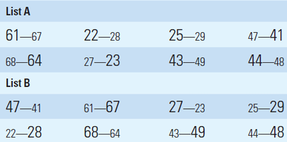
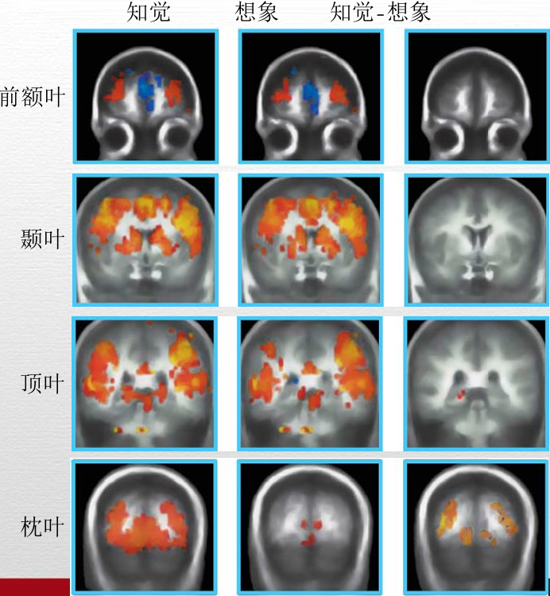
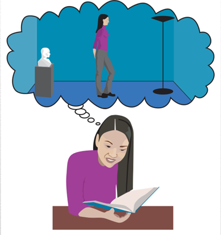
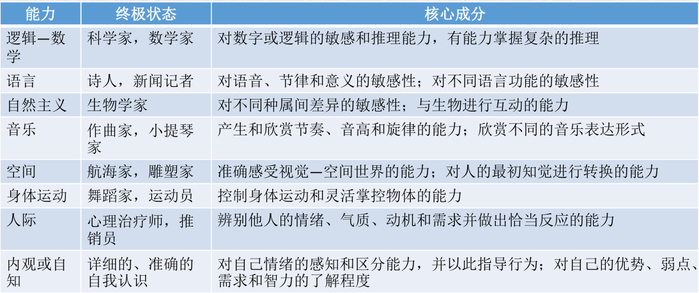
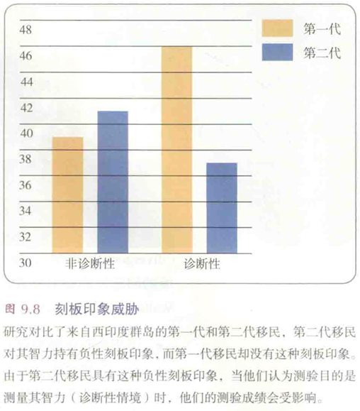
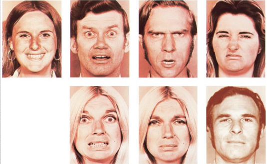
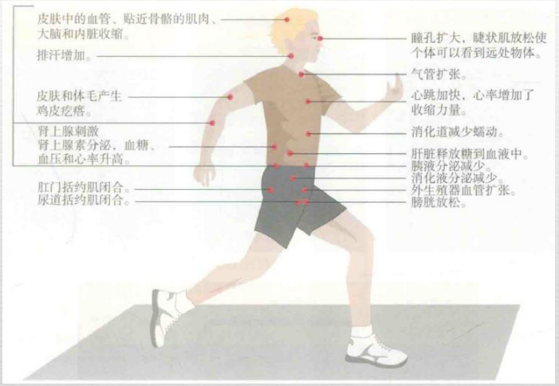
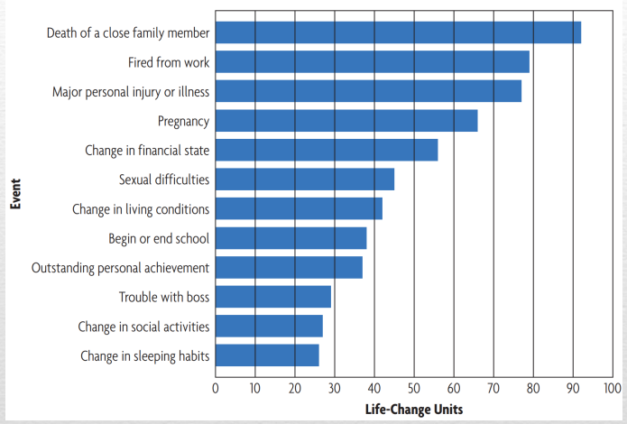
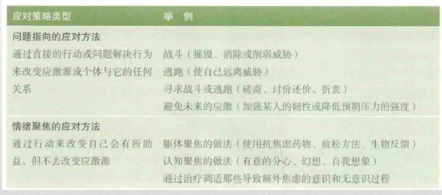

::: v-pre

# B

## 8 认知过程

- 认知是一个所有形式的"知"的通用术语
  - 内容:概念,事实,命题,规则和记忆
  - 过程:是指为了解释周围世界并为生活中的困境找到创造性解决办法,你如何操纵这些心智内容


- 解释心理过程
  - 唐德斯(F. C. Donders)的实验
    - 心理过程的速度:完成一项任务时,额外的心理步骤经常会使人们花更多的时间
    - 任务1:在所有的大写字符上画C
    - 任务2:在大写的元音字母上画V,在大写的辅音字母上画C
    - 任务3:在所有的大写字母上画V
  - 研究者经常利用**反应时**(参与者完成特定任务所花费的时间)来检验关于某种特定认知过程的一些解释
  - 序列过程:多个过程依次执行
  - 平行过程:多个过程同时执行
  - 理论家通过估计心理过程需要占用多少心理资源来确定心理过程是序列的还是平行的
    - 关键假设
      1. 人的加工资源有限并且必须分配给不同的心理任务
      1. 注意过程负责分配这些资源
  - 受控-自动维度
    - 受控过程:需要注意,一次执行一个以上的受控过程是困难的
    - 自动过程:一般不需要注意,常常能够无干扰地与其他任务同时执行
    - 充分练习:受控过程 >>> 自动过程
    - 任务变难:自动过程 >>> 受控过程
    - Ganor-Stern的实验
      - 圈出每对数字中字号更大的数字:List A比List B更困难(数值的大小会影响到对其字号大小的判断)
      - 
  
- 语言生成

  - 听众设计

    - 说话者在产生话语时,会考虑话语所针对的听众,以及与听众共享哪些知识

  - 赖格斯(Grice,1975)的合作原则
  
    - | 合作的说话者的四条格言                                       | 对说话者的价值                                               |
      | ------------------------------------------------------------ | ------------------------------------------------------------ |
      | 量:让你说的话提供的信息恰好满足需要,而不超出所需           | 必须尽力判断你的听众真正需要的信息有多少;评估听众可能已经知道什么 |
      | 质:尽量让你说的话真实.不要说你自己认为站不住脚的话.不要说缺乏证据的话. | 当你说话时,听者会假设你能够用合适的证据支持你的断言.当你计划说每句话时,你都必须考虑这句话所基于的依据. |
      | 关系:让你所说的话前后相关联                                 | 保证听者能够理解你正在说的如何与你以前所说的相关联.当转移话题时,必须做出解释. |
      | 方式:显而易见.避免表达模糊和歧义.让你说的话简洁有序       | 以尽可能清晰的方式说话.尽管你会不可避免地犯错,但你必须保证你的听者能够理解你的信息 |
  
    - 克拉克(Clark,1996):判断共同基础的三个根据

      - 团体成员身份
      - 行动同现:共同经历的某些事件或行动,包括双方稍早之前的交谈
      - 知觉同现:说话者与听者共同面对同一知觉事件

  - 言语执行和口误
  
    - **斯本内现象**(spoonerism)
  
      - 在一个短语或句子中两个或更多个词的首音互换
  
        - > You have tasted the whole worm
          >
          > You have wasted the whole term
  
      - 不是随机的
  
        - > "slips of the tongue"会被说成"tips of the tongue",但不会被说成"tlips of the tongue",因为"tl"不能作为起始声音
  
      - **SLIP技术**(实验室诱导产生的斯本内现象):(darn bore)有时会被说成(barn door)
  
        1. 要求参与者默读一些由词对构成的词表,这些词对为希望出现的斯本内现象的声音结构提供了模型.例如 (ball doze) (bash door) (bean deck) (bell dark)
        2. 要求参与者大声说出像(darn bore)这样的词对
  
      - 当口误所产生的仍然是真实存在的词时,斯本内现象更可能出现
  
    - | 计划类型                                                     | 正确用法                                      | 口误                                          |
      | ------------------------------------------------------------ | --------------------------------------------- | --------------------------------------------- |
      | 选择最符合他们想法的内容词                                   | Grizzly和ghastly                              | grastly                                       |
      | 把所选的词放在话语中的正确位置.因为说话者在产生话语时会计划话语的整体单元,所以,内容词有时会发生错位. | A tank of gas;Wine is being serverd at dinner | A gas of tank ;Dinner is being server at wine |
      | 必须说出想说的词.因为说话者要事先计划,所以有时会出现声音的错位. | Left hemisphere Pass out                      | Heft lemisphere Pat ous                       |
  
  - 声音,词和结构的选择
  
    - 声音:特定的声音出现在特定位置的相对频率
    - 词:刚刚说过的单词会使与之有关联的单词更难被接着说出
    - 结构:最近听到的和理解的语言的句子结构会诱导产生与之结构相同的句子
    - 
  
- 语言理解

  - 歧义
    - 词语歧义
      - bank 既可以指银行也可以指河岸

    - 结构歧义(树形图分析法)
      - The mother of the boy and the girl will arrive soon.
      - 
      - 

  - 消解歧义
    - 语境的信息可以帮助个体消解词语歧义
      - 均衡歧义:To their surprise, the bark (树的外皮 或 犬吠声) wa unusual because it sounded high-pitched and hoarse.
      - 有偏歧义:Last year the pen (钢笔 或 动物的围栏) was abandoned because it was too dirty for the animals to live in.
      - 对于以上的的两种类型的歧义,大脑会以不同的方式做出反应
        - 

    - 语境的信息也可以帮助个体消解结构歧义

  - 理解的产物:命题
    - 语句的主要思想,是意义表征的基本单元
      - 

    - 如果一句话中的两个词属于同一个命题,那么即使它们在实际的句子中并不接近,在记忆中也会表征在一起
    - 我们通常能记得一句话的大致意思,但很难逐词记忆(语言加工过程执行的一个主要操作是抽取命题,而那些呈现命题的确切形式很快就会丢失)
    - 听者经常使用推论(inference)(根据记忆中的信息而做出的逻辑假设来填补空白)
      - 我要去熟食店见唐娜
      - 她答应买一块三明治给我当午餐
      - 推论1:她指唐娜
      - 推论2:熟食店是一个可以买到三明治的地方

    - 读者对文本的整个语境所形成的模型会影响他们的推论

- 语言的演化

  - **语言结构**
    - 人类语言的特殊之处在于,使用有限的单词表达无限的意义
    - 人类是唯一在生物学上有所准备的,能够学习如此复杂的语言规则的物种
      - 苏.萨维奇.朗博(Savage-Rumbaugh,1998):倭黑猩猩可以通过观察其他生物(人类和倭黑猩猩)使用符号进行交流的过程来习得符号的意义,能理解一些英语口语,但是它们不能掌握可产生无数言语的语法规则

- 语言,思维和文化

  - 语言相对论:人们所使用的语言结构影响其思考世界的方式
    - 颜色词对颜色类别知觉的影响:纳米比亚的辛巴语不对蓝绿色调进行词义的区分,它使用一个词来表示大部分的蓝绿色调.辛巴人对于相应颜色的分类判断受到其语言的影响.

- 视觉认知

  - 
  
- 使用视觉表象

  - 表象的使用与真实视知觉的特点在很多方面一致

    - 心理旋转
      - 

  - 当一个物体真实存在或存在于视觉表象中时,个体都可以聚焦注意力获取更多信息

    - 将头脑中的视觉表象并排排列来回答相对大小的问题
    - 帮助回忆客体的视觉特点

  - 视觉表象的使用存在一些限制

    - 想象一张大白纸.在心里把它对折50次.当你做完时,纸大概有多厚?(8046.7万千米)

  - 数据支持

    - 知觉和想象对应的脑活动有很大的重合
    - 负责想象的脑区只是负责知觉的脑区的一个部分(参与者并没有使用任何特殊的脑区来创建视觉表象)

    - 

- 言语和视觉表象的结合

  - 言语描述使个体形成视觉表象
    - 例如:一只长着三条尾巴的猫
    - 形成空间心理模型
      - 你能够运用想象把自己投射到一个场景之中.好像你真的站在房间里一样.同说出什么东西在**身后**相比(雕塑),说出什么东西在**面前**所花的时间更少(灯)
      - 言语经验 ==> 视觉的,空间的经验
      - 

- 问题的解决

  - 问题的定义

    - 初始状态:开始时不完整的信息或令人不满意的状况
    - 目标状态:你希望获得的信息或状态
    - 一套操作:为了从初始状态迈向目标状态,你可能采取的步骤
    - 以上三个部分共同定义了问题空间

  - 定义良好的问题 定义不良的问题

    - 遇到定义不良的问题时,问题解决这的首要工作是尽可能找出问题究竟是什么,即明确初始状态,理想的解决方案以及可能的手段

  - 问题解决的两种方法

    - 算法
      - 总能为特定类型的问题提供正确答案的按部就班的程序
      - 对于定义良好的问题更有用

    - 启发式
      - 通过一些策略或经验法则解决问题
      - 对于判断和决策也至关重要

  - 研究方法:出声思维报告法

    - 要求参与者描述他们正在进行的思维

  - 挑战

    - 解决一个特定问题所需的心理资源超过了加工资源

  - 改进

    - 找到一种问题表征方法,使问题解决的每个操作**在现有的资源条件下都可行**.

      - 对解决办法的每一个成分都进行练习(eric:优化,减少占用的资源)

    - 对问题空间形成适当表征

      - > 
        >
        > eric:证明,但不要联想到数学和言语表征,使用视觉表征

      - 功能固着:一种心理上的阻断,它通过抑制人们感知常与某些功能相联系的物品的新用途,从而对问题解决产生不利影响

  - 创造性

    - 就特定环境而言,个体产生新异且适宜的思想和产品的能力.
    - 创造性的评定
      - 发散思维:对一个问题产生许多不寻常的解决方法的能力.
        - 测量发散思维的问题使测验对象有机会展示流畅性和灵活性思维.

      - 聚合思维:通过整合不同来源的信息解决问题的能力.
        - 远距离联想测验
        - 顿悟:突然想到问题解决办法的情况

      - 创作出具有创造性的作品
  
- 演绎推理

  - 正确运用逻辑规则,得出有效结论
    - 前提1:这家饭店接受所有的主流信用卡
    - 前提2:美国运通卡是一种主流信用卡
    - 结论:这家饭店接受美国运通卡
    - eric:由小推大(venn)正确的

  - 实际情境中的演绎推理既受到特定知识的影响,也受到针对特定问题个体所能使用的表征资源的影响
    - 前提1:所有带有发动机的东西都需要油
    - 前提2:汽车需要油
    - 结论:汽车有发动机
    - eric:由大推小(venn)错误的

  - 信念偏差效应
    - 人们倾向于把那些他们认为可信的结论判断为有效,而把那些他们认为不可信的结论判断为无效
    - 面对不确定时,与先前知识一致的演绎结论会产生做出"有效"判断的反应偏差;与先前知识不一致的结论会产生做出"无效"判断的反应偏差
    - 有些情况下,运用过去经验的能力有助于在推理任务中表现更好
      - 沃森选择任务:印有AD47的四张卡片,为了检验元音字母背面是偶数这一规则,必须翻开那些卡片?
      - 若评估规则"喝啤酒必须年满18岁",则经验会使得推理变得简单
      - 

- 归纳推理

  - 利用可获得的证据,产生可能而非确定的结论
  - 基于概率而不是逻辑的必然
  - 例子
    - 利用过去的信息产生关于当下和未来的期望
    - 类比式问题解决
      - 当前情形的特征与先前情形的特征之间建立一种类比

    - 心理定势:先前存在的心理状态,习惯或态度
      - 在某些情况下,可以提升感知和问题解决的质量和速度.而当先前的思维和行动方式在新的情境中没有价值时,同样的定势可能抑制或破坏心理活动的质量.

- 判断和决策

  - 判断
    - 形成看法,得出结论或对事件和人做出关键评价的过程

  - 决策
    - 在备选项之间做出选择的过程

  - 启发式和判断
    - 人们的判断依赖于启发式而不是正式的分析方法
      - "适应性工具箱","快速而节俭"的启发式仓库
      - 在大多数情况带来正确的判断

    - 可得式启发式:根据记忆中易于获得的信息做出判断
      - 主要成分
        - 信息提取时相对容易或流畅
        - 容易提取的记忆的内容

      - 例子:在一段小说摘录中,是以字母"k"开头的单词更多呢? 还是第三个字母是"k"的单词更多?(大多数人相信"k"更 经常出现在词的开头,事实上"k"更常出现在第三个位置)
      - 不同的背景将影响提取信息的容易程度,进而影响判断
        - 当测试者先完成一些测验,涉及到"bike,poke,take"等单词后再回答上述问题,答案有所改变

      - 记忆偏差也可能导致我们做出错误判断
        - 由于人们更容易记得负面结果而非正面结果,所以学生们会高估他们将正确答案改成错误答案的概率,而低估将错误答案改成正确答案的概率

    - 代表性启发式:基于客体是否具有某类别成员的典型特点做出判断
      - 代表性编码:峰尾规则
        - 代表值通常是事件的峰值强度和结尾强度的平均

    - 锚定式启发式:对某个事件或结果的可能值所做出的判断,相当于对一个起始值的不充分调整--或者向上,或者向下
      - 请你花5秒钟估计一下下面几个数字的乘积,然后写下你的答案:
      - 1 × 2 × 3 × 4 × 5 × 6 × 7 × 8 × 9 =
      - 9 × 8 × 7 × 6 × 5 × 4 × 3 × 2 × 1 =

- 决策心理学

  - 对选项的一个特定的描述
  - 决策的后果
    - 后悔
      - 当决策结果很糟糕时
      - 选择机会广泛时
      - 当人们明确知道某个决策带来的损失时

    - 恶魔盒子实验
      - 当参与者错失更多机会时,随后会冒更大的风险
      - 壳核的激活为其他的脑结构提供信息,最终产生冒险模式

    - 决策者差异:知足者 最大化者

***

## 9 智力与智力测量

- 心理测量
  - 心理测量(psychological assessment)是指使用特定的测验程序来评估人们的能力,行为和个人特质
  - 心理测量通常是指对个体差异的测量,因为大多数测量都是针对在某一特定维度上,某个个体与其他人的差异或相似程度
- 测量的历史
  - 中国古代的测量技术 - 科举选拔制度
  - 西方智力测验:弗朗西斯.高尔顿爵士 <遗传的天才>
    - 提出治理测量的四条重要思想
      - 智力差异可以根据智力程度来量化
      - 智力的个体差异呈正态分布(钟形曲线)
      - 智力或心理能力可以通过客观测验测得
      - 两套测试成绩之间的相关程度可以通过统计程序确定
- 正式测量的基本特点
  - 应该满足三方面的要求
    - 信度,效度和标准化
  - 信度指某一测量工具给出一致分数的可信程度
    - 重测信度:同一批人先后两次接受同一种测验,计算两次所得分数的相关程度
    - 内部一致性测验:(例子)比较某人在测验的奇数项目和偶数项目上的得分.若两部分得分相当,则测验内部一致性好,具有较高信度.
  - 效度指测验能够测得它所要测量的东西的程度
    - 内容效度:当测量能够测量**欲测领域的所有方面**时,测验具有内容效度
    - 效标关联效度(效标效度):测验的成绩与和测验相关的其他标准上成绩的相关程度
    - 结构效度:指测验充分测量潜在结构的程度
  - 信度是某一测验与其自身的相关程度,效度是测验与外部的相关程度.
  - 通常,缺乏信度的测验也不具有效度,但具有信度的测验**也可能没有**效度.
  - 常模:是基于对大量人群施测所指定的标准,通过将个体的测验分数与测验常模相比较,可以得到对于测验分数的解释.
  - 标准化:指在同一条件下对所有人,以同样的方式实施测验.标准化是必要的,它使得常模具有意义.
- 智力测验的起源
  - 智力(intelligence)是一种一般性的心理能力,其中包含推理,计划,问题解决,抽象思维,理解复杂思想,快速学习以及从经验中学习等能力
  - 由于智力包含多种能力,所以对于智力的测量向来存在着争议
  - 第一份可实施的智力测验:比奈智力测验 (阿尔弗雷德.比奈和西奥多.西蒙,1905)
    - 客观智力测验,用于区分发育迟滞儿童与正常学龄儿童
    - 测验通过选择题的形式评定儿童的判断能力与推理能力
    - 不同年龄的正常儿童的平均分数被作为基准.每个儿童的测验结果以达到某一特定分数的儿童的平均年龄(即心理年龄)来表示.
- IQ测验
  - IQ,即智商,是对**智力的数量化和标准化的测量**
  - 斯坦福-比奈量表(刘易斯.推孟,1916)
    - 对比奈测验进行了标准化,通过对成千上万名儿童的测量结果得到了与年龄相关的常模.
    - 提出智商,IQ的概念,IQ = 心理年龄÷生理年龄×100
  - 韦克斯勒智力量表(WAIS)(大卫.韦克斯勒,1955)
    - 量表包括言语和非言语(或操作)分测验,可以分别估计言语和非言语IQ值.
      - 语言理解:相似性;词汇
      - 知觉推理:方块图形;图片填充
      - 工作记忆:数字广度,算数
      - 加工速度:符号搜索;划消
    - WAIS-IV适用于16岁及以上人群,WISC-IV适用于6-16岁儿童, WPPSI-III适用于2.5-7.25岁儿童,韦氏测验家族可以提供所有 年龄段的IQ分数,可用于追踪特定智力随时间的发展
- 极端智力
  - IQ=100是平均值,分数段85-115之间的个体被界定为正常
  - 智力缺陷:18岁以下的个体在智力测验中的有效IQ得分低于平均分约两个标准差时,他们就被界定为智力缺陷.此外,被归为智力缺陷的个体还必须表现出适应性行为缺陷,即"在日常生活中习得的概念技能,社交能力和实践技能的集合"存在缺陷.
  - 智力缺陷可能与基因和环境因素有关-----唐氏综合征,苯丙酮尿症与不良产前环境都可能导致智力缺陷
  - 智力缺陷个体与正常个体的分离教育被证明并不有效
  - 个体的学业成绩和所测得的IQ之间存在巨大差异会被诊断为学习障碍
- 特殊智力
  - 天才:个体IQ分数在130以上,且在能力,创造力和任务执着三个维度上都有高水平的表现
  - 天才往往比同龄人能够更好地进行社交和情绪调整,在生活上都很成功
  - 由于天才被认为是一种多维度建构,对于天才的教育应该更为灵活以适应学生个体的特殊天赋
- 智力的心理测量学理论
  - 心理测量学是心理学的一个分支领域,主要对心理能力进行全方位的测量,包括人格评定,治理评估和能力测量
  - 查理斯.斯皮尔曼在智力领域应用因素分析,发现个体在不同智力测验上的成绩高度相关,认为存在一般智力因素或g因素,这是所有智力操作的基础,每个维度还与其特殊智力相关联,即s因素.
  - 雷蒙德.卡德尔采用更为先进的因素分析方法,将一般智力分为两个相对独立的成分:晶体智力与流体智力.
    - **晶体智力**包括一个人所获得的知识以及获得知识的能力;
    - **流体智力**是发现复杂关系和解决问题的能力.
  - 斯滕伯格的治理三因素理论
    - 自卡德尔之后,许多心理学家都扩展了智力的概念范围, 加入许多传统IQ测验没有的操作.
    - 罗伯特.斯滕伯格提出了智力三因素理论,认为智力包括三种类型:
      - 分析智力:提供了人们对于许多熟悉任务的基础信息加工技能.
        - 知识获得成分,操作成分和元认知成分
      - 创造智力:指人们处理新异问题的能力.
      - 实践智力:包括对新的不同环境的适应,选择合适的环境以及有效地改变环境以适应你的需要.
  - 加德纳的多元智力理论
    - 霍华德.加德纳提出了多元智力理论,涵盖人类经验范围 的许多智力.每一种智力依据特定社会对它的需要,奖赏以及它对社会的作用,在不同的人类社会中其价值也有所不同.
    - 
- 情绪智力
  - 情绪智力与加德纳的人际智力和内省智力的概念相关,也有一种主要观点认为情绪智力包括四种主要成分
    - 准确和适当地知觉,评价和表达情感的能力
    - 运用情绪来促进思维的能力
    - 理解和分析情绪,有效运用情绪知识的能力
    - 调节和管控情绪,以促进情绪和智力发展的能力
  - 情绪智力对于日常生活有非常重要的影响.
- 群组比较的历史
  - 几乎从一开始,智力测验就被用来对少数种族和民族群体做出负性评价.
  - 智力的差异可以被归因于先天的遗传因素,但也要考虑环境对于IQ的重要影响.
- 遗传,环境与IQ
  - 双生子研究通过比较同卵双生子,异卵双生子和其他基因有重叠的亲戚之间的表现差异,确定对于某 项特质遗传因素的贡献.
  - 对于IQ的双生子研究用于 对IQ进行遗传力估计,即估计基于IQ的测验分数可归因于遗传因素的变异比例.
  - 研究发现30%-80%的IQ分数变异来源于遗传.
  - 研究同时发现遗传力虽年龄的增长而增加.可能的解释为"遗传倾向将我们推向了能突显我们的遗传特质的环境,因而使遗传力随年龄增长而增加".
  - 遗传力估计是组内的估计,不能解释组间的差异.
  - 基因在个体IQ测验中起着相当大的作用,同时社会经济地位,教育水平等环境因素也在很大程度上影响着IQ.
- 文化与IQ测验的效度
  - IQ测验的成绩能否用于跨文化和种族的比较存在争议.
    - IQ测验对于不同文化下背景知识不同的受测者的难度存在差异;
    - 人们会在能力测验中受到刻板印象威胁的影响.
  - 刻板印象威胁通过以下三种破坏机制产生消极影响:
    - 导致应激生理反应从而影响注意力集中;
    - 促使个体密切监控自己的表现,从而导致做出更谨慎,更缺乏创造性的反应;
    - 当个体体验到刻板印象威胁时,心理资源会部分用于压制由此 引发的负性想法和情绪.
    - 
- 测量与社会
  - 心理测量领域充满争议,焦点是三个与伦理有关的方面:
    - 基于测验的决策的公平性;
    - 测量用于教育评价的可行性;
    - 根据测验分数进行个体分类的意义.
  - 尽管智力测验可用于预测,也可以作为个体当前表现的指标,但测验的结果不应该用来限制个体发展和改变的机会.
  - 当测量的结果将影响个体的生活时,所用的测量技术对该个体和测量目的而言,必须可信而有效.

***

## 11 动机

- 动机

  - 定义
    - 对所有引起,指向和维持生理和心理活动的过程的统称
  - 动机概念的功能 
    - 把生理和行为联系起来 
    - 解释行为的差异性 
    - 从公开的行动来推断内心的状态 
    - 为行为分配责任
    - 解释逆境中的意志
  - 来源
    - 驱力和诱因
      - 驱力
        - 响应动物的生理需求而产生的内部状态 
        - 消除紧张 
      - 诱因 
        - 与生物需求并无直接关系的外部刺激和奖赏
      - 行为是内部和外部动机共同作用的结果
    - 本能行为与学习
      - 本能 
        - 对生存至关重要的预置的行为倾向 
      - 早期的人类机能学说 
        - 人类比动物更多地依赖于本能行为
        - 人类有很多社会本能 
      - 跨文化人类学家
        - 发现了不同文化间的行为差异,与本能理论 相悖
      - 行为主义者 
        - 反对本能研究中的循环论证
        - 重要的行为与情感是后天习得的
      - 认知取向的研究者
        - 本能和强化史不足以解释某个动物行为的所有细节
    - 动机的期望与认知取向 
      - 重要的人类动机不是来自外部世界的客观现实,而是来自对现实的主观解释 
      -  期望
        - 对行为结果的预期
      - 朱丽安∙罗特的社会学习理论 
        - 个体从事某一行为的可能性是由他对达到目标的期望以及该目标 的个人价值决定的.
        - 期望与现实之间的差距能够驱使个体做出修正行为. 
      - 弗里茨∙海德
        - 行为的结果可归因于内在因素或情境因素,这些归因方式影响着个体的行为方式
    - 需要层次
      - 马斯洛的需要层次理论
      - 在到达下一个更高等级之前,更低等级的每种需要都必须被 满足. 
      - 核心
        - 每个人都具有成长以及实现最高潜力的需要.

- 饮食

  - 饮食生理学
    - 外周反应
      - 饥饿感 
        - 胃部的运动对人们的饥饿感起着重要作用,但并不是饥饿的必要 条件 
      - 停止进食
        - 由食物引起的胃部压力--不是由膨胀的气球引起的--将提示个体停止进食 
        - 食物的口腔体验 
          - 特定味觉饱食感
    - 中枢反应
      - 双中心模型
        - 外侧下丘脑LH:饥饿中枢
        - 腹内侧下丘脑VMH:饱食中枢
      - 对双中心模型的修正
        - VMH的信号依赖于食物类型,VMH的损毁可能会部分增强大鼠对食物的反射性反应.
        - 下丘脑的弓状核(ARC)和室旁核(PVN)对LH和VMH调节进食起补充作用 
      - 中枢信号来源
        - 血液里调节糖和脂肪浓度的感受器
  - 饮食心理学
    - 文化对饮食的影响
      - 人们常常按照社会和文化标准来选择吃什么东西
      - 健康饮食的一些障碍是经济限制的产物
    - 肥胖与节食
      - 体重指数(BMI)
      - 为什么有些人会超重?
        - 遗传机制:如控制瘦素的基因
        - 基因与环境的交互作用决定着肥胖的风险
        - 个体对食物和进食行为的看法:限制性饮食 vs. 非限制性饮食
        - 许多超重者常常是限制性饮食者,如果生活中发生 了应激性事件,导致他们 放弃约束,随之而来的暴 饮暴食很容易导致体重增加.
    - 饮食障碍
      - 神经性厌食症
        - 当一个人的体重低于正常体重的最低值(体重指数18.5kg/m2)但 仍然表现出对变胖的强烈恐惧. 
      - 神经性贪食症
        - 反复发作的失控性暴食,然后用自我催吐,滥用泻药,绝食等方 式来清除体内多余的热量.
      - 暴食症
        - 毫无节制地狂吃,但又不像神经性贪食症患者一样采取措施清除 体内多余的热量
      - 饮食障碍的风险因素
        - 遗传:在青春期受遗传影响更大
        - 完美主义 
        - 高度的身体不满意
          - 与他们的实际身体状况无关, 却与他们不准确的身体感知相关 
          - 文化规范和媒体的影响 
            - 证据1:与黑人相比,白人女性对 自己的身体满意度更低
            - 证据2:进食障碍患病率的性别差异逐渐缩小

- 性行为

  - 动物的性行为
    - 主要动机:繁殖
    - 性唤起主要是由生理过程决定的
      - 脑垂体和性腺分泌的性激素
      - 刻板性行为模式
    - 性唤起也常常由外部环境的刺激所引起
      - 交配对象展现出仪式化的视觉和声音模式 是性唤起的一个必要条件
      - 雌性配偶的新颖性会影响雄性的行为
      - 触觉,味觉和嗅觉也可以作为性唤起的外部刺激物
  - 人类的性唤起与性反应
    - 性激素
      - 正常范围:无影响
      - 低于正常值:对性欲产生消极影响
    - 性唤起
      - 由对性刺激的生理和认知反应引起的兴奋而紧张的动机状态
    - 马斯特斯和约翰森的性反应研究 
      - 男性和女性有相似的性反应模式
      - 尽管两性的性反应周期的阶段顺序是相似的,但女性的变化更多,而且往往反应更慢,但保持的性唤醒时间更长
      - 许多女性能有多次性高潮,而男性在相同的时间里却很少如此
      - 心理过程对于性唤起和性满足的核心意义
        - 性反应问题源于心理因素,而不是生理因素,并且可以通过治疗改善或克服
    - 性规范
      - 科学的影响下,许多文化中都出现了一种更开放地谈论性问题的总体趋势.
      - 性脚本
        - 从社会中学习到的性反应程序
      - 大学生的性行为 
        - 性勾搭 
        - 强暴:男性和女性行脚本存在毁灭性冲突
          - 约会强暴
    - 同性恋
      - 同性恋的先天和后天因素
        - 遗传性
          - 双生子研究
        - 大脑差异
          - 大脑形状和体积
          - 杏仁核与其他脑区间的联结模式
        - 生物学因素并不直接影响性偏好, 而是通过影响儿童的性情和活动 而产生间接影响
          - 相异感导致情绪唤起,随着时间的推移,这种唤起就会转化成性吸引.
      - 社会与同性恋
        - 社会对同性恋行为持续的敌意
          - 同性恋恐惧症
        - 是否把自己的性取向告诉父母
        - 与同性恋有关的压力不是来 自性动机本身,而是来自性动机公开之后人们的反应

- 个人成就动机

  - 成就需要

    - 反映了计划并努力实现目标对个体的重 要性的个体差异.
    - 主题统觉测验
      - 就一系列模棱两可的画面编故事
      - 利用参与者的想象来测量成就需要的强度
    - 对效率的需要
      - 并不意味着高成就需要的人总是愿意更努力地工作
    - 对成就的需要也能预测某些职业的成功

  - 对成功与失败的归因

    - 归因

      - 关于某一结果产生原因的判断,归因能对动机产生重要影响
      - 三种维度
        - 内部--外部
        - 稳定性--不稳定性
        - 整体--特殊

    - |                | 对成功的归因                     | 对失败的归因             |
      | -------------- | -------------------------------- | ------------------------ |
      | 乐观的归因方式 | 内部的;稳定的;整体的           | 外部的;不稳定的;部分的 |
      | 悲观的归因方式 | 外部的;不稳定的;整体的或特定的 | 内部的;稳定的;整体的   |

    - 工作和组织心理学

      - 在工作条件下,个人动机水平将部分取决于工作环境中 的人员和规章制度的总体情况
      - 公平理论 
        - 员工关注他们的投入及其产出,然后 与其他员工的投入与产出进行比较
        - 相等:满意
        - 不相等:不满,行为或心理上的改变
      - 期望理论
        - 当员工预期他们工作上的努力和成绩会产生理想的结果时,他们就会受到激励.
        - 期望 * 工具性 * 效价

## 12 情绪,压力与健康

- 情绪

  - 一种身心变化的复杂模式,包括生理唤醒,感受,认知 过程,可见的表达(包括面部表情和身体姿势),以及针对知觉为有个人意义的情境所做出的的特定行为反应.
  - 与心境作对比
    - 情绪(emotion)
      - 对具体事件的具体反应
      - 持续时间较短,较为强烈
    - 心境(mood)
      - 不太强烈,并可能持续数天
      - 与触发事件的关系通常较弱
  - 基本情绪和文化
    - 查理.达尔文
      - 情绪与人类的和非人类的结构和功能的其他重要方面一起进化
      - 遗传而来的特化心理状态,其功能是应对世界上某类反复发生 的情境 (Hess & Thibault, 2009).
    - 是否存在一些天生的情绪反应?
      - 希尔文.汤姆金斯
        - 婴儿无须预先学习就会对巨大的声响表现出恐惧或者呼吸困难的反应.
        - 他们似乎对特定的刺激具有"预置"的情绪反应,这种反应非常普遍,足以适应各种环境.
      - 跨文化研究
        - 来自美国,日本和中国的11个月大的婴儿在经历愤怒和恐惧时, 会表现出相同的面部表情(Camras et al.,2007).
      - 习惯化反应
        - 5个月大的婴儿可以区分高兴与恐惧表情(Bornstein & Arterberry, 2003).
    - 面部表情是普遍的吗?
      - 保罗.埃克曼
        - 所有人的"面部语言"都有共同之处
        - 将恐惧,厌恶,快乐, 惊讶,轻蔑,愤怒和 悲伤与七张面孔匹配
        - 
      - 匈牙利人,日本人,波兰人,苏门答腊人,美国人和越南人对 面部表情的判定具有很高的一致性(Biehl et al., 1997).
      - 不同文化的面部表情有不同的"方言"(Dailey et al., 2010; Elfenbein et al., 2007).
        - 当人们做出不同的面部表情时,面部肌肉的特定运动存在一致 的跨文化差异.
        - 观察面孔的习惯性差异,可能导致来自不同文化的人对面孔在表达特定情绪时"看起来是怎样的"有着不同的期待 (Jack et al., 2012)
    - 文化如何制约情绪表达?
      - 不同的文化对情绪应如何管理仍有不同的标准(压抑vs表达)
      - 

- 情绪理论

  -  情绪的生理学

    - 自主神经系统:
      - 轻微的,不愉快的刺激:交感系统
      - 轻微的,愉快的刺激:副交感系统
      - 强烈的情绪反应(如恐惧和愤怒)
        - 紧急反应系统,交感系统促使肾上腺释放激素
        - 紧急事件过后,副交感系统会抑制这些激活性激素的释放
    - 中枢神经系统:
      - 下丘脑与边缘系统:负责整合激素和神经方面的唤醒,它们是情绪以及进攻,防御和逃跑模式的控制系统
      - 杏仁核(边缘系统的一部分):给接收到的感觉信息,尤其是 负性体验,赋予意义 
      - 皮层:通过其内部的神经网络以及与身体其他部分的联系来参 与情绪体验过程

  - 詹姆斯-兰格的身体反应理论

    - 情绪来源于身体反馈(eric:归因)
      - 
      - 对刺激的感知引起自主神经系统唤醒和其他的身体反应,而这些反应导致了特定的情绪体验
    - 外周主义理论
      - 认为情绪链中最重要的角色是内脏反应,而控制它的自主神经系统位于中枢神经系统的外周

  - 坎农-巴德的中枢神经系统过程理论

    - 对詹姆斯-兰格的身体反应理论的见解
      - 内脏反应与情绪无关
        - 即使通过手术切断内脏与中枢神经系统的联系,实验动物仍会有情绪反应
      - 自主神经系统的反应显然太慢了,不足以成为瞬间激发的情绪的源头
    - 身体和心理反应具有独立性
      - 
      - 唤醒情绪的刺激同时带来两种结果:通过交感神经系统导致身体的唤醒;通过皮层产生情绪的主观感受
      - 两者不存在因果关系

  - 情绪的认知评价理论

    - 情绪体验不能简单地理解为在个人或大脑中发生了什么, 而要考虑和评估前者与环境的交互作用.

    - 

    - 吊桥效应(Dutton&Aron,1974)

      - ```cmd
        吊桥效应(Capilano Suspension Bridge effect)的实验流程主要包括以下几个步骤:
        
        1. **实验地点选择**:实验一将实验地点设置在加拿大北温哥华的卡皮诺拉吊桥(The Capilano Suspension Bridge)和一个安全坚固,低矮的跨溪实木桥上.卡皮拉诺吊桥全长450英尺,宽5英尺,悬空吊桥左右摇摆,既令人激动又令人惊恐.
        
        2. **实验对象选择**:实验对象为18-35岁之间且没有女伴的男性.
        
        3. **实验过程**:在他们走过桥梁时,桥中央的实验助手会请求他们参与一项研究,要求对方填写调查问卷.问卷第一页收集一些基本信息,问卷第二页要求实验对象根据一张图片描写一个简短的,戏剧性的故事.如果实验对象同意参与实验,就在桥上完成问卷.
        
        4. **实验助手**:实验助手的性别选择了男性和女性分别在两座桥上开展,实验助手并不知道实验的真实目的.
        
        5. **后续联系**:完成问卷后,实验助理会给实验对象留下联系方式,并邀请每个实验对象之后进一步交流.
        
        6. **故事评分**:实验结束后,研究者对每个实验对象编撰的故事进行评分,根据故事中涉及到的性相关内容进行1(低性内容)-5(高性内容)的评分.
        
        7. **实验结果分析**:研究者比较了在吊桥和实木桥上完成问卷的男性对实验助手的吸引力评价以及他们联系实验助手的频率,以此来分析吊桥效应的存在.
        
        这个实验通过比较在不同情绪唤醒状态下(如恐惧或兴奋)的男性对同一女性的反应,来探讨情绪唤醒与性吸引力之间的关系.实验结果表明,在卡皮拉诺吊桥上的女性实验助手性吸引力更强,有更多的实验对象在实验结束后联系实验助手,且所描述的故事涉及的性相关内容更多.
        ```

      - 支持:人们通过评估环境线索来解释自己的生理唤醒

    - Zajonc:在一些条件下人们会有某种偏好-对刺激的情绪反应-却不知原因(2000,2001)

    - 认知评价是情绪体验的一个重要过程,但并不是唯一的(Izard,1993)

- 心境和情绪的影响

  - 人们体验到的心境对加工信息的方式有强烈的影响 (Clore & Huntsinger, 2007; Forgas, 2008).
    - Pickel, 2009 
    -  学生们观看了一段记录犯罪过程的视频.一个版本中行凶者手 持一把手枪;另一个版本中行凶者拿着一张装在塑料盒里的音 乐CD.
    - 看完视频后填写问卷,以测试他们对行凶者外貌的回忆能力. 
    - 当行凶者拿着手枪时,参与者的回忆要差得多.
    - 当持枪者是女性时,参与者的成绩最差.
  - 情绪唤醒能让人们把更多的心理资源聚焦于高优先级的刺激(Mather&Sutherland,2011)
  - 在一定程度上你能控制情绪对自己及他人的影响.你有情绪调节的能力,你可以改变情绪体验的强度和持续时间 (Gyurak et al., 2011).

- 主观幸福感

  - 个体对生活满意度和幸福度的总体评价
  - 遗传对主观幸福感的个体差异有影响 
    - 挪威双生子研究(Nes et al., 2006)
      - 比较同卵和异卵双生子,遗传因素可以解释男性主观幸福感51% 的方差,而女性为49%.
    - 美国双生子研究(Weiss et al., 2008)
      - 遗传对主观幸福感有很大的影响.
  - 生活经历对主观幸福感的影响
    - 调查46个国家的8557名参与者(Kuppens et al., 2008) 
      - 积极情绪对生活满意度的影响约两倍于消极情绪.
      - 存在文化差异,如在生存都成问题的文化里,生活满意度的判断 较少取决于积极的情绪体验.

- 生活压力

  - 应激(stress):
    - 当刺激事件打破了有机体的平衡,使其难以应付或超出其应对能力时,有机体做出的一种反应模式.
    - 这些刺激事件包括各种各样来自外界或内部的情形,统称为应激源.(要求有机体做出适应性反应的刺激事件)
    - 
  - 生理应激反应
    - 慢性应激:长期的唤醒状态,会持续很长时间,它使人感到自己可获得的内在和外在资源达不到应对压力的要求.(没有时间去做所有想做的事而感到持久的沮丧)
    - 对于急性威胁的紧急反应
    - 战斗或逃跑反应
      - 下丘脑发起的对于危险的应激反应.
    - 照料和结盟反应
      - 在应激时期,首先要考虑孩子的需求,确保他们的安全
      - 与自己所在的社会团体里有着相同目标(降低孩子的风险)的 成员结盟.
    - 急性应激中的躯体反应
      - 
    - 一般性症候群和慢性应激
      - 报警 抵抗 衰竭
      - 
  - 心理应激反应
    - 重大生活事件 社会再适应量表
    - 
    - 并非所有的生活事件对所有人都有同样的影响
      - 
  - 创伤性事件
    - 一个消极且无法控制,无法预测或模棱两可的事件特别有压力.
    - 创伤后应激障碍(PTSD)
      - 
    - 慢性应激源 
      - 一般来自社会和环境事件
      - 如犯罪,经济条件,污染,恐怖 主义的威胁等
    - 日常挫折
      - 挫折与健康问题有明显的相关 (Lazarus, 1981; 1984b).
      - 日常性挫折带来的影响可以被日常积极体验所抵消 (Lazarus & Lazarus, 1994).
  - 应对:
    - 处理那些被认为使个人资源紧张或超出个体资源的内在或外在 要求的过程.
    - 对压力的评估 
    -  一般评估理论 
      - 初级评估:对严重性的初始评估
      - 次级评估:评估可用于处理压力情境的个人和社会资源
      - 
    - 压力调节变量 
      - 可以改变应激源对特定类型的应激反应的影响的变量.
        - 调节变量过滤或调节应激源对个体反应的影响
      - 例如疲劳水平和总体健康状况就是影响你对某个特定的心理或 生理应激源的反应的调节变量.
      - eg:认知评估
    - 应对策略的分类
      - 
    - 改变认知策略
      - 重新评价应激源自身的性质
      - 重构你对于应激反应的认知
    - 压力免疫法 (Meichenbaum,1977,1985,1993)
      1. 人们努力提高对自己实际行为的认识
      2. 人们开始找出可以抵消非适应性的自我挫败行为的新做法
      3. 当适应性行为建立后,个体要对他们的新行为的结果进行评估,避免先前的那种自我贬低的内心独白
    - 确立对应激源的控制感
    - 将社会支持作为应对资源
      - 个体需要的支持类型与得到的支持类型需要相互匹配
      - 
    - 应激的积极作用
      - 积极应激
      - 益处发现(人们从负面事件中寻找积极方面的能力)
      - 创伤后成长

- 健康心理学

  - 致力于研究人们保持健康的方式,患病的原因以及生病 后的反应方式.
  - 健康是指身体和精神在健全和活力方面的一般状态.
  - 健康的生物心理社会模型
    - 健康是一个动态的,多维度的体验,与心理状态和社会 环境相关.
    - 身心健康综合了身体,智力,情绪,精神,社会和环境 的方方面面.
  - 健康促进
    - 制订一般的策略和特定的方法来消除或减少人们患病的 风险.
  - 治疗
    - 遵医嘱 
    - 利用心理治疗身体 
      - 放松反应
      - 生物反馈
    - 心理神经免疫学 
      - 心理状态会影响免疫功能 
    - 心理对健康结果的影响
      - 压抑与个人创伤,失败,悔恨或羞耻经历有关的想法和感受, 对精神健康和生理健康有灾难性的损害.
      - 
  - 人格与健康
    - A型行为模式 
      - 极端好胜,富有攻击性,缺乏耐心,有时间急迫感和敌意 
    - B型行为模式
      - 较少有竞争性,较少敌意等
    - 乐观主义与免疫功能
  - 职业倦怠与医疗保健系统
    - 职业倦怠:
      - 一种情绪衰竭,去人性化,个人成就感降低的综合征.
      - 通常发生在那些需要不断同病人,来访者和公众进行高强度接 触的职业中.
    - 如何减少工作倦怠?
      - 减少看护者需要照顾的病人的数量
      - 更改工作日程表,避开高压力情境 
      - 采用团队接触代替个人接触
      - 给予积极反馈

## 13 理解人类人格

## 14 心理障碍

## 15 心理治疗

## 16 社会心理学

:::