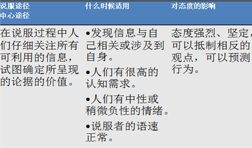
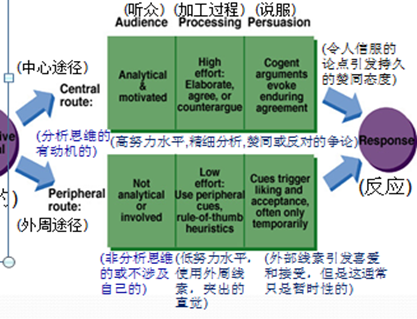
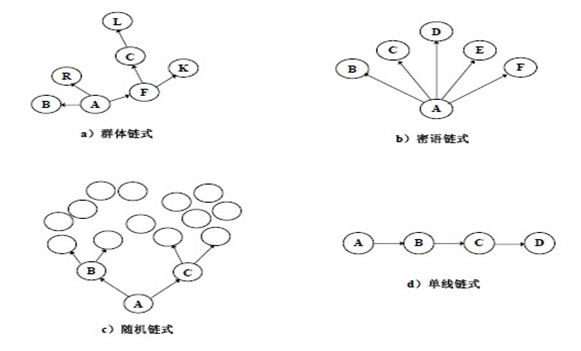
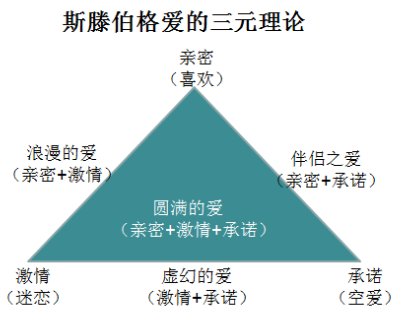

# Social Psychology

## 导论

### 社会心理学

- 定义: 关于研究人们如何思考,如何认识他人,影响他人以及与他人关系的一门科学.
- 研究领域: 社会思维,社会关系,社会影响.
- 特点: 关于情境力量的科学
- ==重要观点==
  - 我们构筑社会现实
  - 我们的社会直觉的力量是强大的
  - 社会影响塑造行为
  - 个人态度和性格倾向塑造行为
  - 社会行为同时也是生物行
  - 社会心理学的原理可以应用到日常生活和其他学科领域
- 分析层次
  - 个体水平:我们如何感知周围的人,事等
  - 人际水平:我们如何影响他人以及受他人影响
  - 群际水平:我们的群体身份如何影响到我们对于其他群体成员的行为
  - 社会水平:我们所处的社会的文化和规范如何影响我们的行为
  - 跨水平:所研究的自变量和因变量不是处于同一研究层次
- 研究步骤
  - 研究问题的提出
  - 从已知的文献或现象了解问题,寻找答案
  - 形成关于成因和影响的假设
  - 用实证数据对假设进行检验
  - 结论
- 研究方法:
  - 相关:探寻自然关系
  - 观察研究:自然的、实验室的
  - 调查研究:问卷、访谈
  - 设计的问题:问题措辞、第三变量、社会赞许
  - 实验设计:探寻因果关系--控制、随机分配
  - 问题--==安慰剂效应==指病人虽然获得无效的治疗,但却"预料"或"相信"治疗有效,而让病患症状得到舒缓的现象、需求特征(所谓==需求特征==就是指受测者在实验中所注意到的线索或暗示,而这些线索会影响到实验或假设.)
    - 解决:单盲/双盲实验
  - 现场研究&实验室研究
    - 现场研究的优点:外部效度、实验真实性高,最小化参与者怀疑最大化自然和自发的行为.
    - 实验室研究的优点:可以随机分配和控制变量.

### 社会心理学和其他学科的关系

与社会学的关系:

- 社会学是研究社会结构及其内在关系与社会发展规律的学科
  - 同:研究的都是社会对象;离不开社会环境和条件
  - 异:
    - 社会学研究社会生活中的全部客观事实,注重宏观社会及大群体活动趋势;
    - 社会心理学只侧重一部分,注重微观小群体/个体心理行为的规律
- 与心理学的关系
  - 同:是心理学的一个分支,是整体和部分的关系
  - 异:
    - 普通心理学研究个体心理活动的基本形式,过程和规律,侧重头脑的机能和生理活动规律,采取观察法和实验法;
    - 社会心理学研究个体在群体/社会情境下的心理和行为规律,侧重人的心理和行为如何受环境制约并影响环境,采取观察,实验,档案,问卷等方法

## 自我与他人

### 自我

- 自我概念
  - 自我中的认知成分,会随着时间和情境的不同发生变化,具有动态性.
  - 包括个体自我,关系自我,集体自我
  - 自发的自我概念(spontaneous self-concept):在特定的时间点出现在个人意识中的身份.是可被意识到的自我.
    - (身份:比自我概念更加具体,值个体认为能够界定或描述自己的那些特征,包括价值观,性别,特质等)
  
- 社会身份理论
  - 社会身份理论是指个体根据社会群体的成员身份来感知自己和他人.
  - (社会身份:指个体关于和属于一定社会群体的知识以及对他而言这个群体身份的情感和价值重要性)

- 最小群体范式(minimal group paradigm)

  - 根据一些非常细小的特征和信息将人们分为不同的群体

  - (Taijfel, 1970,最小群体范式实验)
    - 让被试完成统计屏幕上的点的任务,然后被试被分成两组.告诉其中一组他们有高估倾向,另一组有低估倾向.然后被试被要求分配奖励给其他被试.结果显示,被试倾向于给与自己群体的成员更多的奖励.

- 最佳区分理论
  - 最佳区分理论任务,人们需要在求同需要和求异需要之间保持平衡.求同需要和求异需要需要两者存在张力,个体不断调整自己知觉到的相似性和独特性,以保持最佳的水平.

- 自我身份的文化差异
  - 集体主义文化 $<->$ 个体主义文化
  - 独立性自我(西方文化) $<->$ 互依性自我(非西方文化)

  - | 特征比较   | 独立性自我                                                   | 互依性自我                                                   |
    | ---------- | ------------------------------------------------------------ | ------------------------------------------------------------ |
    | 定义       | 与社会关系分开                                               | 与社会关系连结                                               |
    | 结构       | 有界限的,单一的,稳定的                                       | 有弹性的,多变的                                              |
    | 重要特征   | 内在的,私人化的(能力,思考,感觉)                              | 外在的,公开的                                                |
    | 任务       | 保持独立性,表达自我,实现内在特征,促成自己的目标,直接:直言无隐 | 寻求归属,找到自己的位置,采取恰当的行为,促成他人的目标,间接:猜测心事 |
    | 他人的角色 | 评价自我:他人是社会比较,反射性评价的重要来源                 | 定义自我:以特定网络中和他人的关系来定义自我                  |
    | 自尊的基础 | 表达自我的能力:确认内在的属性                                | 适应,约束自我,和社会网络维持和谐的能力                       |

- 社会身份或类别的动态性
  - 是一个动态的社会判断过程的表达,而不是一个固定的心理结构
  - 对于个体在不同的社会情境中适应和调节自己的行为和认知具有重要意义

#### 自尊

- 自尊是自我中的情感部分,反应了人们对于自己的价值判断和评价.
- $自尊 = {成功\over抱负}$ (自尊的经典公式,1980)
- 自尊来源于

  - 个人经验(早年的经历,受原生家庭影响很大)
  - 别人的评价(镜像自我)
  - 社会关系(被他人接纳)
  - 社会比较和群体比较

- 高自尊

  - 正面:
    - 期待成功,愿意表现自我以获得表扬;对生活更加满意,较少抑郁;对关系满意,婚姻幸福.
    - 自利判断
    - 将积极事件归功于自己,并将消极事件归因于外部原因(即自我服务式偏差/自立归因偏差).经常想起自己成功的经历,并夸大个人的重要性(即自我中心偏差)

  - 负面:
    - 对他人造成心理压力,对不按照自己意愿行动的人抱有敌意.受威胁时,常常会以打压他人的方式来应对,有时甚至是暴力的方法反应.

  - 自恋:过于迷恋自己和自我膨胀的一种特质.受到他人批评时,会做出敌对或侵犯性反应.

  - 安全性高自尊:对自己持有积极地看法,有信心,不需要别人不断的赞美和确认来维持.

  - 防御性高自尊:对自己持有积极的看法,但是很脆弱,容易受到打击和威胁.下意识华裔自我,缺乏安全感.一旦受到批评便做出消极反应,表现出浮夸、傲慢、敌对.

- 自我妨碍:设置障碍物来阻挠自己获得成功 ,出于自我保护的目的,即为可能的失败找借口,以维持自尊.
- 后视偏差 (Hindsight bias)
  - 概念:早已知道结果后, 对预见能力的夸大倾向.
  - 例子:在某个友邻或熟人家的孩子考上重点大学时,很多人喜滋滋地宣告:"这孩子是我看着长大的,我就知道他迟早会有出息的!"但是在这之前没有人会预测这个孩子会考上重点大学.
- 虚假一致性偏差/虚假特异性偏差
  - 我们倾向于把自己的行为和观点看作是典型的,普遍的行为;我们倾向于将自己的道德标准等特质看得高于一般人.
- 自我评价维持理论
  - 该理论认为,其他人的行为表现会威胁到个人的自我概念,而受到威胁的程度取决于别人与自己的亲密程度以及个人与该行为的关联程度.如果某个朋友在自己珍爱的方面表现超过了自己,可以通过以下方式解决:疏远朋友;改变关于该方面对自己的重要程度认识;提高自己水平以超过朋友.

#### 自我效能Self-efficacy

- 是人们关于自己是否能够完成某项任务的信念,表现为对自己能力与效率的乐观信念,可以获得很大的回报
- 控制点(focus of control):个体对自己生活中发生的事情及其结果的控制源有不同的解释,控制点人们认为事情的结果取决于外部还是内部原因.内部控制点:命运由自己控制.外部控制点:命运由外部力量决定.
- 习得性无助 (Learned helplessness versus self-determination)
  - 当动物和人经历无法控制的有害事件时,会习得一种被动和无助感,从而使得他们就算之后处于一种可以逃避惩罚的条件下也只会被动的畏缩.其原因是他们认为自己的努力完全没有作用,习得性无助发生的过程:无法控制的有害事件--知觉到无法控制--习得性无助.
- 自我实现的信念(自证预言)(Self-Fulfilling Beliefs)
  - 自我实现的预言,指一个人对他人的错误期望导致他人表现出所期望的特征和行为.
  - 例子:老师的期望与学生的表现.在这个研究中,男性大学生被试得到一个有魅力的或没有魅力的女性的照片,然后让被试给不相关的女生打电话.误认为在跟有魅力的女生通电话的男生表现地更温柔一些.这些女生因此也表现得善于与他人交往的、友好的、和可爱的.
  
#### 自我表达

- 印象管理(自我呈现)
  - 想展示一种受赞赏的形象.努力控制我们给以他人的印象,以获得期望的结果.
  - [自我监控高的人会根据周围的环境不断调整自己的行为--关心他人对自己的评价]

- 人格特质:个人在不同时间和场合在情感、思想和行动想表现出的一致性,使得自己与别人有所区别.

#### 自我知觉

- 对自己的能力、抱负和状态等的认识和了解.主要途径包括镜像自我和社会比较.
- 镜像自我:指个体把别人当作镜子来进行自我感知(from 库利),进一步可以理解为与我们的自我概念有关的并不是别人实际上如何评价我们,而是我们觉得他们如何评价我们(from乔治.米德)
- 社会比较理论:
  - 每个个体在缺乏客观的情况下,利用他人作为比较的尺度,来进行自我评价(from利昂.费斯廷格).包括向上比较和向下比较.社会比较可以为个体提高自信心,并且成为合理自我完善的基础.但是当比较建立了不实际的标准,这些功能都会失效.
- 自我知觉理论:
  - 当我们的态度不是很坚定时,我们就通过观察自己的行为及其环境来推断我们的态度.(前提条件:行为是自主发生的;内部线索委托;缺乏外在反馈)→[过度合理化效应]
    - 例子:我又吸烟了,我肯定很喜欢吸烟;表情/步态对我们的影响.
- 过度合理化:人们通过关注周围的情景来解释自己的行为.
  - (e.g.给人们报酬让他们做自己喜欢的事情会让他们将其行为归因于报酬,这样会削弱他们的自己知觉--因为兴趣而去做)
- 当个体明显是为了控制别人而事先付出不相称的报酬时,就会发生过度合理化反应.
  - 报酬是针对人们的成就,就会增加个体内部动机
  - 报酬是为了控制人们,而人们自己也相信是报酬导致了他们的努力,那么就会降低个体对工作的内在兴趣.
- 自我展示理论:假定人们适当调整自己的态度以使其看起来与行为一致.为了给他人留下好印象,我们通常会表现出与自己的行为一致的态度.

### 对他人的认知

#### 社会知觉

- 指人们运用所能得到的信息形成对他人的印象,从而判断对方是什么样的人的过程.
- 并非只限于形成印象,还涉及对有关信息进行记忆、推理、判断、理解和解释等认知过程.
- 人格特质:个人在不同时间和场合在情感、思想和行动想表现出的一致性,使得自己与别人有所区别.
- 核心特质:也称中心特质,指最能说明一个人人格的特质,是人格的"构件".一个人的人格由几个彼此相联系的核心特质组成,核心特质虽不如首要特质那样对行为起支配作用,但也是行为的决定因素.
- 首要特质(cardinal trait),是一个人最典型、最具概括性的特质.
- Asch实验:条件词为热情的-冷酷的,有礼貌的-粗鲁的,会使得别人对相关其他特征的描述产生影响.
  - 结论:一些特质可能比其他特质更重要, 也就是与大量其他特质是相联系的.比如:热情和冷漠.
- 晕轮效应/光环效应(Halo Effect):人们更倾向于对他人形成评价上一致的印象.(可以是正性的/负性的),人们对他人的认知判断首先是根据个人的好恶得出的,然后再从这个判断推论出认知对象的其他品质的现象.
- 首因效应:认知者比较重视最先得到的信息,并据此对别人做出判断,最初印象形成后,对后来的信息就不重视的现象,也叫"先入为主效应"
- 近因效应:在多种信息出现的时候,印象的形成主要取决于后来出现的信息的现象,也叫"新颖效应"

#### 归因

- Covariation Model (Kelley, 1967)的共变模型

- 共变模型指出人们试图发现一个特定效应和一个特定原因是否在不同的情境下共同发生.

  - 一贯性--在这种情境下个体是否总是表现出这种行为

  - 一致性--其他人在这个效应下是否也有相似的反应

  - 区分性--在其他类似的刺激条件下,那个人的反应是否也和此效应情况下相似.

- 我们可以根据共变模型来对一个人的行为做出常识性归因.
  - 例子:学生在课堂上打瞌睡

- "折扣原则"
  - 认为如果有多种可能原因存在的话,我们不大轻易把结果归因于任一特定原因.即如果在对日常行为的解释中,如果出现了其他似是而非的因果关系,我们会对已经作出的归因大打折扣.
  - 例子:如果一个陌生人对你特别热情,你首先会认为是因为她很善良,很热心;如果你知道她是一个推销员,那么你首先认为因为她很善良的概率下降,因为有可能是因为她需要你买东西才对你特别热情;如果你还知道他们的销售量和奖金联系十分紧密那么你认为她对你热情的原因是因为她善良、热心的比率又会下降.

- 归因偏差--行动者-观察者偏差
  - 行动者对自身的行为原因分析与观察者对同一行为的分析不一致.行动者倾向于强调情境作用,观察者倾向于强调个人特征作用.
    - 出现的原因
      - 行动者难以观察自身行为,容易关注环境--观察者相反
      - 行动者了解自己过去的行为--观察者无法了解
- 基本归因错误:
  - 我们更倾向于把他人的行为归因于他们的性格倾向,而不是他们所处的情境.即我们在解释他人行为的时候,我们会低估环境造成的影响而高估个人特质和态度造成的影响.
  - 存在文化差异--东方文化.环境归因较强

## 社会认知

人们从社会环境主公获取信息,并使用这些信息进行推理、做出判断.

### 图式

- 人们对于事物或者范畴的心理表征,包括了对事物或范畴的核心特征.人们用图式组织自己对社会现象的认识
  - 经典研究:图式对信息回忆的影响-放映一段关于女士生日派对的录像,并告知该妇女职业,录像中包含了一些与该女士职业吻合的信息.一段时间后(4-7days)让被试回忆录像的信息,与该女士职业相关的信息能够回忆的更准确.
- 启动:激活某个图式增加了另外一个图式在未来被激活的可能性.
  - 经典研究:先让被试观看一段关于一个商人让助理帮助安排行程的录像(一组商人对助理友好,一组商人对助理不友好),并告知被试将对其进行记忆实验.让被试阅读一篇关于某个青年的文章,文中描述为中心.阅读完毕之后,要求被试评价文中青年是否友好.

- 长期易得性:对于个体来说某些图式容易被激活的程度
  - 经典研究:首先通过让被试描述自己以及4位朋友(2男2女)的特征,并归纳总结出描述中共同的特性作为易得的特性.一段时间后(2 week)请被试阅读短文(一组内容与易得特性有关,一组与一的特性无关),并回忆信息.结果前者记忆效果更好.
  - 经典研究:罪恶和身体清洁
  
- 刻板印象:知觉者将某些特征与某个群体中的成员联系起来,认为该群体的成员具有某系特征.
  - 是关于其他群体的信念(有可能准确,也有可能不准确)-----> 人们倾向于高估外群体内部的相似性.
  - 刻板印象会导致选择性信息加工.
  - 经典实验:首先让被试观看9岁小女孩在学校操场和在自家外的场地玩耍的录像,操纵被试使一般被试对女孩产生负面印象,另一半产生证明印象.让部分被试立即评价女孩的学习成绩(作为对比的基准线),再让其余被试观看第二段录像,录像中该小女孩回答了25道题,实际上女孩的表现是模糊又不一致的,无法判断成绩好坏.然后要求被试评价女孩成绩.
    - 结果:对女孩有正面印象的评价超过基准,原本具有负面印象的评价低于基准.
  - 补充:证实假设检验-选择性寻求支持自己信念的信息被称为证实假设检验.当我们期待发现某些重要的联系时,我们会很容易将各随机事件联系起来,从而知觉到一种错觉相关.假如我们相信事件之间存在相关,我们更可能注意并回忆出某些支持性的证据.

### 决策

1、认知

- 自动加工:人们无法控制的判断和思考,效率非常高,而且是无意识的
- 控制加工:人们能够支配的判断和思考,是有意识的,需要大量认知资源
- 认知吝啬理论:
  - 在知觉他人时,常常试图去掉琐碎的信息以节省精力;人们并不去知觉或记下所有信息,而只是从发生的事件中挑出对形成印象所必要的信息
  - 补充:直觉判断-印象形成的一部分,是个体对于所感知的事物,在一瞬间作出的直接的、迅速的、下意识的确定、评价与推断.它是与地点、时间感结合着的专注而迅速的思考,并不涉及关于知觉对象的目的、动机和行为原因之类的假设,而只是对所接触或交往的对象有个大致的印象.

2、决策模型

- 理性决策模型:(作了解)
  - 决策者面临的是一个既定的问题--问题是界定的
  - 决策者选择决定的各种目的,价值或目标是明确的,而且可以依据不同目标的重要性进行排序.--不同选择的权重
  - 决策者有可供选择的两个以上的方案,面对着这些方案,通常在逐一选择的基础上,选取其中一个.假如方案基本是相同的,通常会作相同的决定.--可能的方案
  - 决策者对同一个问题会面临着一种或多种自然状态.它们是不以人们意志为转移的不可控因素.或者可以说决策者的偏好会随着时空的变化而变化.--各种情况的概率
  - 决策者会将每一个方案,在不同的自然状态下的收益值(程度)或损失值(程度)计(估)算出来,经过比较后,按照决策者的价值偏好,选出其中最佳者.--选择期望最高的模型
  - 前提条件:
    - 决策过程中必须获得全部有效的信息.
    - 寻找出与实现目标相关的所有决策方案
    - 能够准确地预测出每一个方案在不同的客观条件下所能产生的结果.(概率)
    - 非常清楚那些直接或间接参与公共政策制定的人们的社会价值偏向及其所占的相对比重.(偏好)
    - 可以选择出最优化的决策方案
- 行为决策模型: 针对理论决策模型与现实的矛盾进行改进.这些矛盾包括:无法准确界定所有问题;无法得知所有备选方案;人的认知是有偏差的无法了解所有状况;决策者很少寻找最佳方案.
  - 决策模型的假设:
    - 人的理性是有限的
    - 人的认知能力是有限的
    - 人们对于解决方案的了解是有限的
    - 人们所喜好的方案是有限的
    - 决策者追求满意方案而非最佳方案
- 启发:能够简化决策的基本原则,又称经验法则
  - 作用:
    - 通过经验总结为评估当前状况提供简便的方法.
    - 通过简单的法则或标准化操作程序代替复杂的信息搜集与计算
    - 节省大量脑力与认知过程
  - 补充:启发性偏差-当人们要对一个既复杂模糊又不确定的事件进行判断时,由于没有行之有效的方法,或者为了节省脑力,倾向于以来启发或捷径进行决策,有时会导致判断的偏差.称为"启发式偏差".包括:代表性偏差、可得性偏差、锚定效应

- 可得性启发:人们认为容易记住或者容易回忆起来的事情(如具有感情色彩的、具体的、极端的事件)比难以记住或难以回忆的事情发生的可能性更大.
  - 导致对此类事件或事件联系的普遍性的高估.
- 代表性启发:人们根据当前的信息或事件与其认为典型的信息或事件的相似性程度进行判断.首先考虑借鉴要判断事件本身,或事件的同类事件以往的经验,即以往出现的结果.
  - 导致忽略基准概率、导致忽略平均回归趋势(参照的是相似事件或极端事件,实际上是偏离了平均情况的值)
- 锚定:人们在信息不充分的情况下进行判断是,往往参照某个标准差点,然后逐渐调整. →标准点的选择影响决策结果
- 框架效应(Framing effects) :决策会受到问题表述形式的影响,当消费者感觉某一价格带来的是"损失"而不是"收益"时,他们对价格就越敏感.PS:收益曲线和心理效能曲线

- 单独评估:个人一次只看一种物品,然后对这物品进行评价
- 联合评估:个人同时看到多种物品,然后对物品的特性进行比较并做出决策.
- 可评估性偏差:由于人们只是有限,决策很大程度上收到决策者是否能够评估某些特性的影响,当可评估的特性对于目的而言不重要而被评估为重要时,会导致决策失误

## 态度

态度可以界定为个体对目标的评价,这种积极/消极的反应是可以进行评价的.由行为、感觉、认知三个要素组成.三个要素并不是高度相关的. 功能:客体评价和价值表达

### 行为和态度

1、 态度的形成

- 感情来源:给人们带来积极或消极情感体的东西,人们也对其形成相应的态度
- 认知来源:当人们判断目标具有消极或积极的特性,形成态度
- 行为来源:当人们无法了解其内在状态时,通过外部行为来推测自己的态度.
- 生理来源:先天条件造成容易在某方面成功或失败而造成不同的态度.

2、 学习理论

- 假设人是外部力量的消极接受者.人们通过学习来获得态度.包括条件反射理论、强化理论和社会学习理论.
- ==经典条件反射理论==:认为态度对象(条件刺激物)与引起积极或消极情绪的事物(无条件刺激物)之间的重复的、系统的联系,可以产生对该对象的积极或消极的态度. 纳粹分子这个词通常与恐怖罪行有联系,人们痛恨纳粹分子是因为把他们同恐怖罪行联系起来了.
- ==强化理论==:认为人们习得从事某个行为,是因为该行为伴随着某种愉快的事情,人们习得避免某个行为,是因为该行为伴随着某种不愉快的后果.运动增进了身体健康,这是一种正强化,从而加强了对运动的积极态度.学生学会了不在课堂与老师对抗,是因为每次对抗都会带来不愉快的后果.
- ==社会学习理论==:人们学习社会态度和社会行为往往只是由于观察到榜样的态度和行为.小孩学会点火是由于观察到母亲的点火行动.青少年的政治态度可能来自于观察他人的态度.模仿可以不需外部强化,只通过观察榜样.
- 具体学习方法包括信息学习和情感迁移

3、 诱因论

- 认知反应理论
  - 假设人是主动的信息加工者,他们会对外来信息产生认识反应而非被动接受.人们会以正向的或者负向的想法对某种特定的立场做出反应(即认知反应),态度的改变取决于信息引发的反驳论点的多少和类型.
    - 假定有人发表言论,主张减少政府对低收入者的补贴.你听后感到,低收入者很难自立,需要有人帮助,政府应当给予补贴.这种消极的认知反应可能使人对这个言论持反对态度.如果你听后认为,政府负担太重了,每个人都应当自立.这种积极的认知反应可能使你赞成这个言论.

- 预期-价值理论
  - 假设人们通过对事物有点和缺点的评价来确定自己的态度,倾向于采取能导致最好结果的态度,拒绝采取能导致不良结果的态度.人们在决定态度时力图扩大主观效用,主观效用#某结果的价值X该态度产生该结果的预期.
    - 假定你决定买一辆车,考虑买赛车还是买家用车,在比较的时候,你认为几乎可以肯定(高预期)赛车是更有趣的(高正价值).但是也有某种可能(低预期)赛车修理时花钱多,然而你有个哥哥会修车,你认为花钱不会太多(低负价值).这时肯定的高正价值超过了不肯定的低负价值,所以你决定买赛车.

4、 认知一致理论

- 平衡理论

  - 认为人们倾向于通过平衡彼此的态度与对某事件的态度来维持其相符一致.
    - 假定有某甲、某乙、某件事,如果某甲喜欢某乙,他们二人对某件事的态度又是一致的,或者某甲不喜欢某乙,他们二人对某件事的态度又是不一致的,这时出现认知平衡状态.反之,如果某甲喜欢某乙,他们二人对某件事态度不一致,或者某甲不喜欢某乙,他们二人对某件事的态度是一致的,这时出现认知不平衡状态.

  - 出现不平衡状态时,人们倾向于把它改变为平衡状态.不平衡状态产生一种压力使人改变态度,以达到平衡状态.至于采取什么方式改变,平衡理论提出最少用力原则,去预测改变的方向.
    - 如某甲喜欢某乙,但二人对某件事态度不一致,某甲赞成,某乙反对,这是一种不平衡状态,改变的方法有几种:某甲可以设想他实际上不喜欢某乙,或者他实际上反对某件事,或者曲解现实,认为某乙实际上不反对.无论选择哪一个都可以达到平衡.这样选择依赖于容易程度,即最少用力原则.

  - T.M.纽科姆于1968年对这个理论作了补充.他认为当某甲不喜欢某乙时,平衡的压力是较弱的,他把这种情况称为非平衡状态,这是为了区别于不平衡状态.他认为某甲和某乙之间的情感关系是首要的,人们并不关心与他们不喜欢的人的态度是否一致.改变的方向主要是改变某甲或某乙对某件事的态度,而不是某甲对某乙的态度.

- 认知失调理论
- 当两种认知或认知与行为不协调时,为了保持一致,态度将发生变化.

  - 在费斯廷格等人的一个著名实验,后来的研究明确了失调理论的局限性.研究表明,以与态度失调的方式行动造成态度改组,只发生在如下条件下:
    ①人们相信他们是自由从事该行为的,不是被迫的;
    ②该行为产生不愉快后果.尽管有这些局限,认知失调理论仍然被认为是相当有效的.
  - 它能解释为什么人们倾向于提高选定之物的价值,也能说明人们对于难于达到的目标的特殊满足感.
  - 实验-决策后的不协调:当我们作出重要的决策的时候,我们经常会过高的评价自己的选择而贬低放弃的选择,以此来减少不协调.(可能滋长自负)
  - 减少失调的方法:
    - 改变态度:人们可以仅仅改变他们的态度来使之与其它相矛盾的态度或先前的行为相一致.
    - 增加认知方式:如果两个产生分歧的想法引起了认知失调,人们可以加入更多的辅助想法.
    - 改变分歧的重要性:人们可以改变这种不协调和分歧的重要性.
    - 减少知觉到的选择:人们可以说服自己,他们别无选择只能做前后矛盾的行为.
    - 改变行为:人们可以通过改变行为来消除态度上的矛盾状态.

5、 态度对行为的影响

- 合理行动理论:
  - 人们的行为是有理性的,各种行为发生前要进行信息加工、分析和合理的思考,一系列的理由决定了人们实施行为的动机.
  - 行为信念-对行为后果的评价→行为态度;
  - 规范信念-遵从动机→行为的主观规范;
  - 行为态度-主观规范→行为意向→行为

- 选择性知觉:
  - 同时接收跟自己态度一致的和不一致的信息,结果对于跟自己一直的态度表示积极评价,不同的态度意见表示消极评价,而非中和两者.

6、 态度是否能预测行为:

- La Pieres实验
  - 拉皮尔协同一对年轻的中国留学生夫妇在美国西海岸旅行一万多英里,住宿过66家旅社,在184家餐馆用饭,受到很好的接待,其中多数甚至以"比平常更关心"的方式子以款待,只有一次遭到拒绝.当时的美国普遍存在着对黑人与对亚洲人的种族歧视,特别是在很少有东方人居住的地方更是如此,所以预计会遇到许多困难.但出现的情况使研究者感到非常意外,为此促使他继续作深入调查.
  - 六个月后,他分别向上述光顾过的250家餐、旅馆分别寄去了两种问卷.问卷中都有如下问题:"你是否愿意在你们的商店中把中国人作为顾客来加以接待?"为了避免对方因接待过华人而生怀疑,以致做出不真实的回答,特给其中的一半餐馆、旅馆寄第二种掩护性问卷,其中除上述问题外又插入一些是否愿意接待德国人、法国人、日本人等的问题.同时,他给许多未光顾过的餐馆、旅馆也寄发了问卷,把它们当作控制组.在他的坚持不懈的努力下,回收了128份问卷.在这些问卷中,有118份问卷表示他们不会接待中国客人,有9份表示要视情况而定,只有1个汽车旅馆的妇女很肯定的说她曾经在夏天接待了一对中国夫妇.可见,餐馆、旅馆的主人们对此问题的行为与态度发生了明显的分离.
  - 态度预测行为的前提(观察总体的行为时预测效应会更加明显):
    - 将影响态度和行为的其他因素最小化(无外部压力和情境压力)
    - 强有力的态度.(极端性,重要性,易提取性,直接经验)

### 态度改变模型

1、 系统-启发式模型

- 启发式加工:依赖于直觉,并行加工且加工速度较快,不占用或占用很少的心理资源,对信息进行粗的分析,注重观点提出者的线索.模块化封闭运行,反应自动化,容易受背景相似性、刻板印象的影响,通常我们只能意识到其加工结果而意识不到加工过程.
- 系统式加工:更多地依赖于理性,对信息中的论据进行深入的思考.串行加工且加工速度慢,占用较多的心理资源,非模块化,但分析系统不容易受背景相似性、刻板印象的干扰,主要基于规则进行,其加工过程和结果都可以被意识到.

2、 精细可能性模型

- 针对人们在何种条件下会对信息进行仔细思考.信息加工存在两种途径:
  - 中心途径:当人们在某种动机的引导下,并且有能力全面系统地对某个问题进行思考的时候,他们更多地使用说服的中心途径,也就是关注论据.
    - 
  - 外周途径:如果我们忙于其他的事情而没有专注于信息,那我们就不会花太多的时间去仔细推敲信息所包含的内容,这是说服的外周途径.(关注可以令人不假思索就接受的外部线索,而不考虑论据是否使人信服.)熟悉易懂的表达比新异的表达更具说服力.
    - 
  - 

### 说服模型

1、 外部刺激

- 传达者(可信度、吸引力与偏好)

  - (1)可信度:

    - 可知觉的专家性:
      - 增加可信度:传达听众赞同的观点、以在某一专题内的学识渊博者的身份介绍给大家、自信的表达方式

    - 可知觉的信赖性:
      1. 直视质问者
         1. 听众认为传达者不是在努力说服自己
         2. 站在自身利益的对立面
         3. 传达者站在出人意料的立场上
         4. 说话速度比较快

  - (2)受欢迎程度

  - (3)参照群体:人们对来自自身团体的信息回应要更好

- 沟通过程(差距、论据特点、沟通技巧)

  - (1)差异:中等差距引发的态度改变最大

  - (2)论据特点:信息负载过重;强论据;观点重复次数

  - (3)沟通技巧

    - 强化:好心情效应-当好心情和信息联系在一起时,他们会更具有说服力.(利于个体积极思考、与信息互相联系),好心情时,人们会更快做出决定、做决定时更加冲动、更多的依赖外周线索.

    - 唤起恐惧效应:信息可以通过引起消极情绪而起作用.恐惧程度越高,回应愈多.负面的信息使人们知觉到相关的积极行为更强烈的规范性,而这种规范性能够增强说服力、对行为的监测性.但是当恐惧心理和人们一个令人愉快的行为有关时,其结果通常不会引发行为的改变而是否认这一事实.但是如果在人们意识到威胁的严重性和可能性的同时告诉他们一个解决方法,那么信息会更有效.

    - 分心:注意力分散是更容易接受观点;但是干扰过大会放弃听下去;

    - 预警:预先警示可能会有一场说服战(认知反应理论)

2、 被说服者

- (1)自我的卷入程度

  - 承诺:是否公开表明自己的态度;是否直接体验;是否愿意选择

  - 议题卷入:与个人的相关程度

  - 反应卷入:是否会被他人接受

- (2)接种:支持性防御;免疫性防御
- (3)人格因素:年龄,教育背景, etc.

3、 干预过程

- 登门槛/得寸进尺现象 (The foot-in-the-door phenomenon)
  - 首先提一个小要求,然后提出大的.
  - 原因:当人们承诺公众行为并且认为这些行为是自觉做出的时候,他们会更加相信自己的所为.

- 以退为进的说服技巧 (Door-in-the-Face Technique)
  - 首先提出一个大的无理的要求,然后提出小的要求,进而达到自己的目的.

## 人际沟通

### 沟通模型

### 正式沟通和非正式沟通

- 正式沟通
- 正式沟通是指在组织系统内,依据一定的组织原则所进行的信息传递与交流.
- 正式沟通的优点是,沟通效果好,比较严肃,约束力强,易于保密,可以使信息沟通保持权威性.重要的信息和文件的传达、组织的决策等,一般都采取这种方式.
- 其缺点是由于依靠组织系统层层的传递,所以较刻板,沟通速度慢.
- 

网络类型

| 标准         | 链式 | 环式 | Y式    | 轮式                      | 全通道式 |
| ------------ | ---- | ---- | ------ | ------------------------- | -------- |
| 集中性       | 适中 | 低   | 较高   | 高                        | 很低     |
| 解决问题速度 | 适中 | 慢   | 较快   | 快(任务简);慢(任务繁) | 快       |
| 信息准确度   | 高   | 低   | 较低   | 高(任务简);低(任务繁) | 适中     |
| 领导能力     | 适中 | 低   | 高     | 很高                      | 很低     |
| 成员满意度   | 适中 | 高   | 不一定 | 低                        | 很高     |

- 非正式沟通
  - 非正式沟通渠道指的是正式沟通渠道以外的信息交流和传递,它不受组织监督,自由选择沟通渠道.
  - 非正式沟通的优点是,沟通形式不拘,直接明了,速度很快,容易及时了解到正式沟通难以提供的"内幕新闻".非正式沟通能够发挥作用的基础,是团体中良好的人际关系.
  - 其缺点表现在,非正式沟通难以控制,传递的信息不确切,易于失真、曲解,而且,它可能导致小集团、小圈子,影响人心稳定和团体的凝聚力.
  - 

### 建设性沟通策略

建设性沟通的三层含义:有效的解决问题;信息准确的传递;建立良好的人际关系

- 基于客观信息的策略
  - 完全性:提供全部必要的信息;根据双方需要提供精准的信息
  - 清晰性:用尽量少的语言,有明晰的思考和清晰的表达
  - 具体性:运用图表、突出关键词,运用类比等手法;谈话连贯,避免打断和过长的停顿
  - 描述性沟通(描述客观事实、行为和环境,避免质控,并列出数据和证据;关注自己的行为和反应而不是他人的态度;关注问题解决方案)/逻辑性沟通

- 基于主体定位的策略
  - 自我显性:承认思想源泉属于自己而非他人或集体,承担个人评论的责任
  - 积极倾听:积极倾听而非单项输出原则(从可定对方的立场倾听,克服先验意识,给对方适当的反应);视角转换

- 基于对象情感的策略
  - 认同性:是对方感到自己被认可、被承认、被接受和有价值;从受众能接受的角度准备一个信息,把自己放在对方的立场.意识听众的观点、期望和情感.具体表现为尊重对方并双向沟通.
  - 一致性:主体表达各方面之间的一致

## 吸引和亲密

### 影响人际吸引的相关因素

- 接近性(相互关注、曝光效应)
  - 互相关注:地理距离不是关键,关键在于功能性距离(人们生活轨迹相交的频率).

- 熟悉性(曝光效应)
  - 单纯暴露效应.
  - 曝光效应:熟悉诱发喜欢(无意识接受刺激的时候,曝光效应更加强烈),我们喜欢与自己相关的事物.我们更喜欢以常见的方式展示的自我.

- 相似性
  - 匹配原则:人们选择朋友,尤其是在终身伴侣的选择上,通常倾向于那些不仅在智力上,而且在外表吸引力方面都能与自己匹配的人.
    - 已婚伴侣之间更加匹配
    - 吸引力较差的一方常常具有其他方面的品质来对自己的外表进行补偿

  - 相似性产生喜欢.
    - 如果你喜欢自己,就会更有可能与一个同样喜欢你的人结为伴侣

  - 不相似导致不喜欢
    - 我们有一种偏好--错误一致性偏好--倾向于认为别人与我们拥有同样的态度.不同的态度对喜欢的抑制作用甚于相似态度对喜欢的促进作用.
    - 白人&黑人

- 个人特质
  - 外表吸引力的刻板印象:美的就是好的.完美的平均具有吸引力.

### 爱情

- 斯滕伯格的爱的三元理论 (亲密-激情-承诺)
  - 
  - 激情之爱:深情,富有激情.伴随情绪的急速转变,强烈渴望和对方在一起,难以自拔.
    - 实验:过桥后增强爱情的感觉.任何一种可以增加兴奋感的东西都可以增强对爱情的感受.
    - 影响爱情的因素:文化和性别(男人比女人更容易坠入情网,更难从一段爱情中解脱出来).
  - 伴侣之爱:一段关系维持的时间越长,它所引发情绪波动就会越少.
    - 随着时间逐渐激情消退,其他因素(价值观等)更加重要

### 人际关系

- 人们共同生活中彼此为寻求满足各种需要,而建立起的相互间的心理关系.
- 产生原因:归属和亲和的需要/获得各种回报/摆脱寂寞
- 人际关系建立和发展的阶段:情感探索阶段、情感交流阶段、稳定交往阶段
- 自我表露:真实的展现自己并且可以从中知道自己是被他人接受的.
- 表露互惠效应:一个人的自我表露会引发对方的自我表露.
  - 女性通常比男性更愿意表露自己.

- 社会交换理论:人们彼此之间要交换馈赠.人类的一切行为都受到某种能够带来奖励和报酬的交换活动的支配,因此,人类一切社会活动都可以归结为一种交换,人们在社会交换中所结成的社会关系也是一种交换关系.
- 公平理论:
  - 吸引的公平原则:你和你的伴侣从感情中所得到的应该和你们双方各自投入成正比,否则就会有不公平感出现.
  - 长期的公平:处于长期平衡关系中的人并不在乎短期的公正.
  - 对公平的知觉和满意度:处于公平关系中的人们往往满意度最高(不公平:内疚&愤怒),占了便宜的人对不公平关系较为不敏感.

## 攻击行为

- 敌意性攻击:愤怒引起,以伤害为目的
- 工具性攻击:把伤害作为达到其他目的的手段

### 攻击行为的理论

- 生物学理论:本能论、神经系统的影响、基因的影响、生化因素的影响

  - 本能论(弗洛伊德--攻击源于自我破坏的冲动;洛伦兹--攻击行为是自我适应性)
    - 供给源于本能而非习得
    - 进化论:攻击是为了个体更好的生存,保留自己的基因等

  - 神经系统的影响:攻击行为很复杂,不是单独受脑部一个区域影响.但是脑部还是有一些区域能够促进攻击行为.[例子:猴子通过电击控制恼怒的大猴子]

  - 基因的影响:遗传因素影响神经系统对暴力线索的敏感性.先天和后天的因素是相互影响的.

  - 生物化学因素:血液中的化学成分也可以影响神经系统对攻击性的刺激的敏感性.[比如酗酒后攻击行为更容易发生]暴力行为与雄性激素/神经递质5-羟色胺的缺乏也有关.他们之间的作用是相互的.

- 挫折-攻击理论

  - 用来解释敌意性攻击

  - 修正后的理论(挫折产生的是愤怒,攻击行为的一种情绪准备状态)、挫折不等于剥夺、相对剥夺

    - 挫折:任何阻碍我们实现目标的事物.当我们达到一个目标的动机非常强烈,预期得到满意的结果但是行为过程中遇到障碍时,挫折就产生了.

    - 转移:我们会把我们的敌意转移到一些安全的目标上.挫折产生攻击的动机.由于对反对和惩罚的畏惧,人们往往不直接对挫折源进行攻击,因此攻击驱力可能会被转移,指向其他目标,甚至转而指向自己.那个替代对象越接近真实来源,攻击的冲动越强,但是对于攻击的焦虑也越强.因此替代性攻击大多倾向于指向更弱小和没风险的对象.

    - 修正后的挫折-攻击理论: 挫折产生的是愤怒--攻击行为的一种情绪准备状态.一旦有攻击线索,那么就会放大这种攻击成为.

    - 挫折与剥夺:挫折是来源于期望与实际之间的差距产生的挫折感,当你的所得满足了你的期望.你的需求是你的收入水平可以实现的,这时你会感到满足而非挫折.

    - 相对剥夺:被剥夺感(与别人进行比较时的挫折感比较复杂)

- 社会学习理论:攻击行为的回报、观察学习(家庭、文化)

  - 攻击性行为时有回报的(篮球运动中攻击性强得分更多/获得社会关注等)

  - 社会学习理论:通过观察他人,人们可以进行攻击性行为的学习.(尤其是当别人表现攻击行为而没有收到惩罚时)--来自于家庭(家庭暴力、缺乏父爱)和来自社会文化(对暴力的推崇)也对攻击性行为有影响.同时,攻击性行为是否发生同时取决于我们对结果的预期.当攻击行为看上去比较安全甚至会带来好处的时候,我们在被唤醒之后就很可能那么做.

## 影响因素

- 厌恶事件:疼痛、炎热、攻击、过度拥挤:这些事件会增加我们的攻击性行为发生概率. 唤醒
- 斯坦利的实验:人们可以通过不同方式体验到机体的唤醒状态.--得出的结论:一种躯体唤醒情绪会引发怎样的情绪,主要取决于人们对于这种唤醒的解释和分类. 各种形式之间的唤醒可以互相增强(性爱在受到惊吓之后才最富有激情)
  挫折、酷热、侮辱性的情境都会提高我们的唤醒水平.
- 攻击线索
  - 武器也是一种攻击线索(家庭中有手枪的人自杀率更高)
  - 武器不只是提供攻击线索,还拉大攻击者和受害者之间的情感距离.
- 媒体影响:色情文学与性暴力
  - 观看这些导致
    - 歪曲了关于女人与性攻击的真实态度的认知.
    - 增加了男人对女人的攻击行为.
  - 对性现实的歪曲理解
    - 接触色情信息会增强人们对于"强暴谬论"的接受程度.
  - 针对女性的攻击
    - 在观看完了色情暴力片之后,男大学生选择了比以前更强的电击--尤其是对女性.
- 电视对行为的影响
  - 宣泄假说:观看暴力节目可以使人们释放他们被压抑的敌意. 观看暴力节目似乎的确能够导致人们的攻击行为.

1. 导致社会暴力内容的不是暴力内容本身而是由他造成的唤醒状态.
2. 观看暴力使得人们降低抑制
3. 媒体内容引起模仿.
电视对思想的影响 脱敏作用(暴力的吸引力下降) 改变知觉(看的暴力电视多的更容易夸张周围世界暴力的发生频率) 认知启动

激活与供给相关的概念网络(例子:punch是击打还是饮料?) 电子游戏 角色扮演/奖赏 群体影响
群体通过责任扩散使得攻击行为增大.责任扩散随着距离的增大和人数的增多变强. 群体唤醒、去抑制和极化. 通过分散责任和计划行为,群体情境能够增强攻击反应. 减少攻击 宣泄
暴力不能实现宣泄残忍的行为引发相应的态度..我们应该通过非攻击的方法来表达我们的感觉和告知别人. 社会学习观点 建议通过消除引发攻击的因素来控制它--通过减少令人厌恶的刺激、奖励和塑造费攻击行为,和产生于攻击行为不一致的反应. [利他]
1、助人的5步决策模型

2、受助者的特点

3、 助人者的特点

我们为什么会有帮助行为

- 获得回报,避免惩罚
社会交换:帮助行为会使施与者和接受者同样受益.帮助行为的报偿有外部的也有内部的.可以提升我们的自我价值感,可以使自己产生积极的心境,有利于成年人的精神状态乃至健康状况. 内部回报:
帮助行为的受益也包括内部的自我回报:接近痛苦的人,我们也会感到痛苦,给予帮助可以减轻我们的痛苦.

1. 内疚感--犯错之后为了消除内疚感,降低不良情绪,恢复自我形象,就会加大助人的行为;
2. 消极心境--成年人在消极心境下会增加助人的行为,儿童则不会.因为利他对于成人来说可以得到自我满足.因此帮助行为来自于社会化的过程.最初的帮助行为是因物质回报产生,之后是社会回报,最后是自我回报
3. 坏心情-好行为现象的例外--当人们处于愤怒或者极度的自我悲痛中时将不会产生帮助行为
4. 好心情,好行为--帮助行为可以缓解不好的心境,也可以维持好的心境.积极心境又可以产生积极想法和自尊,从而导向积极行为.

- 社会规范:

1. 互惠规范:对于那些曾经帮助过我们的人,我们也应该施以帮助,而不是伤害.
2. 社会责任规范:人们应该帮助那些需要帮助的人,而不是考虑以后的交换.社会规范使人们有选择的只帮助那些有需要,但不是由于自己的疏忽才产生这种需要的人.
3. 性别与助人规范:当需要中的人是女性时,男性会提供更多的帮助,而女性则对不同性别的求助者一视同仁.

- 进化心理学:
亲缘保护:基因使我们关心与我们有亲缘关系的人,会偏袒那些和自己有共同基因的人.帮助近亲是我们的本能 互惠:一个有机体帮助其他个体,是因为它期待能得到回报性的帮助,在小的、与外界隔离的群体中能最好地起作用.
- 比较和评价帮助行为的理论

- 真正的利他主义 当我们感到我们与某人有所关联时会产生共情(同情或怜悯他人),我们就不会更多地关心自己的痛苦,而去关注受害者的痛苦.这种共情是自然产生的.
- 我们何时会帮助
  - 旁观者数量:会大大降低人们对事件的干预.
    1. 注意:当旁观者人数增加时,任何一个旁观者都会更少地注意到事件的发生.
    2. 解释:更少地把它解释为一个重大问题或紧急情况.我们会高估他人了解我们内心状态的能力,认为别人会看出自己内心起伏,但别人却看到了自己的平静,认为事情没有那么严重.别人也会这样认为自己.
    3. 确定责任:更少认为自己有采取行动的责任.当有其他人注意这件事情的时候,就分散了个体做出反应的责任.
  - 当别人也提供帮助时帮助 亲社会的榜样能够促进利他行为
  - 时间压力 那些时间充裕且认为自己的参与无关紧要的被试会停下来提供帮助;那些认为自己的参与很重要,而又延误了时间的被试则很少会停下脚步去帮助别人.
  - 相似性 我们更多地对那些跟我们相似的人产生共情,也乐于帮助他们.相似性偏爱既包括外表,也包括信仰方面.
- 如何增加帮助行为
  - 去除对帮助的抑制: 减少模糊性,提高责任感:帮助人们正确解释事件和确认责任可以增加他们的参与性.任何凸显个人特征的事情都增加了帮助的可能性.内疚和对自我形象的关心:通过提升人们的对违规行为的意识来增加他们的帮助意愿.
  - 利他主义的社会化:
    道德教化包容:把那些区别于自己的其他人都看做是一样的人类,以他们的道德价值观和正义准则来对待他们.树立利他主义榜样:人们看见其他人的帮助行为或者读到他人帮助的故事,很有可能做出帮助行为.把帮助行为归因于利他主义动机:对人们的良好行为给予恰到好处的反馈,我们也许可以增加他们自己从做这些事情中得到的快乐.习得的利他主义:人们一旦了解了为什么旁观者在场会抑制帮助,他们在群体情境下帮助的可能性会增加.
  - 媒体与利他主义

## 从众

是指根据他人而做出的行为或信念的改变.多变现为接纳(真诚的、内在的从众行为)和顺从(依靠外在力量表现出,为了得到奖励或者避免惩罚,由明确命令引起的叫做服从).

- 经典研究
  - 谢里夫的规范形成研究
    实验室下的有可能观察到社会规范的形成.[当对光点的移动距离反复进行估计时,三个被试的估计值汇聚了.]并且该规范持续很长一段时间.[模糊任务]社会传染效应/暗示(人群暗示往往以集体妄想的形式出现--自发传播错误观点)例子:自杀事件报道的越厉害的地区,其自杀事件越多.[易被周围的事情影响,青少年是易感人群]
  - 阿施的群体压力研究 3条线段哪一条和标准线段一样长.考察人在他人都和自己持有不同观点时的行为.(群体压力研究)特点:缺乏"世俗现实性"具有"实验现实性";没有涉及到明显的从众压力.
  - 米尔格拉姆的服从实验
    实验将参与者随机分为两组,告诉他们分别扮演老师和学生,老师根据手中的问题单子对学生进行提问.若学生回答错误,则对学生进行电击,且参与者将相信,学生每次作答错误会真的遭到电击(但事实上并没有电击产生).而当伏特数提升到一定程度后,学生会开始敲打墙壁,而在敲打墙壁数次后则会开始抱怨他患有心脏疾病.接下来当瓦特数继续提升一定程度后,学生将会突然保持沉默,停止作答、并停止尖叫和其他反应.许多参与者在实验过程中都表现出希望暂停实验以检查学生的状况.有些参与者质疑这次实验的目的.一些人在获得了他们无须承担任何责任的保证后继续测验.一些人则在听到学生尖叫声时有点紧张地笑了出来.
- 引起从众的因素
  - 受害者的情感距离:我们很容易贬低远离自己的人或者失去个性的人.当受害者距离遥远时,我们更容易服从/从众并且做出伤害他们的事情.
  - 权威的接近性与合法性:命令发出者在空间距离上的接近性会增加服从率;权威必须被认为是合法的.[例子:医生/护士P161]
  - 权威的机构性:权威的声望对此有影响.;有机构作为背景的权威更易发挥社会权力.
  - 不服从的同伴参与者(群体影响)的释放效应:例子:对于不公平教师的反抗.
- 对经典研究的反思
  - 服从先于道德产生(阿施&米尔格拉姆)
- 行为与态度 当外界影响作用超过了内在的信仰时,态度便无法决定行为.在服从实验中,强有力的社会压力超越了力量较弱的因素.原因:登门槛现象.外在的行为和内在的心理倾向可以彼此互相影响互相促进,有时螺旋式上升.顺从滋生接纳.
- 情境的力量(社会背景的影响力) 社会规范是具有压力的.预测行为,即使是我们自己的行为,也非常困难.情境有时会诱使普通人赞同谬误或向残忍屈服.当分散工作时,大家各司其职时,邪恶(从众/服从)更容易发生.
- 基本归因错误 人们通常把"邪恶"归结到人的特质的原因.但是实质上,在邪恶力量的支配下,善良的人们有时也会堕落,他们会对不道德的行为进行合理化的归因.
- 预测从众
  - 我们对自己的判断感越不确定,我们越容易受他人影响.如果任务判断非常困难,或者,参与者感觉无力胜任,那么从众比例会大大增加.
  - 群体由很多个体组成、凝聚力高、意见一致、社会地位高,从众比例增加.
  - 公众场合做出行为反应,并且事先没有任何承诺,那么从众的比率也会很高.
- 影响从众的因素
  - 群体规模:实验室:较小规模群体可以引起较大的效应.
  - 群体组成方式也会影响:多个小群体的一致意见会使得某个观点更可信.
  - 一致性:如果有人破坏了群体的一致性,那么会降低群体的社会影响力.(对相同的异议者抱有亲近的态度但却否认他们对自己的影响作用),观察到其他人有异议--即使这种异议是错误的--会增强我们自己的独立性.
  - 凝聚力:群体之外的人提出的少数派观点,对我们的影响要小于我们自己群体内的少数派观点对我们的影响.一个群体的凝聚力越强,对成员的影响力越大.在一个群体中,人们会感到一种共同的"归属群体的从众压力".那些感到自己受群体吸引的成员更可能对群体影响做出反应.
  - 地位:地位高的人往往有更大的影响力.地位低的人比地位高的人更容易服从研究者的命令.
  - 公开的反应:在实验中,人们必须面对他人做出反应时要比私下里回答问题表现出更多的从众行为.
  - 无事前的承诺:个体一旦对自己的立场作了承诺,就很少屈服于社会压力.事前承诺也很可能抑制承诺力.例子:现实生活中的仲裁者和裁判员就很少推翻自己当初的决定.

- 从众的机制--规范影响、信息影响
  - 想被群体接纳和免遭拒绝,得到他人的接纳/赞赏(规范影响)群体常常拒绝某些行为偏离者.站在群体的对立面,很可能遭到规范压力.
  - 获取重要信息.他人有可能成为重要的信息源.他人的反应也会影响他们对模糊刺激情境的解释.与群体保持一致会使人们特别容易获得证实自己自己的决策是正确的解释.对社会形象的关注往往容易产生规范影响(公开作出反应),而希望自己行事正确则往往容易产生信息性影响(遇到难以决策的任务).

谁会从众--个性、文化
个性:与情境相比,个性是一个预测行为较差的指标.内在的因素很难准确的预测行为.但是却能较为准确的预测个体跨情境的一般行为.社会影响较为微弱时,个性能够较好的预测行为.当我们关注不同个体对于同一情景的不同行为反应时,个性的影响就显示出来了.
文化:服从现象会随着时代和文化的变化而有差异.

抵制从众的社会压力--逆反、坚持独特性
逆反心理理论:社会压力非常明显时,人们采取行动来保护他们的自由感.(回旋镖效应.例子:罗密欧与朱丽叶;青少年酗酒行为)个体认为自己是独特的并且这种独特感是中等程度时会产生较好的自我感觉,他们将以维护自己个性的方式来行动.[对独特性的愿望;自我意识]两个群体最相似,反而最容易产生冲突.我们追求的是正确方向的独特性--追求的是好于众人.

## 群体影响

群体:两个或者更多互动并相互影响的人.群体影响个体,反过来个体也会影响他们所在的集体.

一、社会助长作用

- 社会促进或助长:在有他人在场时,人们可能会比独自一个人的情况下表现得更好,这称为社会助长(无论在场的其他人做相同的工作,还是仅作为观察者/不限于人类,其它种种也存在社会助长).
- 社会抑制:是指他人的存在有时候会抑制个体的绩效.
- 纯粹他人在场

- 拥挤现象:众多他人在场 他人的影响效应(无论是积极还是消极)会随人数的增加而增加. 拥挤能够增强唤起状态,而唤起状态能够促进优势反应.
为什么会被唤起:
- 评价顾忌:忧虑的原因在于我们想知道别人怎么样评价我们.如果人们认为自己正在受在场的人的评价,那么他们的优势反应最明显.
- 分心:注意他人和注意任务之间的矛盾冲突使得认知系统负担过重,于是引起了唤起.(非人的分心物也能引起这种效应)
- 纯粹在场:即使没有评价顾忌和分心的情况下,他人的纯粹在场也会引发一定程度的唤起.

小结P213

- *社会懈怠*--个人在群体中会减少努力,多发生在个人行为无法被单独评价时
- 人多好办事
  - 在群体情境中,降低了个体的估计评价.[拔河/鼓掌社会懈怠现象]
  - 激励方法:使得个体作业成绩可识别化.[单独评价]
- 日常生活中的社会懈怠 平均分配报酬--搭集体便车现象出现.(努力无法被单独监控/评价的时候偷懒)
  - 社会懈怠现象减弱的时候:
  - 群体目标具有吸引力,需要每个人都尽最大的努力(面对挑战性任务、激励性措施)--团队精神维持,增强个人努力程度
  - 凝聚力(认同群体,成员之间彼此熟悉)、集体文化主义
- 去个体化
一起做一些我们单独不会做的事:(社会助长-社会懈怠,群体兴奋感) 群体规模 群体引发成员的唤起状态同时使得成员个体身份模糊化 个体评价顾忌降到最低水平(责任多被归因于环境) 身体匿名性
匿名性使人们的自我意识减弱,群体意识增强,更容易对情境线索作出回应,无论这线索是消极的(3K党制服),还是积极地(护士制服). 唤起和分心活动 常常会发生一些较小的引发人们唤起状态或者分散其注意力的事件.
当人们看到别人和自己做出同样的行为时,会对自己做出冲动性的举动产生一种自我强化的愉悦感.(我们会认为他们想的和我们一样,从而强化我们自身的感觉) 弱化自我意识 (分离个体的行为和态度)
去个性化群体更不自控、更不自律、毫不顾忌自己的价值观就做出行动,对环境的反应更加强烈. 对立面--自我觉察.[不大可能做出欺骗行为.言行一致,更加自控.喝酒降低自我觉察]

P221小结

群体极化 (群体加强我们的观点) "风险转移"案例 群体极化--群体决策往往会更加冒险.(不同看法趋于统一)并不是总是适用. 群体极化实验、生活中的群体极化
讨论可以强化群体成员的平均倾向.人往往和与自己观点相似的人交往.这强化了大家共同认同的观点. 学校/社区(例子:恐怖分子)/互联网的群体极化. 对极化的解释:信息影响、规范影响
1、信息:讨论产生一系列和主导观点相似的观点.积极参与更易导致态度的改变.重复别人的观点越多,就越容易认同. 2、规范:希望被他人认同/赞赏,所以我们会被群体中的人所说服/夸大自己的观点引起他人的注意和赞同.
在群体讨论中,有说服力的观点往往主宰那些涉及事实的问题 ,而社会比较会影响那些设计价值判断的反应.

小结P227

群体思维(人们为了维护群体和睦而压倒异议)
症状:无懈可击的错觉(群体表现的过分自信)、对群体道义无可置疑(接受内在道义,忽视其他的社会道义)、合理化(将决策合理化)、对对手的刻板印象(对手难以抵抗他们的计划)、从众压力(抵制那些提出疑问的人)、自我审查压力(异议往往令人不舒服)、一致同意错觉(不破坏一致性的潜意识)、心理防御(有些成员会保护群体,使得那些质疑群体决策效率和道义的信息不会对群体构成干扰)
这些症状会阻止群体成员对相反信息以及问题的各种可能性的探寻以及讨论. 对于群体思维的批判 安全而高度团结的团体既能够导致意见统一,也可以进行批判性分析.

预防 P232 公平;鼓励批评性评价;先把群体化分为几个小组,然后再组在一起.欢迎局外专家/伙伴提出意见.召开"第二次机会"会议,让大家畅所欲言. 群体问题解决
群体目击者比起单独的个体给出了更为准确的描述.几个头脑的相互批评碰撞可以使群体能避免某些形式的认知偏见并且产生出一些奇思妙想.

少数派影响 一致性:坚持自己立场的少数派更具有影响力.少数派缓慢效应(少数派更慢的表达自己的观点--不从众的痛苦) 自信:一致性&坚持性.通过强有力的行为表现,少数派的明显自我支持可以促使多数派重新考虑他们的立场.
从多数派中叛离:坚持的少数派会打破任何的一致同意错觉.(多数派变为少数派的比一直是少数派的更有说服力),但是这些影响同样可以作用于多数派. 领导是否属于少数派影响:领导通常与多数派站在一起,但是有时也会引导群体力量来施加少数派影响.

群体竞争合作的因素

一、相互作用的次数

因为只做一次,被试不需要考虑未来的行为,所以更多地利用对方来获取自己的最大利益──双方选择红的,而实际上双方都输.多次重复这种游戏,双方知道了对方每次可能的选择,于是尝试着进行合作.虽然合作双方少得一些好处,但对双方都有利.如果一方想牺牲对方,多得好处,会让对方以牙还牙,则对双方都不利.

二、奖励

根据被试在实验中的不同表现而给予相应的奖励,随着奖励的内容以及额度的不同,被试选择合作或者竞争的趋势就会发生相应的变化.在大多数研究中,只是给予实验被试分数上的奖励或者虚拟的金钱或者可能是数量很小的金钱,对于被试来说,在实验中表现得好比表现得不尽人意并没有实质上的差别.因此,他们自我肯定超越竞争对手的心理倾向远远超过了通过合作来赢得金钱的心理倾向.然而,当奖励额度较大,被试可以得到十几美元甚至更多,那么赢得金钱的心理倾向就会相对表现得更强烈.

三、奖励方式

奖励方式一方面是指运用何种方式来强化行为的结果,它涉及:(1)奖励类型,如分数、表扬或物质性鼓励;(2)奖励频数,如奖励间隔时间的长短、奖励数量的多少等;(3)奖励的可接受性,如直接奖励或间接奖励;(4)奖励的对象,如面向全体、小组或个人.另一方面,奖励方式是指人际间奖励的互赖性.斯莱文(R．E．Slavin,1980)认为,人际间奖励方式是指同伴的成绩之于个体的重要性.在竞争性的奖励方式中,如按正态曲线对学生评定等次,一个学生的成功注定了别人相对应的失败.因为在竞争性的奖励方式中,别人的成功就是自己的失败,是负向的奖励方式.反之,在合作性的奖励方式中,一个人的成功同时会帮助别人成功,人们之间存在着一种正向的互赖关系.

四、信息沟通

表12-1所列的多伊奇研究结果已经很好地证明,参与者之间进行沟通可以明显地提高合作的比例.他在囚犯两难困境实验中,用看不见同伴;可以看见,但不能谈话;看不见,但可以谈话;及看得见可以谈话等四种措施对实验情境进行操作.结果证明,合作比率与沟通水平有着直接联系.沟通水平越高,合作比率也越高.无沟通与有非语词沟通时,合作比率仅约40%.而准许进行语词沟通或可以直接进行面对面沟通时,合作比率达到70%以上.

五、威胁

当仅有一方设置控制门时,称之为单方面的威胁.当双方都设置控制门时,则称之为双边威胁.控制门的存在使两人合作的数量发生了相当大的差别.两人中没有一个人使用控制门,就可形成最大的合作.如果有一人使用控制门,合作就会减少.
在一项典型的实验中,两辆卡车在道路的中途相遇,问题是谁首先倒车.如果使用控制门的人倒车,关闭控制门阻止对方利用这条路.这样,二者都受到损失,但没有威胁的一方其损失可能更大一些.如果另一个人倒车,则使用威胁的一方的卡车就能通过,并且赢得许多分.因此,所有合作的选择对使用威胁的一方都是有利的,所以赢得的分数较高.最后,当双方都使用威胁时,合作的数量就会很少.典型的结果是,双方都关闭控制门,立刻绕道走一段冤枉路,这肯定要损失金钱,但是避免了狭路僵持会引起的更大的损失.
被试持有威胁而不去使用它,其所受的剥削就会多于开始没有威胁的被试.很明显,权力只有在别人认为它将被使用时才是有用的.否则,确实可以降低一个人的实力,使其陷入软弱和无能.
男性和女性的被试对威胁的反应有所不同.女性在同伴持有威胁而不用时,具有特别的合作性;男性则对是否感到对方是个有权力的人,有不同的行为.如果别人有权力,但不使用威胁,男性就会认为对方软弱而加重剥削他或她.但是,如果对方持有威胁,男性与有权力的人的合作比与软弱者的合作为多.也就是说,不管是选择合作还是竞争,威胁都起着重要的作用,而且在一般情况下,使用威胁的一方得到更多的好处.

六、社会文化因素

美国黑人和英裔美国人最富于攻击性,墨西哥的城市儿童的竞争性相对较弱,墨西哥乡村儿童则无竞争行为的研究发现,以色列集体农庄里的儿童比城市儿童更具合作性.
其他一些比较研究发现,中国孩子比加拿大孩子更富有合作性,肯尼亚乡村的儿童比美国城市儿童更为合作
